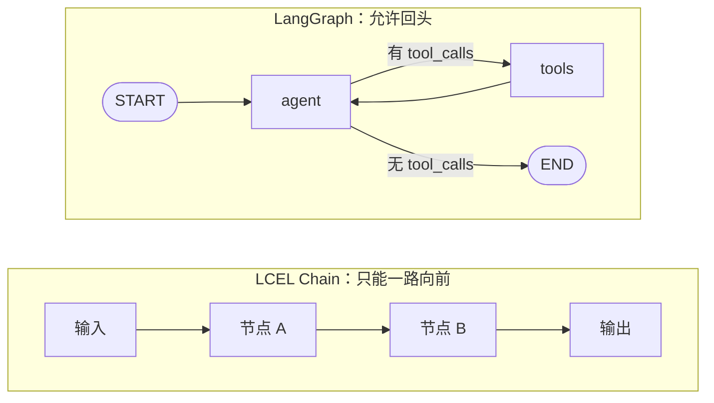
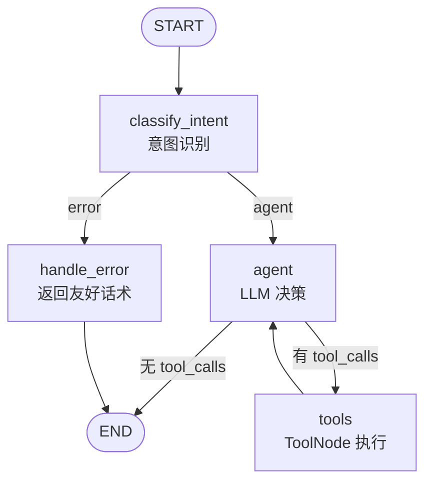
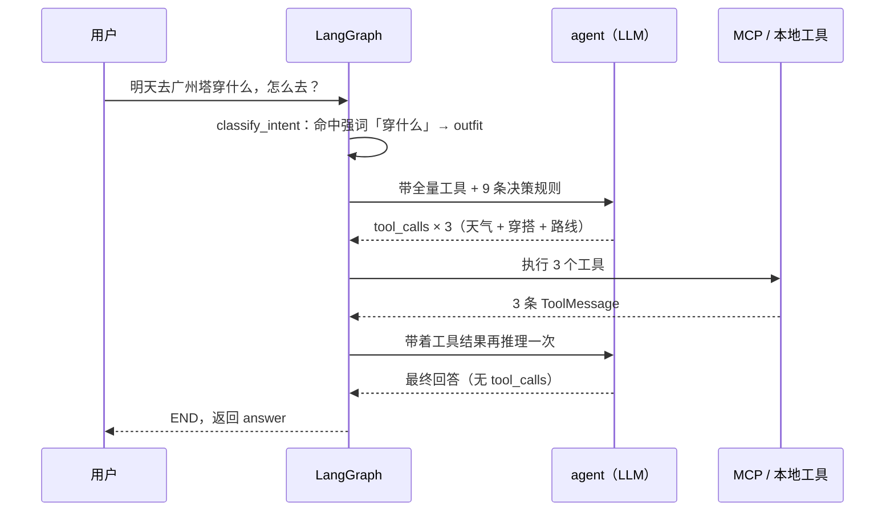
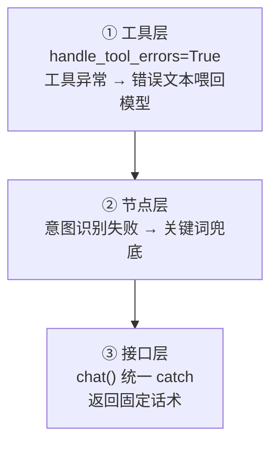

# 从 0 到 1 用 LangGraph 搭一个带工具调用的 Agent：状态、循环与兜底

> 「AI Agent 工程化实战」系列 · 01
> 项目背景：广州气象大数据 + AI 智能体出行推荐系统（FastAPI + LangGraph + MCP + pgvector）
> 关键词：LangGraph、ReAct、状态机、条件边、兜底设计

---

## 一、起点是一句让人头疼的提问

线上收到过这么一句：

> 明天去广州塔穿什么，怎么去？

这句话里塞了三件事：明天广州塔的天气、该穿什么、从当前位置怎么过去。

纯 LLM 能给你一段读起来很顺的回答，但里面的数据全是它"印象里"的——它不知道明天广州塔下不下雨，也不知道你要坐几号线。**答得越流畅，幻觉越危险。**

要答对，就得去查真实数据。而"让模型去查数据"这件事，工程上有两条路：

1. 在代码里 if-else：命中"天气"调天气接口，命中"穿搭"查规则表，命中"路线"算路径。
2. 把工具交给模型，让它自己决定调哪个、调几次、要不要接着调。

我选了第二条。然后在选定方案的瞬间，撞上了这篇文章真正要讲的东西：

**一旦让模型自主决策，控制流就不再是一条直线了。**

---

## 二、为什么用"图"，而不是 Chain

先说清楚 LangChain 的 Chain（LCEL）为什么在这里不够用。

Chain 的本质是一个有向无环图（DAG）：数据从 A 流到 B 再到 C，可以分支，可以并行，但**不能回头**。而带工具的 Agent 天生是个循环：

```
agent 想调工具 → 执行工具 → 结果丢回 agent → agent 再想一次
```

只要模型还没给出最终答案，这个圈就得一直转。用 Chain 表达这个"转"，只能自己写 `while`，而 `while` 里的状态维护、终止判断、异常处理最后都会变成一坨胶水代码。

LangGraph 的做法很直接：把"转"画进图里——节点是函数，边是控制流，**环是合法的边**。



还有一点心态上的转变，我觉得比 API 本身更重要。

刚上手时我以为 LangGraph 是"更高级的 Chain"，用起来才发现它的核心价值是**把控制流显式化**。它逼你回答两个问题：

- 哪些事交给模型决定？→ 调哪个工具、调几次、答什么。
- 哪些事必须由代码定死？→ 什么时候停、出错往哪走。

前者写在提示词里，后者画在图上。这条边界划清楚，Agent 才不会变成一个"看起来很聪明但随时失控"的黑盒。

---

## 三、状态：AgentState 与 add_messages

LangGraph 的节点之间靠一个共享 state 通信，先定义它：

```python
from typing import Annotated, TypedDict
from langgraph.graph.message import add_messages


class AgentState(TypedDict):
    """会话状态。messages 用 add_messages 做累加合并。"""

    messages: Annotated[list, add_messages]
    intent: str   # 意图标签，决定要不要给模型绑工具
    answer: str   # 最终答案，方便外部直接取
    error: str    # 出错标记，兜底路由用
```

这里的重点只有一个：`Annotated[list, add_messages]`。

普通 list 是**覆盖**语义——节点 B 返回新的 `messages`，节点 A 写的就没了。可 Agent 循环里，每一轮的工具结果都必须追加进去，不能被覆盖。`add_messages` 提供了归约（reducer）语义：新消息按 ID 合并追加，顺带自动去重。

另外三个字段是我额外加的，作用很朴素：

- `intent` 存过程结论，供 `agent` 节点判断要不要绑工具；
- `answer` 存最终答案，非流式场景直接取这个字段；
- `error` 存异常标记，给条件边做路由依据。

一句话概括这个状态的职责划分：**`messages` 存过程，其余字段存结论。**

---

## 四、把 Agent 拆成 4 个节点

图是这样搭起来的：

```python
from langgraph.graph import END, START, StateGraph
from langgraph.prebuilt import ToolNode


async def _build_graph():
    """构建 LangGraph 状态机（含 MCP 工具 + 本地工具节点）。"""
    tools = await _get_all_tools()  # 预加载全部工具，供 ToolNode 使用
    graph = StateGraph(AgentState)

    graph.add_node("classify_intent", _classify_intent)  # 意图识别
    graph.add_node("agent", _agent_node)                 # LLM 决策
    graph.add_node("tools", ToolNode(tools))             # 执行工具
    graph.add_node("handle_error", _handle_error)        # 异常兜底

    graph.add_edge(START, "classify_intent")

    # 意图识别之后：出错去兜底，否则进决策
    graph.add_conditional_edges(
        "classify_intent",
        _should_error,
        {"error": "handle_error", "agent": "agent"},
    )

    # 核心工具循环：agent -> tools -> agent（直到无 tool_calls 才 END）
    graph.add_conditional_edges(
        "agent",
        _should_continue,
        {"tools": "tools", END: END},
    )
    graph.add_edge("tools", "agent")
    graph.add_edge("handle_error", END)

    return graph.compile()
```

画成图长这样：



四个节点各管一段，边界很清晰：

| 节点 | 职责 | 由谁决策 |
| --- | --- | --- |
| `classify_intent` | 判断用户意图 | 强关键词 → LLM → 弱关键词（三级降级） |
| `agent` | 决定调工具 / 反问 / 直接回答 | **LLM** |
| `tools` | 执行工具，把结果回填进 state | 代码（`ToolNode`） |
| `handle_error` | 返回兜底话术 | 代码 |

而控制流的全部出口，就是两个路由函数：

```python
def _should_continue(state: AgentState) -> str:
    """路由：最后一条消息若含 tool_calls 则执行工具，否则结束。"""
    last = state["messages"][-1]
    if getattr(last, "tool_calls", None):
        return "tools"
    return END


def _should_error(state: AgentState) -> str:
    """路由：有 error 则进入兜底，否则继续。"""
    return "error" if state.get("error") else "agent"
```

`_should_continue` 是 ReAct 循环的"转不转"：最后一条消息里有没有 `tool_calls`？有就转圈去执行工具，没有就说明模型已经给出最终答案，收工。
`_should_error` 是"出错去哪"：state 里挂了 error 就去兜底节点。

**整个 Agent 的自主性上限，就锁在这两个函数里。** 再复杂的推理，也只能在这张图允许的路径上跑。

---

## 五、一次真实的循环：消息是怎么转起来的

拿开头那句"明天去广州塔穿什么，怎么去？"实跑一遍：



对应的消息流转：

| 轮次 | `state.messages` 末尾 | LLM 决策 | 路由 |
| --- | --- | --- | --- |
| 第 1 轮 | `Human("明天去广州塔穿什么，怎么去？")` | 返回 3 个 `tool_calls` | `→ tools` |
| 第 2 轮 | `ToolMessage × 3`（天气 / 穿搭 / 路线） | 输出整合后的最终回答，无 `tool_calls` | `→ END` |

这里面有三个容易看漏、但很关键的细节：

**1. 意图是 `outfit`，工具却是全量绑定的。**

因为"穿什么"命中了强关键词，意图被直接判成 `outfit`。但看 `_agent_node` 的逻辑：

```python
TOOL_INTENTS = {"weather", "travel", "outfit", "knowledge"}

if intent in TOOL_INTENTS:
    tools = await _get_all_tools()
    llm_with_tools = llm.bind_tools(tools)   # 绑的是「全量」工具
    system = GENERATE_SYSTEM_PROMPT
else:
    llm_with_tools = llm                      # 闲聊类：一个工具都不绑
    system = CHAT_SYSTEM_PROMPT
```

意图只决定**"要不要给模型工具"**，不决定**"给哪些工具"**。这样设计的好处是：哪怕意图粗判成了单一类别，复合问题依然能被模型自己拆开处理；而闲聊类请求不绑工具，能省下一大坨工具 schema 的 token，也少了模型乱调工具的机会。

**2. 模型可以一次返回多个 `tool_calls`。**

现代模型的原生并行工具调用，让"天气 + 穿搭 + 路线"三个工具能在**同一次决策**里全部发出去，执行完一起回流。要是模型只肯一次调一个，那这个圈就得转三轮——延迟差着一倍。所以我在提示词里明确写了"必须逐一调用所有相关工具，不要只答其中一部分"，就是为了逼它把工具一次调全。

**3. 循环的终止权在模型手里。**

代码从不判断"查够了没有"，只判断"还有没有 `tool_calls`"。模型不再调工具的那一刻，循环自然结束。这个设计很省心：新增工具不需要动控制流，模型自己会决定什么时候收手。

---

## 六、兜底：三个层面，别让异常穿透

"接口永不 500"不是口号，是三层各司其职的结果：



**① 工具层：错误当成"数据"喂回去**

```python
_client = MultiServerMCPClient(
    connections={"weather_travel": connection},
    handle_tool_errors=True,  # 工具出错时返回错误文本而非抛异常
)
```

工具抛异常时，适配器会把错误信息变成一段文本交回模型。模型看到"该地区天气查询失败"，会自己换个说法，而不是让整条链路炸掉。把异常降级成**模型能读懂的输入**，比把它抛给上层有用得多。

**② 节点层：意图识别失败不阻塞链路**

```python
except Exception as exc:  # LLM 失败降级到关键词
    logger.warning("意图识别 LLM 调用失败，降级到关键词规则: %s", exc)
    intent = _keyword_intent(user_text)
```

意图识别挂了，就用关键词规则顶上去。最坏结果是意图判得糙一点，但链路不停。（这一层的完整设计——强词预判 / LLM 分类 / 弱词兜底的三级结构，是后面单独一篇的主题。）

**③ 接口层：最后一道网**

```python
try:
    ag = await _get_agent()
    result = await ag.ainvoke(initial)
    return {"intent": result.get("intent", ""), "answer": result.get("answer", "")}
except Exception as exc:  # 统一兜底，避免接口 500
    logger.exception("对话异常: %s", exc)
    return {"intent": "other", "answer": "抱歉，AI 服务暂时不可用，请稍后重试。"}
```

前面全挂了也没关系，这里保证接口返回 200 和一句人话。AI 服务的稳定性，很大程度取决于你愿不愿意在最后写这个 `except`。

---

## 七、两个真实的坑

### 坑 1：图的构建必须是惰性的（而且要 async）

`ToolNode(tools)` 需要在**构建图的时候**就拿到工具列表，而工具是要 `await` 从 MCP Server 加载的。所以构建图这件事天生是异步的：

```python
_agent_instance = None


async def _get_agent():
    """惰性单例：首次调用时构建（需先加载 MCP 工具）。"""
    global _agent_instance
    if _agent_instance is None:
        _agent_instance = await _build_graph()
    return _agent_instance
```

不能在模块顶层直接 `graph = _build_graph()`——import 阶段没有事件循环，而且会把"拉起 MCP 子进程"这种事绑死在启动路径上。惰性单例 + 进程内复用，是这里唯一舒服的解法。

### 坑 2：兜底节点写了，但从来没被触发过

这个坑我不想藏。写完兜底我顺手验证了一下触发路径，发现 `handle_error` 根本走不到。

原因在接线：`_should_error` 这条条件边**只接在 `classify_intent` 后面**。也就是说，`handle_error` 只有在意图识别节点返回 error 时才可达。

但 `_classify_intent` 自己已经把异常全 catch 了，并且降级到关键词返回——**它永远不返回 error**。于是这个兜底节点在真实运行里是死代码。

那 `_agent_node` 里 LLM 失败时的 `return {"error": str(exc)}` 呢？它不走条件边。state 里是有了 error，但 `messages` 没变，最后一条消息没有 `tool_calls`，于是 `_should_continue` 直接返回 `END`，图结束，`answer` 是空字符串。

修法有两种：

```python
# 方案 A：把 _should_error 也接到 agent 后面，先判 error 再判 tool_calls
graph.add_conditional_edges(
    "agent",
    _should_error,
    {"error": "handle_error", "agent": "continue"},
)
graph.add_conditional_edges(
    "continue",
    _should_continue,
    {"tools": "tools", END: END},
)
```

```python
# 方案 B：一个路由函数同时管「出错」和「要不要调工具」
def _route_after_agent(state: AgentState) -> str:
    if state.get("error"):
        return "error"
    last = state["messages"][-1]
    return "tools" if getattr(last, "tool_calls", None) else END
```

我选了方案 A。"出错去哪"和"下一步去哪"保持两个独立路由函数，读起来更直白。

这段没什么高深技术，但结论值得记住：**图的边是手写的，画得出兜底不等于接得上兜底。** 写错一条边，图照样跑，只是那个分支永远沉默。上线前把节点可达性过一遍，比事后翻日志便宜太多。

（顺带一提：流式入口 `chat_stream` 里还有个相关细节——`astream(stream_mode="messages")` 会把 `classify_intent` 节点的输出也吐出来，得靠 `meta["langgraph_node"] != "agent"` 过滤掉，否则意图标签会混进正文。这是第 13 篇的话题。）

---

## 八、可以抄走的东西

- 状态用 `Annotated[list, add_messages]`，别用裸 list——循环场景下覆盖语义会丢消息。
- 让模型决定"调什么"，让代码决定"什么时候停、出错往哪走"。前者写进提示词，后者画进图。
- 意图只决定"要不要绑工具"（省 token），不决定"绑哪些工具"（避免误判放大成功能缺失）。
- 三层兜底各管一段：工具层降级成文本、节点层降级成规则、接口层兜住一切。
- 图必须惰性异步构建，别在 import 时拉起外部进程。
- 写完条件边，检查一遍节点可达性。

本次涉及的代码集中在 `backend/app/services/agent.py`，约 320 行，覆盖意图识别、工具合并、图构建和单轮 / 流式两个入口。

---

**下一篇预告**

工具是从哪来的？下一篇进 `backend/app/services/mcp_client.py`：怎么通过 MCP 协议把工具层从 Agent 里彻底拆出去——`stdio` 与 `streamable_http` 双传输、工具动态发现、`sys.executable` 那个解释器坑，以及"为什么有状态工具不能走 MCP"。
