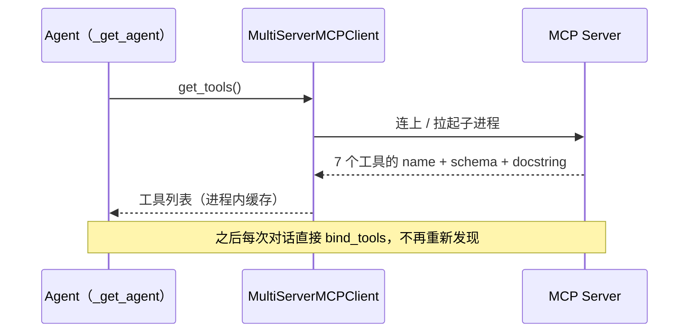
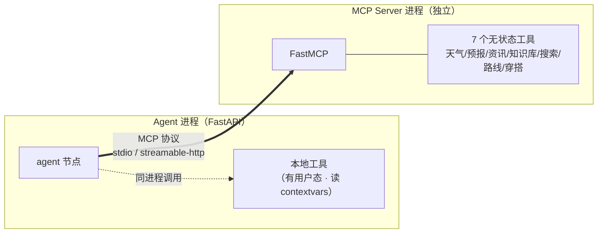

# MCP 实战：把工具层从 Agent 里彻底解耦

> 「AI Agent 工程化实战」系列 · 02
> 项目背景：广州气象大数据 + AI 智能体出行推荐系统（FastAPI + LangGraph + MCP + pgvector）
> 关键词：Model Context Protocol、FastMCP、stdio、streamable-http、工具发现、进程隔离

---

## 一、工具写进 Agent 之后，我后悔了

最早那版 Agent，工具是直接写死在 `agent.py` 里的：天气一个函数、穿搭一个函数、出行规划再来一个。七个能力，七个 `import`，全堆在 Agent 进程内。

跑通那天很爽。两周后想加工具，打开文件就头大：改 `agent.py` 就得重启 Agent；天气接口挂了，Agent 跟着一起挂；最难受的是——**工具的实现细节全糊在编排逻辑旁边，读代码时分不清哪段是"控制流"、哪段是"业务"**。

于是我把工具整层搬出去，用 MCP（Model Context Protocol）接回来。搬完之后，Agent 端关于工具的核心代码只剩一行：

```python
tools = await get_mcp_tools()
```

这一篇讲的就是这个搬运过程，以及那几个真踩过的坑。

---

## 二、先说清一个常被混用的词：MCP ≠ function calling

很多人第一次见 MCP，会以为"这不就是 function calling 嘛"。不是，两件事差着一个层级：

- **function calling** 是模型的能力：模型输出一段结构化调用 `{name: "get_weather", args: {city: "广州"}}`。它解决"模型决定**调哪个**"。
- **MCP** 是工具接入协议：它规定工具怎么被**发现、描述、调用、返回**。它解决"**有哪些工具、怎么连、怎么把参数说明白给模型看**"。

一句话记法：**function calling 决定"调哪个"，MCP 决定"有哪些、怎么调"。** 模型不会自己长出工具，你得先把工具按某种协议喂给它——MCP 就是那个"喂"的标准。

解耦的好处很直接：

| 维度 | 工具写进 Agent | 工具走 MCP |
| --- | --- | --- |
| 加一个工具 | 改 `agent.py` + 重启 | 改 Server + 重新发现 |
| 隔离性 | 工具崩，Agent 一起崩 | Server 独立部署、独立扩容 |
| 工具描述 | 手写 JSON schema | docstring 自动推断 |
| 多 Agent 复用 | 复制代码 | 连同一个端点 |

---

## 三、FastMCP：一个装饰器就是一个工具

MCP Server 用 FastMCP 写，注册工具简单到有点不像真的：

```python
from mcp.server.fastmcp import FastMCP

mcp = FastMCP(name="weather-travel-tools")


@mcp.tool()
async def get_weather(city: str) -> str:
    """查询指定城市的实时天气（当前温度、体感、湿度、风向风力、降水、能见度等）。

    Args:
        city: 城市名，支持中文名/拼音/别名，如"广州"、"北京"、"gz"、"上海"。
    """
    return await tools.get_weather(city)


@mcp.tool()
async def get_forecast(city: str, days: int = 3) -> str:
    """查询指定城市未来 N 天（1~7 天）的天气预报，含温度区间、天气现象、降水与预警。

    Args:
        city: 城市名，支持中文名/拼音/别名。
        days: 预报天数，1~7 之间的整数，默认 3 天。
    """
    return await tools.get_forecast(city, days)
```

两件事值得停一下：

1. `@mcp.tool()` 一挂，这个函数**就自动变成了一个可被发现的工具**。`name` 取函数名，`description` 和参数说明都从 docstring 推断——连 JSON schema 都是框架生成的。所以我写工具描述时的纪律是：**`Args` 段落必须写实**，因为模型只读这个。
2. 真正的逻辑我没写在 `server.py` 里，而是转发到 `tools.py`：

```python
# tools.py：纯业务函数，与 MCP 协议解耦
async def get_weather(city: str) -> str:
    """查询指定城市实时天气。参数 city 支持中文名、拼音、常见别名。"""
    if not city or not city.strip():
        city = "广州"
    if not lookup_city(city):
        return f"抱歉，暂不支持查询「{city}」的天气。当前支持：{_SUPPORTED_CITIES}。"
    bundle = await fetch_weather(city)
    return weather_to_text(bundle)
```

这个分层不是洁癖。`tools.py` 里是纯业务函数，能单测、能被非 MCP 场景直接 `import` 复用。`server.py` 只负责"翻译成 MCP"。哪天不想用 MCP 了，业务逻辑一行不用动。

> 顺手记一笔（给后面接手的人）：`server.py` 顶部 docstring 写的是"注册 3 个工具"，`tools.py` 里的清单也只列了 3 个——但实际已经注册了 **7 个**。文档落后于代码，小步快跑的项目里太常见了，改工具时记得顺手把清单也改了。

目前这 7 个工具长这样：

| 工具 | 干什么 | 背后接的 |
| --- | --- | --- |
| `get_weather` | 实时天气 | 天气 API（和风 / Open-Meteo） |
| `get_forecast` | 未来 N 天预报 | 同上 |
| `search_news` | 资讯检索 | 资讯库（SQL） |
| `search_knowledge` | 语义检索 | 公共知识库（RAG / pgvector） |
| `web_search` | 联网搜索 | Tavily → DuckDuckGo 兜底 |
| `plan_travel_route` | 出行规划 | `skills/travel_planning` 的 `route_planner` |
| `recommend_outfit` | 穿搭推荐 | `skills/outfit_recommend` 的 `outfit_engine` |

注意最后两个：MCP 工具本身只是个"壳"，真正逻辑是调用对应的 Skill 脚本。这个"MCP 负责调用出口、Skill 负责能力本体"的分工，是后面单独一篇的主题。

---

## 四、一份逻辑，两种跑法：stdio 与 streamable-http

同一个 Server，本地开发和生产上线用两套传输，靠一个命令行参数切：

```python
def main() -> None:
    parser = argparse.ArgumentParser(description="MCP 天气出行工具服务")
    parser.add_argument("--transport", choices=["stdio", "streamable-http"], default="stdio")
    parser.add_argument("--port", type=int, default=9000)
    parser.add_argument("--host", default="127.0.0.1")
    args = parser.parse_args()

    if args.transport == "streamable-http":
        mcp.run_streamable_http(host=args.host, port=args.port)   # 上线：独立 HTTP 服务
    else:
        mcp.run()                                                 # 本地：stdio 标准输入输出
```

- **stdio**：开发时 Agent 直接拉起子进程，靠标准输入输出通信。零配置，调试直观，日志直接进控制台。
- **streamable-http**：上线时 Server 独立成 HTTP 服务，Agent 通过 `/mcp` 端点连。能单独扩容、多个 Agent 共用、Server 崩了不影响 Agent。

Agent 端切不切，也是一个配置项的事：

```python
def _build_connection() -> dict:
    if settings.MCP_TRANSPORT == "streamable_http":
        return {"transport": "streamable_http", "url": settings.MCP_SERVER_URL}
    return {
        "transport": "stdio",
        "command": sys.executable,                       # 见坑 1
        "args": ["-m", "mcp_server.server"],
        "cwd": str(BACKEND_DIR),                         # 保证相对 import 生效
    }
```

`MCP_TRANSPORT` 一改，工具代码零改动。

---

## 五、工具是"动态发现"的，不是写死的

这是解耦最爽的一点。Agent 启动时不会硬编码"我有这 7 个工具"，而是问 Server："你都有啥？"

```python
_tools_cache: list[BaseTool] | None = None


async def get_mcp_tools() -> list[BaseTool]:
    """加载 MCP Server 暴露的所有工具（缓存，幂等）。"""
    global _tools_cache
    if _tools_cache is None:
        client = _get_client()
        _tools_cache = await client.get_tools()
        logger.info("已加载 %d 个 MCP 工具: %s", len(_tools_cache), [t.name for t in _tools_cache])
    return _tools_cache


async def reload_tools() -> list[BaseTool]:
    """强制重新加载工具（用于 MCP Server 重启后同步）。"""
    global _tools_cache
    _tools_cache = None
    return await get_mcp_tools()
```

`client.get_tools()` 拉一次，缓存到进程里，之后每次对话直接 `bind_tools`。**新增 / 下架工具，只改 MCP Server，Agent 端零改动**——Server 重启后调一下 `reload_tools()` 就自动重新发现。



对比一下：如果工具是写死的，每加一个能力就得改 Agent 的 import、绑定逻辑、测试；现在改 Server 一个文件，Agent 还以为啥都没发生。

---

## 六、两个一定会踩的坑

### 坑 1：stdio 子进程找不到 `mcp` 包

本地用 stdio 时，Agent 要拉起 `python -m mcp_server.server`。我第一版写的是 `command="python"`，一跑就报 `ModuleNotFoundError: No module named 'mcp'`。

根因：Agent 跑在自己的 venv 里（装着 mcp），但 `"python"` 指向**系统解释器**（没装）。子进程用的是自己的解释器，不是父进程的。

修法就一行：

```python
"command": sys.executable,   # 当前进程的解释器（venv 里的那个），不是 "python"
```

`sys.executable` 永远是当前解释器的绝对路径。这一行很值钱，记下来。

### 坑 2：别让工具异常穿透

工具内部出错（天气 API 超时、资讯库连不上），如果直接抛异常，整条 Agent 链路就炸了。我在客户端开了：

```python
_client = MultiServerMCPClient(
    connections={"weather_travel": connection},
    handle_tool_errors=True,  # 工具出错时返回错误文本而非抛异常
)
```

开了之后，工具异常会被适配器包成**一段错误文本**返回给模型。模型看到"天气查询失败：timeout"，会自己换个说法告诉用户，而不是让这次对话 500。把异常降级成"模型能读懂的输入"，和上一篇里说的兜底思路一模一样——出问题不可怕，可怕的是让异常一路冒泡到接口层。

---

## 七、有状态工具，不能走 MCP

这是解耦的一个边界，也是整篇最关键的取舍。

我的本地工具 `search_my_plans`（查用户私有知识库）必须知道"当前是哪个用户"。而 MCP 跑在**独立子进程**里——`contextvars` 设置的用户上下文**跨不了进程边界**。所以一刀切：

- **无状态公共工具**（天气、资讯、公共知识库、联网搜索）→ 走 MCP，独立部署、可插拔；
- **有用户态的私有工具**（查"我"的行程、查"我"上传的资料）→ 留在 Agent 进程内，直接读 `contextvars` 里的 `user_id`。

两者在 Agent 层合并：

```python
async def _get_all_tools() -> list:
    """合并 MCP 工具（无状态公共工具）+ 本地工具（有用户态私有工具）。"""
    mcp_tools = await get_mcp_tools()
    local_tools = get_local_tools()
    return [*mcp_tools, *local_tools]
```

这一刀切得清楚：MCP 负责"公共能力可插拔"，本地工具负责"用户态私有能力"。既拿了 MCP 的解耦红利，又没丢掉多租户隔离。



（"`user_id` 怎么通过 `contextvars` 跨请求隔离、又怎么被本地工具读到"——这是下一篇的主角。）

---

## 八、收尾：MCP 这一层能带走什么

- MCP 是"工具接入协议"，function calling 是"模型调度能力"，别混为一谈。
- `@mcp.tool()` + 写实的 docstring = 一个自动发现、自动描述的工具；`Args` 是写给模型看的，别糊弄。
- 业务逻辑放 `tools.py`、协议翻译放 `server.py`，两层解耦便于复用和单测。
- 一套代码 `stdio` 本地、`streamable-http` 上线，`--transport` 切换。
- 工具动态发现 + 缓存，增删工具 Agent 零改动。
- stdio 子进程务必用 `sys.executable`，否则 `ModuleNotFoundError`。
- `handle_tool_errors=True`，把工具异常降级成模型可读的错误文本。
- 有状态工具走本地、无状态工具走 MCP，两者合并绑定。

本次代码集中在 `backend/mcp_server/server.py`（7 个工具注册）、`backend/mcp_server/tools.py`（业务逻辑）、`backend/app/services/mcp_client.py`（客户端 + 双传输）。

---

**下一篇预告**

`contextvars` 实战：MCP 工具拿不到 `user_id` 这件事，往下挖一层就是请求级的用户上下文隔离——一个进程内、并发安全、改几行就能让私有工具认出"当前用户"的方案，也是多租户 RAG 能跑起来的前提。
