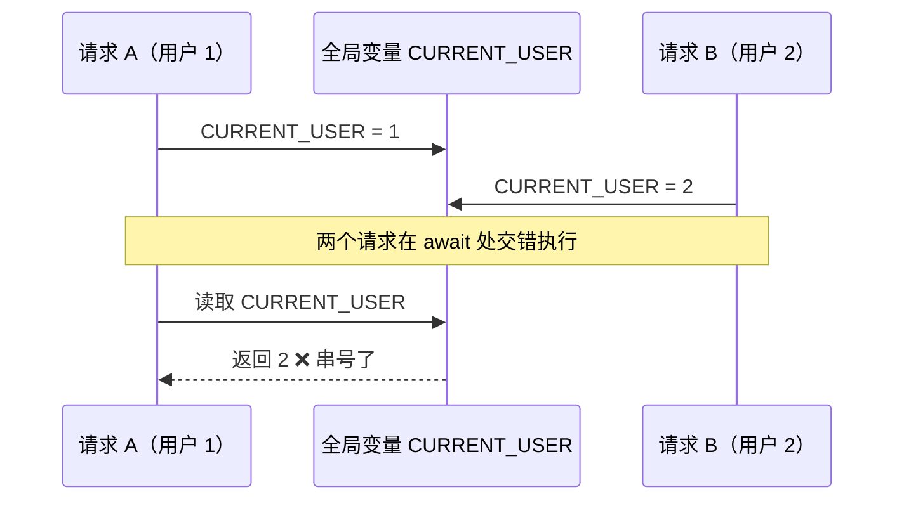
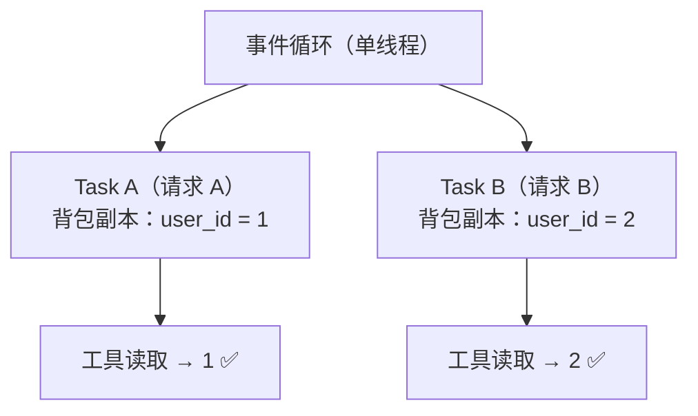
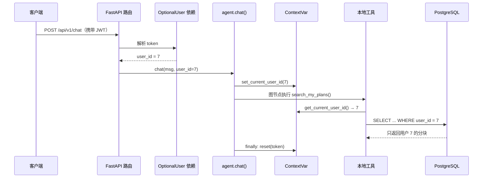

# MCP 工具拿不到 user_id？用 contextvars 做请求级用户隔离

> 「AI Agent 工程化实战」系列 · 03
> 项目背景：广州气象大数据 + AI 智能体出行推荐系统（FastAPI + LangGraph + MCP + pgvector）
> 本文引用了 Python 官方文档、PEP 567 与 MCP 官方文档原文，链接见文末「参考资料」

---

## 0. 先用三句话讲清楚这篇在说什么

1. **要解决的问题**：Agent 调用某个工具时，工具需要知道"当前是哪个用户"，可这个身份只在 HTTP 请求最开头出现过，往后每一层（路由 → 鉴权 → Agent 图 → 工具）都没有它。
2. **采用的方案**：用 Python 标准库的 `contextvars.ContextVar`，在请求入口把 `user_id` "塞进"当前异步上下文，工具内部直接读出来——**不用改任何工具的签名**。
3. **它的边界**：`contextvars` 只在**同一个异步任务（Task）**里有效。跨线程要手动带过去，跨进程（比如独立运行的 MCP Server）完全读不到。正是这条边界，决定了"哪些工具能走 MCP、哪些必须留在本地"。

如果你只想记一句话：

> **`contextvars` 是"给每个异步任务发一个背包"，请求开始时把身份放进背包，调用链深处随时能掏出来；但它只在自己的任务里有效，出了任务就得显式搬运。**

---

## 目录

1. 从一个真实需求说起
2. 先讲清三个概念（否则代码看不懂）
3. 反面教材：三条走不通的路
4. `contextvars` 到底是什么
5. 项目落地：一条链路上的五根接力棒
6. 边界：什么时候它会"失效"
7. 为什么这套做法在业界很常见
8. 小结与下一篇

---

## 一、从一个真实需求说起

用户在对话框里输入：

> 我上次收藏的那家餐厅叫什么来着？

这句话会触发一个私有工具 `search_my_plans`，去这个用户的**私有知识库**里检索。工具内部最后要执行一条 SQL：

```sql
SELECT ... FROM user_knowledge
WHERE user_id = :user_id AND embedding IS NOT NULL
ORDER BY embedding <=> :query_vec LIMIT 5
```

问题就出在 `:user_id` 上。这个值从哪来？

它最早出现在请求头里的 JWT token 里。然后要经过这么多层：

```
HTTP 请求（带 JWT）
  → FastAPI 路由函数
    → 鉴权依赖（解析 token 得到 user_id）
      → agent.chat(user_id=...)
        → LangGraph 图节点
          → ToolNode 执行工具
            → search_my_plans 内部
```

每一层都得把这个值带着走。而工具这一层，恰恰是最"深"、最不该关心上层结构的一层。

所以我们面对的核心问题是：

> **怎么把一个"只在请求开头存在"的值，送到"调用栈最深处"去使用，同时保证高并发下不会串号？**

别急，在写代码之前，先把三个概念掰开讲清楚。这三个概念不搞懂，后面所有代码都只是"抄"。

---

## 二、先讲清三个概念

### 2.1 概念一：什么是"请求级上下文"

一个 Web 服务同时在处理很多请求。有些值**天生属于"某一个请求"**，而不是"整个进程"：

- 当前用户是谁（`user_id`）
- 这次请求的链路追踪 ID（`trace_id`）
- 当前语言、时区、权限
- 当前数据库事务/会话

这些值的共同点是：**值本身随请求变化，但使用它的代码（工具、日志、DAO）位置固定、且很深层**。

如果每个函数都加一个 `user_id` 参数来解决，那函数签名会膨胀得没法看，而且像日志这种"顺手打一行"的地方根本没法加参数。所以业界需要一个机制：**让这些值"挂"在当前请求上，谁需要谁自己取。**

### 2.2 概念二：为什么"全局变量"和 `threading.local` 都不行

先说全局变量。它在**单线程、单请求**的脚本里工作得很好：

```python
CURRENT_USER = None   # 全局变量

def search_my_plans():
    return query(CURRENT_USER)
```

但一旦并发，就出事。原因在于异步（async）的本质：**协程会在 `await` 处把控制权交出去，让别的协程先跑**。看这张图：



请求 A 明明只想查自己的资料，却读到了请求 B 的用户 ID。**这就是数据越权**，在真实系统里属于严重事故。

那用 `threading.local` 行不行？也不行。很多人对它有误解，以为它能救场：

`threading.local` 是**按操作系统线程**隔离的。而 asyncio 是**单线程多协程**——一个线程上跑着成百上千个协程。于是在这个线程里，所有协程共享同一份 `threading.local` 数据。PEP 567 的原文说得很直白：

> Thread-local variables are insufficient for asynchronous tasks that execute concurrently in the same OS thread. Any context manager that saves and restores a context value using `threading.local()` will have its context values bleed to other code unexpectedly when used in async/await code.
> —— [PEP 567 – Rationale](https://peps.python.org/pep-0567/#rationale)

翻译过来：**线程局部变量对付不了"同一线程里并发跑的异步任务"，值会意外地渗透到别的代码。** 一句话，线程粒度太粗，不是我们需要的隔离粒度。

### 2.3 概念三：为什么 MCP 工具天生拿不到身份

这就要说到 MCP 协议的设计了。MCP 官方文档里有一句话，是整个取舍的根：

> **MCP is a stateless protocol.** Every request carries the protocol version and the capabilities relevant to that request in its `_meta` field, so the server can process each request on its own.
> —— [MCP 官方文档 · Architecture overview](https://modelcontextprotocol.io/docs/learn/architecture)

**MCP 被设计成无状态协议**：每个请求自带它需要的信息，服务器独立处理每一个请求，不依赖"上一次你是谁"。这带来巨大的好处——服务器可以随便重启、扩容、被多个客户端共用。代价就是：**它不会自动知道"当前用户是谁"**，协议里也没有这个位置。

再加上本项目本地开发用的是 `stdio` 传输——MCP Server 是一个**独立子进程**：

> Local MCP servers that use the STDIO transport typically serve a single MCP client...
> —— 同上

**进程和进程之间的内存是不通的。** 所以无论我们在 Agent 进程里怎么设置上下文，MCP 子进程都读不到。这就是第一个博客里那句结论的由来：**有用户态的工具不能走 MCP**。

到这里，三个概念齐了：

| 概念 | 一句话 |
| --- | --- |
| 请求级上下文 | 属于"某个请求"、需要被深层代码读取的值 |
| 为什么不用全局变量/thread-local | 并发会串号；thread-local 隔离粒度是"线程"，不是"任务" |
| 为什么 MCP 拿不到身份 | MCP 协议无状态 + 子进程不共享内存 |

---

## 三、反面教材：三条走不通的路

把三条"想当然"的方案摆出来，你就能理解为什么最终选了 `contextvars`。

### 路线 1：全局变量

```python
CURRENT_USER = None           # 模块级全局

def set_user(uid): 
    global CURRENT_USER
    CURRENT_USER = uid

@tool
def search_my_plans(query: str):
    ... WHERE user_id = CURRENT_USER   # 并发下读到别人的 id
```

**失败原因**：并发交错，值互相覆盖（见 2.2 的时间线图）。

### 路线 2：一路传参（显式参数）

```python
async def search_my_plans(query: str, user_id: int):  # 把 user_id 加进签名
    ...
```

看起来"显式"很安全，但在这个项目里走不通，有两个硬伤：

1. **工具签名是由 MCP 协议暴露的**。你去改工具签名，等于改协议契约；而工具可能是独立服务，改一次要协调两边发版。
2. **底层代码根本插不进去**。比如日志、埋点、Agent 图节点里的中间件，这些地方并不适合逐个加参数。

路线 2 在"只有两三层"的小程序里是好方案，但**当调用链很深、或工具是外部服务时，它会让参数渗透到每一个角落**（业界叫"参数污染"）。

### 路线 3：`threading.local`

```python
import threading
_current = threading.local()

def search_my_plans(query: str):
    uid = getattr(_current, "user_id", None)   # 异步下所有协程共享，等于没用
```

**失败原因**：asyncio 单线程跑多协程，`threading.local` 在这个线程里是"共用的"，起不到隔离作用（见 2.2）。

三条路都堵死，于是轮到标准库出的"官方答案"：`contextvars`。

---

## 四、`contextvars` 到底是什么

### 4.1 官方定义

> This module provides APIs to manage, store, and access **context-local state**.
> ...
> Context managers that have state should use Context Variables instead of `threading.local()` to prevent their state from bleeding to other code unexpectedly, when used in concurrent code.
> —— [Python 官方文档 · contextvars](https://docs.python.org/3/library/contextvars.html)

两个关键词：**context-local state**（上下文局部状态）、**bleeding to other code**（渗透到别的代码）。它就是为了解决"并发下状态串号"而生的，3.7 版本引入，设计文档是 PEP 567。

### 4.2 用一个类比理解它

官方抽象的说法不好记，我更喜欢这个类比：

> 把**每一个异步任务（Task）**想成一个人，出发前会领到一个**背包**。
> `ContextVar` 就是背包里的一个**格子**。
> 你 `set()` 就是往格子里放东西，`get()` 就是掏出来。
> **关键**：任务在创建那一刻，会**复制**一份当前背包，从此各背各的。A 往自己背包里放东西，B 的背包不受影响。

用图表示：



这就是它能做到"并发安全"的原因：**隔离的粒度从"线程"降到了"任务"。**

### 4.3 "复制背包"这件事，官方源码里写得很清楚

PEP 567 里直接给出了 asyncio `Task` 的实现片段，这属于"别人的源码"，比任何二手解释都可信：

```python
class Task:
    def __init__(self, coro):
        ...
        # Get the current context snapshot.
        self._context = contextvars.copy_context()
        self._loop.call_soon(self._step, context=self._context)

    def _step(self, exc=None):
        ...
        # Every advance of the wrapped coroutine is done in
        # the task's context.
        self._loop.call_soon(self._step, context=self._context)
```

（来源：[PEP 567 · asyncio](https://peps.python.org/pep-0567/#asyncio)）

翻译成一句话：**Task 在 `__init__` 里就 `copy_context()` 了一份快照，之后协程的每一步都在这个副本里跑。** 所以：

- 创建任务**之前**设置的值 → 任务能看见；
- 创建任务**之后**再设置的值 → 任务看不见（它冻结的是创建那一刻的副本）。

asyncio 官方文档也是同样的措辞：

> If no *context* is provided, the Task copies the current context and later runs its coroutine in the copied context.
> —— [Python 官方文档 · asyncio Task](https://docs.python.org/3/library/asyncio-task.html)

### 4.4 标准库文档里自带的例子

官方文档 "asyncio support" 一节有个很好的例子：一个 echo server，用 `ContextVar` 把客户端地址挂到处理该客户端的 Task 上，深层函数不用任何参数就能读到它：

```python
import asyncio
import contextvars

client_addr_var = contextvars.ContextVar('client_addr')

def render_goodbye():
    # 不用显式传参，就能拿到"当前处理的客户端地址"
    client_addr = client_addr_var.get()
    return f'Good bye, client @ {client_addr}\r\n'.encode()

async def handle_request(reader, writer):
    addr = writer.transport.get_extra_info('socket').getpeername()
    client_addr_var.set(addr)          # 在任务入口 set
    ...
    writer.write(render_goodbye())     # 深层函数直接 get
```

（来源：[Python 官方文档 · contextvars · asyncio support](https://docs.python.org/3/library/contextvars.html#asyncio-support)）

我们项目要做的，本质上是**一模一样的模式**，只不过把 `client_addr` 换成了 `user_id`。

### 4.5 `set` 会返回一个 `Token`，这是配套的"撤销键"

```python
token = _current_user_id.set(user_id)   # 放进去，拿到一张"撤销凭证"
try:
    ...                                 # 中间干正事
finally:
    _current_user_id.reset(token)       # 用完撤销，恢复到 set 之前的值
```

官方对 `reset` 的说明：

> Reset the context variable to the value it had before the `ContextVar.set()` that created the *token* was used.
> —— 同上

为什么要 `reset` 而不是简单 `set(None)`？因为如果上层已经设过一个值，你 `set(None)` 就把上层的值也冲掉了；**只有 `reset(token)` 才能精确恢复到"设置之前"的状态**。这个细节在第 6 章会再展开。

---

## 五、项目落地：一条链路上的五根接力棒

现在把概念落到代码。整个链路一共五步，每步都很短。

### 第 1 棒：定义 `ContextVar`（`user_context.py`）

```python
# backend/app/services/user_context.py
from contextvars import ContextVar, Token

# 当前请求的用户 ID（None 表示匿名）
_current_user_id: ContextVar[int | None] = ContextVar("current_user_id", default=None)

def set_current_user_id(user_id: int | None) -> Token:
    """设置当前请求的用户 ID，返回用于恢复的 token。"""
    return _current_user_id.set(user_id)

def reset_current_user_id(token: Token) -> None:
    """恢复用户 ID 到设置前的值（配合 set 返回的 token 使用）。"""
    _current_user_id.reset(token)

def get_current_user_id() -> int | None:
    """读取当前请求的用户 ID。"""
    return _current_user_id.get()
```

注意一个细节：官方明确要求 **`ContextVar` 要在模块顶层创建，不要写在闭包里**——

> **Important:** Context Variables should be created at the top module level and never in closures.
> —— [Python 官方文档 · contextvars](https://docs.python.org/3/library/contextvars.html)

原因是 `Context` 对象持有对 `ContextVar` 的强引用，放在闭包里会影响垃圾回收。我们这个变量就定义在模块顶层，符合要求。

### 第 2 棒：请求入口拿到 `user_id`（`deps.py` + `chat.py`）

身份来自 JWT。项目里用 FastAPI 依赖解析它：

```python
# backend/app/core/deps.py
async def get_optional_user(
    token: Annotated[str | None, Depends(oauth2_scheme_optional)],
    db: Annotated[AsyncSession, Depends(get_db)],
) -> User | None:
    """可选鉴权：匿名返回 None。"""
    if not token:
        return None
    payload = decode_access_token(token)
    sub = payload.get("sub")
    return await db.scalar(select(User).where(User.id == int(sub)))

OptionalUser = Annotated[User | None, Depends(get_optional_user)]
```

路由里把它取出来，往下传：

```python
# backend/app/routers/chat.py
@router.post("", response_model=dict)
async def chat(body: ChatRequest, current: OptionalUser = None) -> dict:
    user_id = current.id if current else None          # 登录→有值；匿名→None
    conversation_id = body.conversation_id or uuid.uuid4().hex[:16]
    history = await chat_history_service.get_recent_history(user_id, conversation_id)

    result = await agent.chat(body.message, user_id=user_id, history=history)
    ...
```

注意这里的设计很克制：**`user_id` 还是通过参数传进 `agent.chat()` 的**。`contextvars` 不是用来取代"上一层已知的参数传递"，而是用来解决"再往下、签名改不了"的那一段。这是个分寸问题，别一上来就把所有参数都塞进上下文。

### 第 3 棒：进入 Agent 时写进上下文（`agent.chat`）

```python
# backend/app/services/agent.py
async def chat(user_input: str, user_id: int | None = None, history: list[dict] | None = None) -> dict:
    initial = _build_initial_state(user_input, history)
    token = set_current_user_id(user_id)      # ← 放进"背包"
    try:
        ag = await _get_agent()
        result = await ag.ainvoke(initial)    # ← 整条图都在这一个 Task 里，都能读到
        return {"intent": result.get("intent", ""), "answer": result.get("answer", "")}
    except Exception as exc:
        logger.exception("对话异常: %s", exc)
        return {"intent": "other", "answer": "抱歉，AI 服务暂时不可用，请稍后重试。"}
    finally:
        reset_current_user_id(token)          # ← 用完一定要还回去
```

这里能成立有一个前提：**`ag.ainvoke(...)` 是 `await` 调用，没有 `create_task`**。按传播规则，`await` 不会复制上下文，调用链共用一个 Context，所以图里的工具节点自然能读到。如果这里改成了 `create_task` 或丢到线程池，就要重新考虑（详见第 6 章）。

### 第 4 棒：工具内部直接读（`local_tools.py`）

```python
# backend/app/services/local_tools.py
@tool
async def search_my_plans(query: str, top_k: int = 5) -> str:
    """在当前登录用户自己的私有知识库中检索……"""
    user_id = get_current_user_id()          # ← 从"背包"里掏出来，没有任何参数
    if user_id is None:
        return "当前未登录，无法检索个人知识库。请先登录后重试。"

    items = await user_knowledge_service.search(user_id, query.strip(), top_k)
    ...
```

看这个函数签名——`search_my_plans(query, top_k)`，**干净得完全看不出它依赖用户身份**。而它确实是按用户隔离的。这正是 `contextvars` 想要的效果：**横切关注点（cross-cutting concern）不污染业务签名。**

### 第 5 棒：落到 SQL，隔离在查询层（`user_knowledge_service.py`）

```python
# backend/app/services/user_knowledge_service.py
stmt = text("""
    SELECT title, source, content, chunk_index,
           1 - (embedding <=> :vec::vector) AS similarity
    FROM user_knowledge
    WHERE user_id = :user_id AND embedding IS NOT NULL
    ORDER BY embedding <=> :vec::vector ASC
    LIMIT :top_k
""")
```

这里有一个重要的工程原则：**多租户隔离要落在查询条件里，而不是靠应用层"记得过滤"。**

如果只在 Python 层 `if item.user_id == current_user_id: keep`，一旦哪天新加了一条查询路径忘了写这个判断，就会漏数据。把 `WHERE user_id = :user_id` 写死在 SQL 里，**隔离就成了 SQL 的语义，而不是人的记忆力**。（多租户 RAG 的更多细节，是系列后面单独一篇的主题。）

### 把五根棒连起来



整条链路，工具签名零改动，Agent 图零改动，只多了 `set` / `get` / `reset` 三个调用。

---

## 六、边界：什么时候它会"失效"

这一章是本文最实用的部分。`contextvars` 不是万能的，它的传播规则如果不清楚，会踩得很惨。

### 6.1 一张速查表（建议收藏）

| 场景 | 上下文是否自动传播 | 说明 |
| --- | --- | --- |
| 直接 `await` 调用协程 | ✅ 是（同一个 Context） | 不复制，父子读写立即可见 |
| `asyncio.create_task()` | ✅ 是（**创建时**复制一份） | 父级在创建**之后**再 `set`，子任务看不到 |
| `asyncio.to_thread()` | ✅ 是（官方明确会传播） | 见 6.3 |
| `loop.run_in_executor()` | ❌ **默认不传播** | 需手动 `copy_context().run` |
| `threading.Thread` | ❌ 新线程是**空上下文** | 从零开始，继承不到任何值 |
| **子进程（如 MCP stdio）** | ❌ **完全不共享** | 进程边界，原理上就不可能 |

### 6.2 坑一：跨进程（本项目最核心的取舍）

这就是第二篇里那个结论的理论依据。MCP Server 跑在独立子进程，`contextvars` 是**进程内的内存结构**，跨不过进程边界。所以：

- 需要 `user_id` 的 `search_my_plans`、`check_itinerary_weather` → 留在 Agent 进程内（本地工具）；
- 不需要身份的天气、资讯、公共检索 → 走 MCP。

### 6.3 坑二：跨线程

把同步阻塞代码丢进线程池是很常见的优化。但要注意**不同 API 的行为不一样**：

- `asyncio.to_thread()` **会**传播上下文。官方文档原文：

  > Also, the current `contextvars.Context` is propagated, allowing context variables from the event loop thread to be accessed in the separate thread.
  > —— [Python 官方文档 · asyncio · Running in threads](https://docs.python.org/3/library/asyncio-task.html)

- 但 `loop.run_in_executor()` / `ThreadPoolExecutor` **默认不会**。新线程带着一个空上下文启动，读到的只能是默认值。PEP 567 里专门给了正确姿势——**抓一份快照，让目标线程在这个快照里跑**：

  ```python
  executor = ThreadPoolExecutor()
  current_context = contextvars.copy_context()
  executor.submit(current_context.run, some_function)
  ```

  （来源：[PEP 567 · Offloading execution to other threads](https://peps.python.org/pep-0567/#offloading-execution-to-other-threads)）

一个常见的现象是：日志里的 `request_id` 在异步链路上好好的，一到某个线程池里就"随机丢失"——基本都是这个原因。

### 6.4 坑三：`create_task` 的时机

因为复制发生在**创建的那一刻**：

```python
# ❌ 读不到
task = asyncio.create_task(do_work())   # 先创建，快照 = 当前（还没 set）
_current_user_id.set(7)                  # 后 set，包里那份快照已经冻结了

# ✅ 读得到
_current_user_id.set(7)                  # 先 set
task = asyncio.create_task(do_work())    # 后创建，快照包含 7
```

记住那个类比：**背包是在"出发那一刻"拍照复制的，出发之后你再往自己包里塞东西，照片不会变。**

### 6.5 坑四：忘记 `reset`

`contextvars` 的值不会因为函数返回而自动消失，它会一直留在当前 Context 里，直到你 `reset` 或者整个任务结束。在长生命周期的异步服务里，这会带来两个后果：

1. **状态泄漏**：同一个 Task 里后续的代码读到的还是上一个请求的值；
2. **链条累积**：旧请求的上下文没人清理，越积越多。

所以标准写法永远是 `try/finally`：

```python
token = set_current_user_id(user_id)
try:
    ...
finally:
    reset_current_user_id(token)      # token 只能用一次；用 token，不要 set(None)
```

`chat` 和 `chat_stream` 两个入口都是这么写的——**只要 `set` 了，就一定配一个 `finally reset`。**

---

## 七、为什么这套做法在业界很常见

`contextvars` 不是这个项目发明的偏门技巧，它是**异步 Python 世界的通用模式**。你在别的地方一定见过同一个思路：

| 场景 | 用什么 | 干什么 |
| --- | --- | --- |
| 结构化日志（structlog） | `structlog.contextvars` | 把 `request_id`、`user_id` 绑到当前请求，日志自动带上 |
| 分布式追踪（OpenTelemetry） | context propagation | 把 `trace_id` / `span` 沿调用链传播 |
| Web 框架旧时代（Django/Flask） | `g` / `request` 对象 | 请求级数据的存放点（同步时代靠 thread-local） |
| 我们这里 | `ContextVar` | 把 `user_id` 传给私有工具 |

它们解决的是**同一个问题类别**：*请求级状态（request-scoped state）的跨层传递*。区别只在"跨的是什么边界"——同任务的 `await` 免费，跨线程要手动搬，跨进程就别想了。

> 顺带一提，官方文档在"asyncio support"里说得很清楚：`ContextVar` 是"asyncio 原生支持、开箱即用"的。它本来就是为这个场景造的轮子，不用自己造。

---

## 八、小结与下一篇

### 可复用清单

- 请求级的值（`user_id`、`trace_id`、语言…）用 `ContextVar`，别用全局变量。
- `ContextVar` 定义在**模块顶层**，不要放闭包里。
- `set` 一定配 `finally: reset(token)`；恢复用 `token`，不要 `set(None)`。
- 记住传播边界：**同任务 `await` 免费；`create_task` 看创建时机；线程池要 `copy_context().run`；子进程完全不通。**
- 多租户隔离落到 **SQL 的 `WHERE`** 里，别只靠应用层自觉。
- 别滥用：上一层已知的参数就正常传参，`contextvars` 留给"签名改不了"的深层横切需求。

### 代码位置

`backend/app/services/user_context.py`（定义）、`backend/app/core/deps.py`（解析身份）、`backend/app/routers/chat.py`（入口）、`backend/app/services/agent.py`（set/reset）、`backend/app/services/local_tools.py`（读取）、`backend/app/services/user_knowledge_service.py`（查询层隔离）。

### 下一篇预告

工具能查数据了，"数据从哪来"就成了下一个问题。下一篇进 RAG：pgvector 的分块、1024 维对齐、余弦检索的工程细节，以及那个"embedding 挂了怎么办"的确定性伪向量兜底。

---

## 参考资料

1. Python 官方文档 · [`contextvars` — Context Variables](https://docs.python.org/3/library/contextvars.html)
2. [PEP 567 – Context Variables](https://peps.python.org/pep-0567/)（Yury Selivanov，Python 3.7）
3. Python 官方文档 · [asyncio Task 与上下文](https://docs.python.org/3/library/asyncio-task.html)
4. MCP 官方文档 · [Architecture overview](https://modelcontextprotocol.io/docs/learn/architecture)（"MCP is a stateless protocol"）
5. structlog 官方文档 · [Context Variables](https://www.structlog.org/en/stable/contextvars.html)
6. OpenTelemetry · [Python 语言文档（context propagation）](https://opentelemetry.io/docs/languages/python/)
