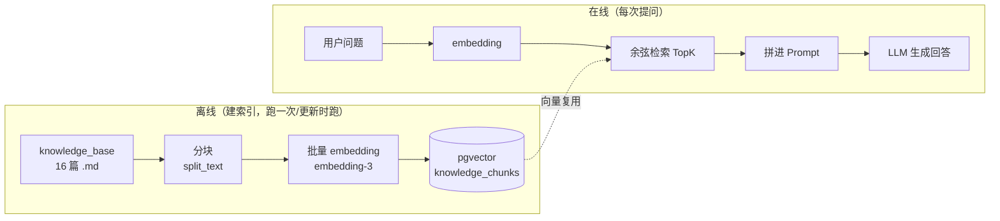
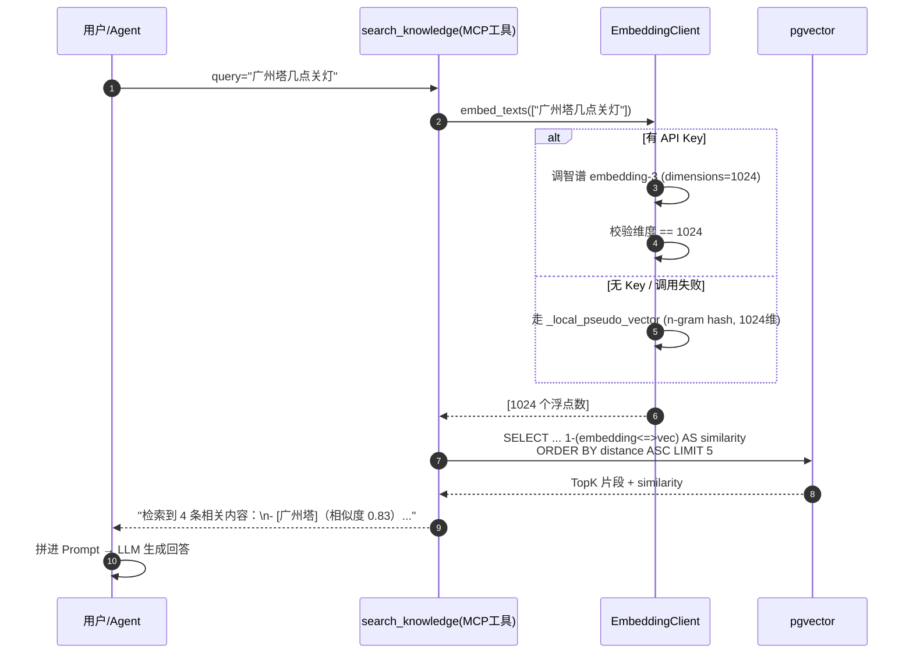

# pgvector 实战：分块、1024 维对齐与余弦检索的工程细节

> 「AI Agent 工程化实战」系列 · 04
> 项目背景：广州气象大数据 + AI 智能体出行推荐系统（FastAPI + LangGraph + MCP + pgvector）
> 本文引用了 pgvector 官方 README、智谱 embedding-3 官方文档原文，链接见文末「参考资料」

---

## 0. 先用三句话讲清楚这篇在说什么

1. **要解决的问题**：用户问"广州塔怎么去"，模型自己的脑子里可能没有这条冷知识，也可能记错。我们需要在回答之前，先从一个**可信的知识库**里把相关内容捞出来，塞进提示词里，让模型"照着材料说话"——这就是 RAG（检索增强生成）。
2. **这篇讲的"工程细节"**：RAG 的骨架其实很简单（文档 → 分块 → 向量化 → 存库；问题 → 向量化 → 相似度检索 → 拼进提示词），真正让人踩坑的是**细节**：块该怎么切、向量维度为什么必须锁死成 1024、检索 SQL 为什么不能写参数、以及 embedding 服务挂了怎么办。
3. **你读完能拿走什么**：一套可以直接抄的 pgvector RAG 实现，外加一个很多人没做、但很实用的兜底——**用 n-gram hash 造一个确定性伪向量**，让整条 RAG 链路在没有网络、没有 API Key 的机器上也能完整跑通。

如果你只想记一句话：

> **RAG 的难点不在"检索"，在"对齐"**——文本切的块要对齐语义边界，向量维度要对齐数据库列，查询算的距离要对齐归一化方式。对齐做好了，剩下的都是体力活。

---

## 目录

1. 从一个真实问题说起
2. 先讲清概念：embedding 和向量检索到底在干什么
3. 离线阶段：文档怎么变成一条条向量
4. 1024 维对齐：一条不能松的工程纪律
5. 在线阶段：余弦检索与那个 `::vector` 的坑
6. embedding 挂了怎么办：确定性伪向量兜底
7. 串起来：一次检索的完整链路
8. 小结与下一篇

---

## 一、从一个真实问题说起

用户在 App 里问：

> 广州塔晚上几点关灯？附近还有什么好逛的？

这句话有三个事实来源：

- "广州塔的运营时间" —— 属于**本地攻略知识**，模型未必知道，或者知道的是过期信息；
- "附近还有什么好逛" —— 也属于本地知识，需要一份策划好的资料；
- 而"现在几点、今晚天气怎么样" —— 属于**实时数据**，那是 MCP 工具的事（见系列第 2 篇）。

本篇只关心第一类和第二类：**那些相对静态、可以提前整理成文档的知识**。

最朴素的做法是把这些资料全塞进系统提示词。但系统的知识库会越来越大——这个项目里 `backend/knowledge_base/` 下已经有 **16 篇**文档。全塞进去有两个问题：**一是 token 爆炸、贵且慢；二是模型在长上下文里对"哪段才是相关的"反而更容易走神。**

RAG 的思路就是：**别全塞，先查，只塞最相关的那几小段。**

---

## 二、先讲清概念：embedding 和向量检索到底在干什么

这一章不写代码，先把三个概念讲透。跳过它，后面的代码你只能抄，不能改。

### 2.1 embedding：把一句话变成一个坐标点

先想象一个坐标系。

如果我问你"广州塔"和"小蛮腰"像不像，你会说像，因为它们指的是同一个东西。但计算机不认识字，它只会比字符串——`"广州塔"` 和 `"小蛮腰"` 一个字都不重合，字符串比较的结果是"完全不同"。

**embedding（文本向量化）就是来解决这件事的**：用一个模型把一段文本压缩成一串固定长度的浮点数，比如 1024 个。这 1024 个数合起来，就是这段文本在某个"语义空间"里的**坐标**。

在这个空间里：

- 意思相近的句子，坐标就挨得近；
- 意思无关的句子，坐标就离得远。

"广州塔"和"小蛮腰"的字符串相似度是 0，但它们的 embedding 坐标会靠得很近。**模型把"意思"搬运到了几何位置上。**

> 打个比方：embedding 就像给每段文字在一个人人共享的地图上钉一个图钉。字面不同但意思相近的句子，会被钉在相近的位置。

### 2.2 余弦相似度：怎么量两个坐标"近不近"

坐标有了，接下来要量两个坐标有多近。**余弦相似度**是这里最常用的尺子。

它算的不是"直线距离"，而是**两个向量夹角的余弦值**。取值范围是 -1 到 1：

- 越接近 **1**，两个向量指向同一个方向（语义越像）；
- 越接近 **0**，两个方向基本垂直（不相关）；
- 负值则是方向相反。

**为什么用夹角而不是直线距离？** 因为夹角只关心"方向"，不关心"长度"。一段长文本和一段短文本谈的是同一件事时，方向是一致的，但向量的长度（模长）可能差很多。用品角量，就绕开了长度差异这个干扰项。

这个项目的 SQL 里，最后算出来的字段就叫 `similarity`，含义正是"余弦相似度"：

```
1 - (embedding <=> '...'::vector) AS similarity
```

那个 `<=>` 是 pgvector 的**余弦距离**运算符，`距离 = 1 - 相似度`，所以 `相似度 = 1 - 距离`。第 5 章会展开。

### 2.3 为什么要"向量数据库"：直接用 Postgres 不行吗

理论上你自己拿 Python 算一遍余弦相似度也行——把所有向量读进内存，逐个算。数据量小（比如这个项目的 33 个块）确实能跑，但这是个陷阱：

- 数据量一大，全量遍历就慢了；
- 你还要自己做索引、做并发、做持久化。

所以专业做法是把向量存进**支持向量类型和向量索引的数据库**。pgvector 的价值在于：**它不需要你单独部署一个 Milvus / Weaviate，直接在已有的 PostgreSQL 里加一个扩展就能存向量、建索引、算距离。**

对这个项目来说，接入成本接近于零——因为 PostgreSQL 本来就在用（存用户、行程、天气历史）。一个数据库同时管关系数据和向量数据，少一个中间件，少一份运维。

> 一句话记住：**embedding 负责"翻译成语义坐标"，余弦相似度负责"量距离"，pgvector 负责"把这一切塞进你已有的 Postgres"。**

---

## 三、离线阶段：文档怎么变成一条条向量

RAG 分成两个阶段，先把离线这条讲完。



### 3.1 为什么必须分块

两个理由，都是硬约束：

**第一，模型有输入上限。** 一篇文档可能几千字，而 embedding 模型和 LLM 都有上下文窗口。整篇塞进去，早就超了。

**第二，检索的粒度决定精度。** 这是更关键的一点。我们检索的目的不是"找到这篇文档"，而是"找到能回答这句话的那**一小段**"。

假如你问"广州塔几点关灯"，检索回来的却是一整篇 3000 字的广州攻略——里面确实有关灯时间，但也混着美食、交通、购物。这段材料喂给 LLM，模型还得自己在一大堆无关信息里翻找，既浪费 token，也稀释了注意力。

**把块切小，检索才能"精准命中"。** 这就是为什么分块要往"段落级、200~300 字"这个量级切。

> 智谱官方文档在"质量提升"里也给了同一条建议：*"避免过度分割长文本"、"保持输入文本的完整性和上下文"*（见参考资料 3）。翻译成工程话就是：**别切得太碎，尽量在语义边界切。**

### 3.2 段落优先 + 重叠滑窗

项目的分块器 `knowledge_loader.split_text` 就是按这个思路写的。核心逻辑可以拆成两层：

**第一层，按空行分段，尽量整段合并。** 段落是天然的语义边界，比按固定字数硬切聪明得多：

```python
# 按空行（\n\n）分段，尽量保证语义完整
paragraphs = [p.strip() for p in text.split("\n\n") if p.strip()]

current = ""
for para in paragraphs:
    if len(current) + len(para) + 2 <= chunk_size:      # 还能塞下，就继续合并
        current = (current + "\n\n" + para).strip() if current else para
    else:
        if current:
            chunks.append(current)
            current = current[-overlap:] if overlap > 0 else ""   # 保留重叠
        # ... 见下一层
```

`chunk_size` 和 `overlap` 来自配置：这个项目是 **300 / 50**（`EMBED_CHUNK_SIZE=300`、`EMBED_CHUNK_OVERLAP=50`）。

**第二层，遇到超长段落，再退化成滑窗硬切。** 因为再"整段"也要有个上限：

```python
# 处理超长段落：滑窗硬切
if len(para) > chunk_size:
    i = 0
    while i < len(para):
        end = min(i + chunk_size, len(para))
        chunks.append(para[i:end].strip())
        i = end - overlap if end < len(para) else len(para)
else:
    current = para
```

### 3.3 重叠（overlap）到底在防什么

**重叠是为了防止"语义被切点截断"。**

想象一句话正好卡在两个块的边界上：前半句在块 A 的末尾，后半句在块 B 的开头。如果你问的问题恰好命中这句话，那 A 和 B 各自都只拿到半句话，谁都不完整。

**保留 50 个字符的重叠，等于让相邻两块"咬合"了一小段**，边界上的信息就至少会在其中一块里完整出现一次。

关于这个项目的 `overlap`，有一点要说实话——它其实是个**轻量重叠，不是教科书里的标准滑窗**：

```python
current = current[-overlap:]      # 只把上一块的"尾巴 50 字符"接到下一块的开头
```

它只在**段落的合并边界**上生效，取的是上一个块的最后 50 个字符，而不是"每 300 字切一刀、每次都回退 50 字"那种严格滑窗。对这种"每篇几百字、切 2~3 块"的小知识库来说，够用；但如果文档很长、块很多，这种实现的边界覆盖是**不均匀**的。这是个可以改进的点，先记在这。

### 3.4 真实的分块结果

光说原理不够，我拿项目里真实的 16 篇文档跑了一遍分块（用的是项目里那份 `split_text` 算法本身）：

| 文档 | 字符数 | 分块数 |
| --- | --- | --- |
| guangzhou_climate.md | 478 | 2 |
| guangzhou_food.md | 411 | 2 |
| guangzhou_history_culture.md | 394 | 2 |
| guangzhou_hotels.md | 389 | 2 |
| guangzhou_itinerary.md | 397 | 2 |
| guangzhou_landmarks.md | 462 | 2 |
| guangzhou_more_landmarks.md | 479 | 2 |
| guangzhou_nightlife.md | 399 | 2 |
| guangzhou_shopping.md | 412 | 2 |
| guangzhou_transport.md | 443 | 2 |
| outfit_advice.md | 458 | 2 |
| seasonal_travel_tips.md | 374 | 2 |
| weather_codes.md | 585 | **3** |
| weather_forecast_basics.md | 502 | 2 |
| weather_outfit_matching.md | 459 | 2 |
| weather_travel_planning.md | 462 | 2 |

**16 篇文档 → 33 个块，平均每块 215 字符。**

这个数字很说明问题：因为每篇文档大多是 350~500 字，基本都超过 `chunk_size=300`，所以几乎都切成 2 块；只有 585 字的 `weather_codes.md` 切成了 3 块。**分块结果是"文档长度"和"300 字阈值"共同作用的结果，不是一个固定数字。** 你把阈值调成 500，结果立刻变。

### 3.5 最后一个动作：批量向量化 + 幂等入库

分完块，就是把每块文本批量喂给 embedding 模型。项目里按 `EMBED_BATCH_SIZE=16` 分批，避免单次请求过大：

```python
texts = [c.content for c in chunks]
vectors: list[list[float]] = []
batch = settings.EMBED_BATCH_SIZE
for i in range(0, len(texts), batch):
    vectors.extend(await embedding_client.embed_texts(texts[i : i + batch]))
```

然后入库。这里有个巧妙的设计——**幂等 upsert**：

```python
stmt = pg_insert(KnowledgeChunk).values(rows)
stmt = stmt.on_conflict_do_update(
    index_elements=["source", "chunk_index"],       # (来源文件, 块序号) 唯一
    set_={
        "title": stmt.excluded.title,
        "content": stmt.excluded.content,
        "embedding": stmt.excluded.embedding,
        "meta": stmt.excluded.meta,
    },
)
```

因为表上有 `(source, chunk_index)` 唯一约束，重复建索引不会产生重复块，而是**原地更新**。这解决了一个很实际的痛点：知识库改了内容，你只想重跑一遍建索引，而不是先清库再建。**"重跑索引"从一件危险操作，变成了一件随时可做的事。**

---

## 四、1024 维对齐：一条不能松的工程纪律

现在讲这篇最容易出事、也最容易被忽略的部分。

### 4.1 维度为什么必须"处处一致"

一个向量有多少个数，就是它的**维度**。这个数字一旦定下来，就必须在所有地方保持一致：

- embedding 模型输出多少维；
- 数据库列声明多少维；
- 检索时传入的查询向量多少维。

**只要有一个地方对不上，整条链路就崩**：要么写库时报类型错误，要么检索时算不了距离。而且这种错误往往出现在运行时，编译期完全发现不了。

### 4.2 这个项目里，1024 出现在三个地方

为了不出错，项目把"1024"锁死在了三处，并且让它们互相呼应：

| 位置 | 写的是什么 | 作用 |
| --- | --- | --- |
| `config.py: EMBED_DIM` | `1024` | 单一事实来源，其余都读它 |
| `embedding_client.embed_texts` | `"dimensions": self.dim`（即 1024） | 告诉智谱"给我 1024 维" |
| `models/knowledge.py: embedding` | `Vector(1024)` | 数据库列的维度上限 |

智谱的 `embedding-3` 是个**支持自定义维度**的模型，官方文档写明维度范围 **256–2048 可自定义**，并且默认是 2048 维（参考资料 3）。也就是说：**如果你不显式传 `dimensions=1024`，拿回来的默认是 2048 维，直接和 `Vector(1024)` 对不上，写库就会挂。**

这就是为什么请求体里那行 `"dimensions": self.dim` 千万不能省。

### 4.3 别等数据库报错：在客户端就校验

光对齐还不够，还得**防着模型哪天不守规矩返回别的维度**。项目的做法是在客户端收到结果后立刻校验：

```python
vectors = [item["embedding"] for item in data.get("data", [])]
# 校验维度，防止与 Vector(1024) 不匹配报错
for v in vectors:
    if len(v) != self.dim:
        raise ValueError(f"向量维度 {len(v)} 与预期 {self.dim} 不一致")
return vectors
```

注意这里的作用域——它抛出的 `ValueError` 会被外层的 `except` 接住，然后**降级到本地伪向量**（下一章的主角），而不是让异常穿透、写库失败。

**这个顺序很重要：先校验、再降级，而不是先写库、再报错。** 前者是一个干净的分支，后者是一条断掉的链路。

> 一句话记住：**维度是一条从配置 → 模型请求 → 数据库列的完整链条，任何一环松了都会在运行时炸。**

---

## 五、在线阶段：余弦检索与那个 `::vector` 的坑

离线把向量存好了，在线就是反过来：**把用户问题也转成向量，然后去库里找距离最近的几个块。**

### 5.1 用 `<=>` 算余弦距离

pgvector 提供了三种向量距离运算符（参考资料 1 原文）：

| 运算符 | 含义 |
| --- | --- |
| `<->` | L2 距离（欧氏距离） |
| `<#>` | 负内积 |
| `<=>` | **余弦距离** |

本项目用的是余弦距离 `<=>`：

```sql
SELECT title, source, content, chunk_index,
       1 - (embedding <=> '...'::vector) AS similarity
FROM knowledge_chunks
WHERE embedding IS NOT NULL
ORDER BY embedding <=> '...'::vector ASC      -- 距离越小越相似，所以升序
LIMIT :top_k
```

几个关键点：

- **`<=>` 算出来的是"余弦距离"，不是相似度**。距离越小越像。所以 `ORDER BY ... ASC` 取距离最小的。
- 为了给人看，把它换算成相似度：`similarity = 1 - 距离`。项目里最终返回的就是这个 `similarity`。
- 升序取 TopK（`LIMIT :top_k`，默认 `EMBED_TOP_K=5`）。

### 5.2 为什么向量是"内联"进 SQL 的

这段代码里有个乍看很怪、其实是被逼出来的写法：

```python
# 向量文本直接内联（来自本地归一化浮点数组，非用户输入，无注入风险），
# 避免 asyncpg 对命名参数与 ::vector 强制转换的语法冲突
vec_literal = "[" + ",".join(str(x) for x in query_vec) + "]"
stmt = text(f"""
    SELECT ...
    1 - (embedding <=> '{vec_literal}'::vector) AS similarity
    ...
""")
result = await db.execute(stmt, {"top_k": top_k})       # 注意：top_k 用参数，向量不用
```

正常写 SQL，我们应该把值都做成命名参数防注入。但这里 `top_k` 走了参数，**向量却硬拼进了字符串**。为什么？

因为 **asyncpg 在解析 `:param::vector` 这种"命名参数 + 类型强制转换"的组合时有语法冲突**——`:param` 后面紧跟着 `::` 双冒号，解析器会懵。这是 asyncpg 驱动的一个已知行为（PostgreSQL 官方的 `::` 类型转换语法和驱动的参数占位符撞车了）。

所以项目做了一个**有意识的风险权衡**：向量不是用户输入，而是本地算出来的一串浮点数（`[0.01,-0.02,...]`），内容完全可控，内联没有注入风险；而真正来自用户/前端的 `top_k` 老老实实走参数。

> 这个细节值得单独拎出来讲，因为它体现了一个工程判断：**不是所有"拼接 SQL"都是坏味道，关键是拼进去的东西可不可控。** 当然，更稳妥的写法是把参数显式 `CAST(:vec AS vector)`，既避开冲突又保留参数化——这是可以改进的方向。

### 5.3 HNSW：让检索"近似但飞快"

如果按上面的 SQL 全表扫，数据量一大就慢了。所以项目建了 HNSW 索引（在 Alembic 迁移里）：

```sql
CREATE INDEX IF NOT EXISTS ix_knowledge_chunks_embedding_hnsw
ON knowledge_chunks USING hnsw (embedding vector_cosine_ops)
```

HNSW 是什么？pgvector 官方 README 的原话是（参考资料 1）：

> *"An HNSW index creates a multilayer graph. It has better query performance than IVFFlat (in terms of speed-recall tradeoff), but has slower build times and uses more memory."*

翻译过来：**HNSW 会建一张多层的图**。查询时不是逐个比对，而是像走迷宫一样在图上"跳"着找最近的邻居，所以快得多。代价是**建索引更慢、更吃内存**，而且它是**近似**检索——官方原文提醒：

> *"Unlike typical indexes, you will see different results for queries after adding an approximate index."*
> *"By default, pgvector performs exact nearest neighbor search, which provides perfect recall."*

即：**加索引前是精确搜索（召回 100%），加索引后为了速度会牺牲一点点召回**，同样的查询可能返回略有差异的结果。

对这个项目来说这是划算的——33 个块的数据量下，快到无所谓，但"用 pgvector + HNSW，就不必为一个出行助手去引入 Milvus 那套运维体系"这个判断是成立的。

`vector_cosine_ops` 表示"这个索引是为余弦距离准备的"，必须和查询用的 `<=>` 匹配。**索引的算子类、ORM 里的列维度、检索时算的距离，三者要对齐**——又是"对齐"。

---

## 六、embedding 挂了怎么办：确定性伪向量兜底

终于到这篇我最有兴趣讲的部分。也是这个项目里一个挺少见的做法。

### 6.1 动机：一个"没有 Key 就整个跑不起来"的尴尬

每次想在本地联调 RAG —— 比如刚 clone 下来、还没配 API Key、或者网络受限 —— 都会卡在同一个地方：

**没有 embedding，就没有向量；没有向量，检索、入库、整个知识问答链路全都跑不起来。** 你连"这条链路到底通不通"都验证不了，只能对着代码干瞪眼。

这个项目的解法很务实：**配一个"降级版的向量"，让链路先跑起来。** 有真实 Key 就用真实 embedding；没有或调用失败，就退到一个**确定性的本地伪向量**。

### 6.2 伪向量怎么造：n-gram hash

核心思路就一句话：**把文本切成很多个三字/三字母的小片段，每个片段 hash 成一个槽位编号，在 1024 个槽位里数数，然后归一化。** 这正是 `embedding_client._local_pseudo_vector` 干的事：

```python
def _local_pseudo_vector(text: str, dim: int) -> list[float]:
    vec = [0.0] * dim
    ngram = 3
    text = text.lower()
    for i in range(len(text) - ngram + 1):
        token = text[i : i + ngram]                 # 取 3 个字/字母
        digest = hashlib.md5(token.encode("utf-8")).digest()
        idx = int.from_bytes(digest[:4], "little") % dim   # hash 到 [0, 1024)
        vec[idx] += 1.0                             # 该槽位计数 +1
    norm = sum(x * x for x in vec) ** 0.5           # L2 归一化
    if norm > 0:
        vec = [x / norm for x in vec]
    return vec
```

拆开看，它做了三件事：

1. **切 n-gram**：`"广州塔"` → `"广州塔"`（就一个 3-gram）；长句会切出很多个重叠的三字片段。
2. **hash 到槽位**：每个片段用 MD5 取前 4 字节，模 1024，落到某个槽位。这个做法在业界叫 **hashing trick / feature hashing**——不用维护词表，直接把字符串映射成固定长度的向量。
3. **计数 + 归一化**：相同片段落在同一个槽位就累加，最后做 L2 归一化，让向量长度统一。

**为什么它必须归一化？** 因为检索用的是余弦相似度，而余弦只关心方向。归一化之后，向量长度都变成 1，"方向比较"才能干净地进行。

### 6.3 我实测了一下：它到底是什么行为

光讲原理不够，我拿真实文本跑了几个数字：

| 测试项 | 结果 | 说明 |
| --- | --- | --- |
| 输出维度 | **1024** | 和 `Vector(1024)` 完美对齐，这就是它能兜底的前提 |
| 确定性（同文本跑两次） | `True` | 同样输入永远同样输出，可复现 |
| `"广州塔怎么去"` 的非零槽位数 | **4 / 1024** | 极其稀疏——短句只切出 5 个 3-gram，去重后剩 4 个 |
| `cos("广州塔怎么去", "怎么去广州塔")` | **0.5000** | 同话题、语序不同 → 有重叠 → 相似 |
| `cos("广州塔怎么去", "广州有哪些好吃的")` | **0.0000** | 不同话题 → 无字符重叠 → 完全不相似 |

### 6.4 说实话：它是"词袋"，不是"语义"

上面那组数字里，藏着这个兜底方案的**真实边界**，必须讲明白：

**它是靠"字面重叠"工作的，不是靠"语义理解"。**

证据就在那两个余弦值里：

- `"广州塔怎么去"` 和 `"怎么去广州塔"`（只是换了语序）→ 相似度 **0.5**，因为它们共享了 `广州塔`、`怎么去` 这些 3-gram 片段；
- `"广州塔怎么去"` 和 `"广州有哪些好吃的"` → 相似度 **0.0**，因为一个字都不重合。

对比一下真实 embedding 模型的能力：它俩要是换成 `"广州塔怎么去"` 和 `"小蛮腰的交通方式"`，真实模型能判断出是同一件事（语义相近），而**伪向量会给出接近 0 的分数**——因为它们字面上几乎不重合。

所以这个兜底的正确定位是：

> **它保证"链路能跑通"，但不保证"检索得准"。** 它是一个开发/兜底用的替身，不是生产环境的语义检索。

这个取舍是清醒的。项目在日志里也明确区分了两种模式：

```python
"embedding_mode": "api" if embedding_client.available else "local_fallback",
```

**有 Key 走 api，没 Key 走 local_fallback，一眼可查。** 而且因为维度恒为 1024、归一化方式一致，**从伪向量切回真实向量时，数据库结构、检索 SQL 一行都不用改**——把 Key 一配，重跑一遍建索引就完事了。

这就是我说的"对齐"：**伪向量和真实向量在"接口层面"完全对齐**（都是 1024 维、都已归一化），所以才能无缝替换。

---

## 七、串起来：一次检索的完整链路

把前面所有零件拼起来，一次"广州塔几点关灯"的检索大概是这样跑的：



检索结果最终以文本形式返回给 Agent，形如：

```
知识库检索到 4 条相关内容：
- [广州塔]（相似度 0.83）广州塔观景平台开放至 22:30 ...
```

**注意"相似度"是展示给人看的**（`round(..., 4)` 保留 4 位），也方便你一眼判断这次检索靠谱不靠谱。

---

## 八、小结与下一篇

### 可复用清单

- **分块**：先按段落（`\n\n`）切、尽量整段合并，超长段落再滑窗硬切；`chunk_size` 200~300、`overlap` 数十字符是个不错的起步。
- **维度**：把维度锁在**一处配置**里，其余全部引用它；模型请求里**显式传 `dimensions`**（智谱 embedding-3 默认 2048，不传就和 `Vector(1024)` 撞车）。
- **校验**：客户端收到向量先验维度，不符就降级，**别等数据库报错**。
- **检索**：`<=>` 是余弦**距离**，`ORDER BY ASC`；展示时换算成 `similarity = 1 - 距离`。
- **SQL**：向量字面量可内联（本地浮点数组、无注入风险）以避开 asyncpg 的 `:param::vector` 冲突；能 `CAST(:vec AS vector)` 更好。
- **索引**：pgvector + HNSW（`vector_cosine_ops`）。记得它是**近似**检索，会牺牲一点点召回；索引算子类要和查询算子对齐。
- **兜底**：用 n-gram hash 造确定性伪向量（hashing trick + L2 归一化），**维度恒定**才能和真实向量无缝替换；但要清醒——它是词袋，只保链路、不保语义。
- **入库**：`on_conflict_do_update(index_elements=["source","chunk_index"])` 做幂等 upsert，让"重跑索引"变安全。

### 代码位置

`backend/app/services/knowledge_loader.py`（分块）、`embedding_client.py`（向量化 + 伪向量兜底）、`rag_service.py`（建索引 + 余弦检索）、`app/models/knowledge.py`（`Vector(1024)` 列）、`alembic/versions/0001_initial.py`（HNSW 索引）、`mcp_server/tools.py:search_knowledge`（检索工具出口）。

### 下一篇预告

这一篇的检索是"全库检索"——所有用户查的是同一份公共知识库。但真实产品里，用户还想问"**我**上次收藏的那家餐厅"——那就需要**每个用户只检索到自己的知识库**。下一篇进**多租户 RAG**：`user_id` 隔离怎么做在**查询层**、公共库和私有库怎么分家，以及它和上一篇 `contextvars` 是怎么串起来的（`WHERE user_id = :uid` 那个 `:uid` 究竟从哪来）。

---

## 参考资料

1. pgvector 官方文档 · [README（Vector Operators / HNSW / Indexing）](https://github.com/pgvector/pgvector)（`<=>` = cosine distance；HNSW 定义与 `vector_cosine_ops` 语法均引自此处）
2. pgvector-python · [SQLAlchemy 集成（`pgvector.sqlalchemy.Vector`）](https://github.com/pgvector/pgvector-python)
3. 智谱 AI 开放文档 · [Embedding-3 模型](https://docs.bigmodel.cn/cn/guide/models/embedding/embedding-3)（维度 256–2048 可自定义、默认 2048；"避免过度分割长文本"等最佳实践）
4. PostgreSQL 官方文档 · [Index Types / 类型转换 `::` 语法](https://www.postgresql.org/docs/current/datatype.html#DATATYPE-CONVERSION)
5. Malkov & Yashunin, [*Efficient and robust approximate nearest neighbor search using Hierarchical Navigable Small World graphs*](https://arxiv.org/abs/1603.09320)（HNSW 原始论文）
6. SQLAlchemy 文档 · [PostgreSQL `INSERT ... ON CONFLICT`（`on_conflict_do_update`）](https://docs.sqlalchemy.org/en/20/dialects/postgresql.html#insert-on-conflict-upsert)
