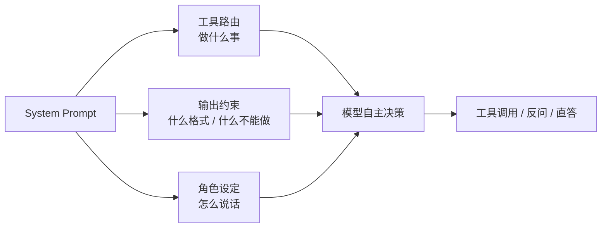

# 我删了 200 行 if-else，把决策逻辑全写进了 System Prompt

> 「AI Agent 工程化实战」系列 · 06
> 项目背景：广州气象大数据 + AI 智能体出行推荐系统（FastAPI + LangGraph + MCP + pgvector）
> 本文引用了 OpenAI / Anthropic 官方 Prompt Engineering 文档、ReAct 原始论文原文，链接见文末「参考资料」

---

## 0. 先用三句话讲清楚这篇在说什么

1. **要解决的问题**：用户问"明天去广州塔穿什么、怎么去"——这是三个问题（天气 + 穿搭 + 路线）。传统写法是在代码里写 `if "穿" in question: call_outfit()` 这种关键词分发，但**中文的自然表达是穷举不完的**（"不要穿太多"、"需要带外套吗"、"这天气该套几件"），规则只会越写越多。
2. **采用的方案**：把"什么时候调哪个工具、什么顺序、什么时候反问"这些**决策规则，写成自然语言的 System Prompt**，交给模型自己判断。代码只负责提供工具和执行，不再负责"想"。
3. **它的代价**：提示词是**软约束**——模型可能不遵守。所以真正稳的写法是"提示词负责决策、代码负责兜底"：能用确定性代码判断的，就别交给提示词。

如果你只想记一句话：

> **好的 Agent 提示词不是"人设介绍"，是一份决策手册**——每一行都该回答"遇到 X 情况，调用 Y，不要做 Z"。写不出这条规则，说明这个 Agent 的业务边界还没想清楚。

---

## 目录

1. 从一行我没敢删的 if-else 说起
2. 先讲清概念：提示词在 Agent 里的三种身份
3. 核心提示词逐条拆解（9 条决策规则）
4. 工具描述也是提示词：为什么 docstring 要写成"给模型看的"
5. 抗幻觉约束：一句话解决"编造日期"的问题
6. 进阶：多智能体里的提示词分工
7. 提示词的边界：什么时候别用提示词
8. 小结与下一篇

---

## 一、从一行我没敢删的 if-else 说起

一开始，这个项目的工具分发是靠关键词写的：

```python
# 早期写法（已废弃）
if any(k in question for k in ("穿", "穿搭", "衣服")):
    tools = [recommend_outfit]
elif any(k in question for k in ("天气", "气温", "下雨")):
    tools = [get_weather]
...
```

跑起来"能用"，但很快就崩了。用户的真实表达是这样长的：

| 用户实际输入 | 关键词能不能覆盖 |
| --- | --- |
| "明天爬山穿什么" | ✅ 命中"穿" |
| "需要带外套吗" | ❌ 一个字都没命中 |
| "这天气该套几件" | ❌ 同上 |
| "我怕冷，明天怎么穿" | ✅ 命中"穿"，但"怕冷"这个**关键参数**丢了 |

第三个问题是致命的：**关键词能判断"要不要触发工具"，但没法判断"该往工具里传什么参数"。** "怕冷"这个偏好，只有理解了整句话才知道要传给 `recommend_outfit(preference="怕冷")`。

你当然可以继续加规则——加"外套"、加"几件"、加"带伞"……然后发现这是个无底洞：**中文表达"同一个意思有 N 种说法"是常态，穷举永远落后一步。**

于是这个项目做了一个反直觉的决定：**把这一整块判断逻辑，从代码里搬进 System Prompt。**

---

## 二、先讲清概念：提示词在 Agent 里的三种身份

"提示词"这个词被用得太泛了。在 Agent 里，它其实承担三种完全不同的职责。分清楚这点，后面才不会写乱。

### 2.1 身份一：角色设定（人设）

就是最常见的那句"你是一个专业的 XX 助手"。它影响**语气和风格**：

```python
CHAT_SYSTEM_PROMPT = (
    "你是「广州天气旅行助手」，一个友好的本地出行服务 AI。"
    "用中文简洁友好地回答用户问题，控制在 100 字以内。"
)
```

**特点**：管"怎么说话"，不管"做什么事"。作用有限但必要——没有它，模型可能用很生硬的说明书语气回答生活问题。

### 2.2 身份二：工具路由（决策）—— 本篇重点

这是 Agent 提示词真正难写、也真正值钱的部分。它回答的是**行为决策**：

- 什么情况下调用哪个工具？
- 一个问题涉及多个方面时，按什么顺序调、要不要全调？
- 什么情况下**不调**工具、直接回答？
- 信息不足时，先反问还是先给方案？

这些规则写进提示词后，模型就变成了一个**会自己看情况行事的执行者**，而不是"你告诉它调什么它才调"的函数。

### 2.3 身份三：输出约束（格式与边界）

规定输出的**形态和红线**：

- 格式："只输出 JSON，形如 `{"domains": [...]}`"
- 边界："禁止编造数据，工具未返回的数据一律不得臆造"
- 篇幅："控制合理篇幅，复合问题可分点作答"

### 2.4 三者的关系



**关键认知**：三者里只有"工具路由"是**行为逻辑**，另外两个是**风格和护栏**。

- 写不好角色设定 → 回答语气生硬，但不影响功能；
- 写不好输出约束 → 格式炸掉、可能编数据；
- **写不好工具路由 → Agent 整个行为错乱**（该查的不查、查一半、参数传错）。

所以提示词工程在 Agent 里，**核心就是写好第二类**。

---

## 三、核心提示词逐条拆解（9 条决策规则）

项目的 `GENERATE_SYSTEM_PROMPT` 就是一份典型的"决策手册"。它由三部分拼成：一句人设 + 9 条决策规则 + 两行红线。

```python
GENERATE_SYSTEM_PROMPT = (
    "你是「广州天气旅行助手」，一个专业的本地出行服务 AI。\n"
    "请遵循以下决策规则：\n"
    # ... 9 条规则
    "禁止编造数据，工具未返回的数据一律不得臆造；数据不足时如实说明。\n"
    "用中文简洁友好回答，控制合理篇幅，复合问题可分点作答。"
)
```

逐条看这 9 条规则的设计意图。

### 规则 1：复合问题必须"全调"，不许只答一半

> 1. 一个复合问题往往同时涉及多个方面（如"明天去广州塔穿什么、怎么去"同时涉及天气+穿搭+路线），此时必须逐一调用所有相关工具：先 get_weather 查天气，再 recommend_outfit 出穿搭，再 plan_travel_route 出路线，最后整合成完整回答，**不要只答其中一部分**。

这条规则针对一个非常具体的失败模式：**模型倾向于"挑一个最明显的工具调完就收工"**。

"明天去广州塔穿什么、怎么去"这句话里，"怎么去"是最显眼的诉求。如果不加约束，模型很可能只调 `plan_travel_route` 给了路线，把"穿什么"忘掉——而用户明明问了两件事。

注意这条规则的三个写法细节：

1. **给了一个具体例子**（而不是抽象说"涉及多方面时都要处理"）——模型对例子的遵循度远高于抽象描述；
2. **明确了调用顺序**（天气 → 穿搭 → 路线）——因为穿搭需要天气作为前提，顺序错了结果就不对；
3. **点明了禁止行为**（"不要只答其中一部分"）——**明确禁止比正面要求更有效**，因为它堵死了那个具体的偷懒路径。

### 规则 2~7：每种意图对应的工具

这一组是"什么情况调什么工具"的主干：

| 规则 | 触发条件 | 调用工具 |
| --- | --- | --- |
| 2 | 需要实时天气 / 本地攻略 / 资讯 | `get_weather` `get_forecast` `search_knowledge` `search_news` |
| 3 | 有实时性但工具覆盖不到（开放情况、活动、票价） | `web_search` |
| 4 | 涉及用户上传的**资料/笔记** | `search_my_plans` |
| 5 | 涉及用户自己的**行程安排** | `check_itinerary_weather` |
| 6 | A 地到 B 地的**路线/交通** | `plan_travel_route` |
| 7 | **穿什么/穿搭** | `recommend_outfit` |

这里最值得学的是**规则 4 和规则 5 的区别**。这两个工具极其容易混：

- `search_my_plans` → 查用户的**文档**（上传的攻略、笔记）——非结构化文本
- `check_itinerary_weather` → 查用户的**行程表**——结构化（日期/地点/活动）

提示词里用了**双重手段**来区分它们：

```python
# 规则 4：明确规定"面向文档资料，不是行程表"
'4. 若问题涉及用户上传的资料/笔记...则调用 search_my_plans '
"检索该用户的私有知识库（面向文档资料，不是行程表）。\n"

# 规则 5：明确点名"不要用 search_my_plans"
'5. 若问题涉及用户自己添加的行程安排...必须调用 check_itinerary_weather'
"查询结构化行程表，不要用 search_my_plans。\n"
```

一条说"是文档不是行程表"，另一条说"别用那个用这个"——**从正反两面同时划定边界**。这是写歧义规则的标准手法：**光说"应该用 A"不够，还要说"别用 B"**，因为模型最容易犯的就是"用了一个看起来很像的工具"。

### 规则 8、9：直答与反问的边界

> 8. 若问题可直接回答，则直接简洁作答。
> 9. 能回答的部分先回答，确实缺失的关键信息（如具体出发地）再单独反问，**不要因为一个信息缺失就放弃整段回答**。

规则 9 是全篇最"产品化"的一条。它约束的是一个很常见的模型行为：**信息不全就整个摆烂**。

用户问"从广州南站到白云山怎么走"——模型发现没给出**目的地**，于是回一句"请提供目的地"就完了。但按规则 9，它应该：把能算的（广州南站到广州中心城区的参考方案）先给出来，再单独问一句白云山具体哪个门。

这个取舍在规则 6 里有对应实现：

```python
"若用户未给出出发地，先用默认出发地（广州中心城区）给出参考方案，"
"同时礼貌询问实际出发地以便精化。"
```

> **先给价值，再要信息。** 这条不只适用于 Agent，是交互设计里的通用原则。

### 9 条规则的结构规律

回头看这 9 条，其实是有套路的：

| 类型 | 规则 | 写法特点 |
| --- | --- | --- |
| 完整性约束 | 1、9 | 明确禁止"偷懒"行为，给具体例子 |
| 工具路由 | 2~7 | "若 <触发条件>，则调用 <工具>"的固定句式 |
| 降级规则 | 8 | 兜底：都不满足时直接答 |
| 红线 | 末尾两行 | 禁止编造 + 篇幅要求 |

**每一条都是"触发条件 → 动作"的形式**。这就是我在开篇说的"决策手册"——它不是散文，是**规则表**。

---

## 四、工具描述也是提示词：为什么 docstring 要写成"给模型看的"

这是很多人忽略的一点：**工具的描述文档（docstring）会作为提示词的一部分，被模型读到。**

看这个项目的工具定义——`async def get_weather(city: str) -> str:` 上面那段 docstring，不是给同事看的注释，**是给模型看的使用说明**：

```python
async def get_weather(city: str) -> str:
    """查询指定城市实时天气。

    参数 city 支持中文名、拼音、常见别名（如"广州"/"gz"/"广州塔"）。
    """
```

"支持中文名、拼音、常见别名"这半句话，直接决定了模型会不会去调用它——如果只写"查询天气"，模型看到拼音输入 `gz` 时可能认为"参数不对"而不调。

### 四个真实例子

对比看看这个项目里的 docstring 都是怎么写的：

**① 写清适用范围**（模型据此判断"这个工具能不能解决我的问题"）：

```python
async def web_search(query: str, max_results: int = 5) -> str:
    """联网搜索实时信息（Tavily 优先，DuckDuckGo 兜底）。

    用于回答知识库和天气 API 都覆盖不到的实时问题，如"广州塔今天开放吗"、
    "最近广州有什么活动""某景区最新门票价格"等。
    """
```

注意它**列举了适用的具体问题类型**——模型判断"我要不要用这个工具"时，靠的就是这几个例子。

**② 写清参数的可选值**（直接把枚举塞进描述）：

```python
async def recommend_outfit(city: str = "广州", scene: str = "", preference: str = "") -> str:
    """穿搭推荐：结合天气（温度/降水/风）+ 活动场景 + 用户偏好，生成贴合场景的穿搭建议。

    参数 scene 可选：爬山/逛街/夜游/商务/通勤/露营/骑行/观景/亲子/摄影；
    参数 preference 可选：怕冷/怕热/正式/运动/休闲/简约/时尚。
    """
```

`scene` 和 `preference` 是可选的字符串参数，**如果不把可选值列出来，模型会瞎编**（比如传 `scene="运动"`，但工具只认"爬山"）。把枚举写进 docstring，等于**给模型一份参数白名单**——这和函数签名里的类型标注是两种不同的约束：类型标注约束机器，docstring 约束模型。

**③ 写清边界行为**（越界时怎么办）：

```python
async def get_forecast(city: str, days: int = 3) -> str:
    """查询指定城市未来 N 天天气预报（1~7 天）。

    参数 days 越界时自动夹取到 1~7。
    """
```

"越界时自动夹取"这句告诉模型：**你可以放心传，不用自己判断合法性**。少了这句，模型可能在传 `days=10` 前先反复犹豫。

**④ 写清与其他工具的区别**（防混淆）：

```python
async def plan_travel_route(origin: str, destination: str, city: str = "广州") -> str:
    """出行规划：从出发地到目的地，返回多套出行方案，融合时间/费用/天气三维评分并带天气提示。

    适用"从广州南站到广州塔怎么走""去白云山坐地铁还是打车"等。
    """
```

### 一个隐含的坑

工具描述既然是提示词，就**必须和代码行为保持一致**。这个项目的 `mcp_server/tools.py` 顶部 docstring 里还写着"工具清单（Day 9）：3 个"，但实际已经注册了 **7 个**——这种文档滞后于人无害，但**如果滞后的是工具 docstring 本身的参数说明，模型就会被误导**（比如描述了已经不存在的参数）。

> 一句话记住：**工具 docstring 是提示词，不是注释。写它的时候，读者是模型，不是同事。**

---

## 五、抗幻觉约束：一句话解决"编造日期"的问题

这是项目里最"便宜"、效果最直接的一条提示词修改。

### 5.1 问题现场

开发早期，用户问"明天天气怎么样"，模型会回答：

> 明天（3 月 15 日）广州多云，气温 18~25℃……

**这个"3 月 15 日"是它编的。** 模型不知道"今天"是哪天——它的训练数据里没有"现在"。当上下文中没有任何日期信息时，它会**根据训练语料的统计规律"猜"一个看起来合理的日期**，然后煞有介事地写出来。

危险的地方在于：这句话**读起来完全正常**。如果不接真实天气工具，用户根本发现不了这是编的——**模型答得越流畅，幻觉越危险。**

### 5.2 解法

约束写在提示词的末尾（红线区）：

```python
"禁止编造数据，工具未返回的数据一律不得臆造；数据不足时如实说明。"
```

这句话做了三件事：

1. **明确禁止**（"禁止编造"）——告诉模型哪条线不能碰；
2. **划定范围**（"工具未返回的数据一律不得臆造"）——把"可信数据源"限定为工具返回值，暗示"你脑子里的知识不算数"；
3. **给出替代动作**（"数据不足时如实说明"）——**这条最关键**。

为什么第 3 点最关键？因为**只说"不许编造"是不够的**——模型被禁止编造后，遇到信息缺失时可能陷入两难：既不能说假话，又必须给出回答。它会很别扭地绕圈子。

**给它一个明确的"合法出口"**（如实说"我查不到"），它才知道该怎么合规地处理这种情况。这和给人定规矩是一个道理：只说"不许做什么"，不如同时说"该做什么"。

### 5.3 这条约束在多处复用

项目的多智能体模块里，同一条约束被抽象成了**所有领域 Agent 共用的底线规则**：

```python
SHARED_RULES = (
    "\n\n通用规则：\n"
    "1. 数据必须来自工具返回，**禁止编造**；查不到就如实说查不到。\n"
    "2. 只回答你负责的那部分，其他方面不用展开（有专门的助手在并行处理）。\n"
    "3. 用中文，简洁直接，不要写开场套话。"
)
```

三个领域 Agent 各自的人设提示词不同，但这条底线是共享的：

```python
messages: list = [
    SystemMessage(content=domain.prompt + SHARED_RULES),   # ← 拼在各自的人设后面
    HumanMessage(content=question),
]
```

**共同约束抽出来复用、个性部分各自写**——这是提示词复用的标准做法，和写代码时抽公共函数是一个思路。

---

## 六、进阶：多智能体里的提示词分工

项目后来演进出了 Supervisor 多智能体架构（单 Agent 之外的可选模式）。这时提示词不再是"一大段"，而是**按角色拆成几份**。

### 6.1 四类提示词，各司其职

| 提示词 | 角色 | 核心职责 |
| --- | --- | --- |
| `ROUTE_SYSTEM_PROMPT` | 调度员 | 判断这个问题需要哪些领域助手（可多选） |
| 领域 prompt × 5 | 专员 | 各自领域的工具使用规则 |
| `SHARED_RULES` | 共同底线 | 禁止编造 + 只答本领域 + 简洁 |
| `SYNTHESIZE_SYSTEM_PROMPT` | 主笔 | 把多份答复整合成一份连贯回答 |

### 6.2 调度员：输出必须是机器可读的

```python
ROUTE_SYSTEM_PROMPT = (
    "你是出行助手的调度模块。请判断用户的问题需要哪些领域助手参与，可多选。"
    "领域只有这些：weather（天气）、outfit（穿搭）、route（出行路线）、"
    "itinerary（用户的行程安排 / 新排行程 / 上传的攻略）、"
    "knowledge（景点美食攻略与资讯）。"
    '只输出 JSON，形如 {"domains": ["weather", "outfit"]}；'
    "如果问题与出行完全无关（闲聊、自我介绍等），返回空数组。"
)
```

这段有两个设计点：

**① 领域名做了"白名单枚举"。** "领域只有这些"这句话很重要——模型**天生喜欢发明新分类**（比如返回 `"traffic"`、`"weather_forecast"`）。一旦它编了一个不存在的领域名，下游查表就会 `KeyError`。

所以代码侧也有对应的防御（这是"提示词约束 + 代码兜底"配合的典型）：

```python
# 返回值**必须过滤**：模型可能编出不存在的领域名，
# 直接拿去查 DOMAINS 会 KeyError。
picked = [key for key in choice.domains if key in DOMAINS]
```

**② 明确给出了"空数组"这个选项。** "如果问题与出行完全无关……返回空数组"——又是一个"合法出口"。不给出这个出口，模型遇到闲聊类问题时会**硬凑一个领域**出来（因为它觉得必须选一个）。

### 6.3 主笔：汇总提示词的六条要求

```python
SYNTHESIZE_SYSTEM_PROMPT = (
    "你是出行助手的主笔，负责把几位领域助手的答复整合成**一份**连贯的回答。\n"
    "要求：\n"
    "1. 去掉重复内容（同一句天气信息可能被多个助手提到）\n"
    "2. 保留各自的关键结论与数字，不要丢信息、不要改数字\n"
    f"3. 按「{DOMAIN_ORDER_HINT}」的自然顺序组织\n"
    "4. 不要出现「某助手说」这类表述，直接给结论\n"
    "5. 不得编造任何未在下面出现的内容\n"
    "6. 用中文，分点或分段，控制合理篇幅"
)
```

六条里，**第 2 条和第 5 条是防幻觉/防失真的**，第 1、3、4 条是**可读性**，第 6 条是**格式**。

> 特别值得注意第 4 条："不要出现「某助手说」这类表述"。
>
> 这个细节是**实测出来的**——如果不约束，汇总输出会变成"天气助手说要带伞，穿搭助手说穿长袖，路线助手说……"这种**把内部架构泄漏给用户**的流水账。用户不关心你有几个 Agent，只关心答案。

配套的兜底也很实在：汇总失败不抛异常，而是按顺序直接拼接：

```python
def fallback_merge(answers: dict[str, str]) -> str:
    """汇总 LLM 失败时的兜底：按领域顺序直接拼接原文。

    **宁可读起来生硬，也不能丢信息或整体失败**——
    多域回答里每一块都是真实查到的结果，拼起来仍然可用。
    """
```

### 6.4 关键的一课：拆架构时，约束要"搬过去"

这是这个项目里最有价值的一个提示词教训。

单 Agent 时代，提示词里有一条约束：**问穿搭要同时查天气**（因为穿搭建议需要天气作前提）。规则 1 里就写着"先 get_weather 查天气，再 recommend_outfit 出穿搭"。

拆成多智能体后，穿搭 Agent 和天气 Agent **变成了两个独立的节点**——原来那条"顺手一起做"的约束**消失了**。结果是：用户问"明天爬山穿什么"，穿搭 Agent 给出"建议穿冲锋衣"，但**没有"明天 18℃ 有雨"这个前提**——建议悬空了。

修复方式很明确——把这条依赖**显式补回来**：

```python
# 领域依赖：命中左边时，右边也要一起跑。
#
# 目前只有一条：**穿搭依赖天气**。用户问"明天爬山穿什么"时，
# 他想要的不只是"建议穿冲锋衣"，还有"明天 18℃ 有雨"这个前提——
# 少了它，穿搭建议就是悬空的。实测单 Agent 的提示词里也是这么要求的
# （要求同时调天气与穿搭），多 Agent 拆分后这条约束必须显式补回来，
# 否则会静默地比原来答得少。
DOMAIN_DEPENDS: dict[str, tuple[str, ...]] = {
    "outfit": ("weather",),
}
```

注释里还刻意记录了**为什么反过来不加**：

```python
# 反过来刻意**不加**：
# - route → weather：路线评分内部已经含天气，再加一次是重复调用
# - itinerary → weather：check_itinerary_weather 本身就会取当天天气
```

> **这是本篇最想说的一课**：提示词里的隐式约束（"顺手一起做"）在架构拆分时**会静默丢失**——不报错，只是答得比以前少。所以拆分架构时，必须回头把所有隐式约束列出来，一条条确认"新架构里谁负责它"。

---

## 七、提示词的边界：什么时候别用提示词

这一章是"劝退"——**提示词不是万能的，滥用会挖坑。**

### 7.1 提示词是"软约束"

提示词的本质是**请求模型遵守**，不是**强制**。模型可能在 100 次里遵守 90 次——那 10 次就是线上 bug。

所以判断标准很清楚：

| 情况 | 用什么 |
| --- | --- |
| 结果需要**100% 确定** | **代码**（if-else、枚举、正则） |
| 需要**理解自然语言**、容忍偶尔失误 | 提示词 |
| 需要确定但**表达形式多样** | **代码判断 + 提示词兜底** |

### 7.2 项目里的三个实例

**实例一：意图识别——关键词优先，LLM 兜底。**

项目**没有**把意图判断全交给 LLM，而是先跑一遍**强关键词预判**，命中就直接定意图：

```python
def route_domains(text: str) -> list[str]:
    """按关键词把问题路由到一个或多个领域（纯函数，不调 LLM）。"""
    hit = {key for key in DOMAIN_ORDER if DOMAINS[key].matches(text)}
    ...
```

而且注释里明确写了**为什么关键词只放高置信词**：

```python
# keywords 只放**高置信**的词：命中即路由，不再问 LLM。
# 弱词（如「推荐」「怎么样」）故意不放——它们会把闲聊误判成业务意图。
```

**为什么要这样混合？** 因为关键词是**免费 + 确定**的（0 延迟、0 token、结果稳定），LLM 是**贵 + 有波动**的。凡是能用关键词稳稳判断的，就别花那次 LLM 调用——**这既是省钱，也是提高确定性。**

**实例二：模板式表达，用正则而不是关键词枚举。**

这个细节特别能说明问题：

```python
# 排行程的请求多是模板式表达（"周末想去广州玩两天"/"帮我排个三日游"），
# 固定关键词覆盖不全，用正则兜住
patterns=(
    r"玩[0-9一二三四五六七八九十两]+天",
    r"[0-9一二三四五六七八九十两]+日游",
    r"排[个一]?份?行程",
    r"规划.{0,4}行程",
),
```

**这个缺口是实测发现的**：

```python
# （这个缺口是实测发现的：'周末想去广州玩两天' 原本路由不到行程领域。）
```

"玩两天 / 玩三天 / 玩五天"，关键词要枚举到天荒地老；一条正则 `玩[0-9一二三四五六七八九十两]+天` 全覆盖。**能用正则表达的规则，就别去求模型。**

**实例三：硬上限不能靠提示词。**

多智能体里每个领域 Agent 的循环步数是**代码写死的**：

```python
async def run_domain_agent(key: str, question: str, tools: list, max_steps: int = 3) -> DomainRun:
    """跑一个领域 Agent 的 ReAct 循环（工具 → 再推理），返回结果与开销。

    max_steps 是**硬上限**：模型偶尔会反复调用同一个工具，
    没有上限就会一直烧 token 直到超时。
    """
```

**这条绝对不能写进提示词**（写"最多调 3 次工具"）——因为模型可能不遵守，然后无限循环烧钱。**安全边界必须用代码，不能用请求。**

### 7.3 一个判断口诀

> **能用确定性代码判断的，别交给提示词；需要理解自然语言、能容忍小概率失误的，交给提示词；两者都要的，用"代码优先 + 提示词兜底"。**

这个项目几乎所有"看起来该用提示词"的地方，最后都采用了第三种写法。

---

## 八、小结与下一篇

### 可复用清单

- **写"决策手册"，不写"人设介绍"**：每条规则都是"若 <触发条件>，则 <动作>"，明确禁止比正面要求更有效。
- **必须给具体例子**：模型对例子的遵循度远高于抽象描述（"明天去广州塔穿什么、怎么去"）。
- **歧义规则要从正反两面写**：说"应该用 A"的同时说"别用 B"（`search_my_plans` vs `check_itinerary_weather`）。
- **一定要给"合法出口"**：禁止编造的同时要说"如实说明查不到"；让选领域的同时要允许"返回空数组"。否则模型会别扭地硬凑。
- **给信息缺失留后路**：先给能给的（默认出发地方案），再单独反问缺的那一项。
- **docstring 是提示词**：写清适用范围、参数可选值、越界行为、与相似工具的区别——读者是模型。
- **共同约束抽出来复用**（`SHARED_RULES`），个性部分各自写。
- **拆架构时，回头检查隐式约束**：提示词里"顺手一起做"的要求，拆分后会静默丢失（穿搭依赖天气就是实例）。
- **守住提示词的边界**：需要 100% 确定的走代码（硬上限、枚举、正则），提示词只做"理解自然语言"这部分。
- **代码兜底不可省**：模型可能编出不存在的领域名 → 必须 `if key in DOMAINS` 过滤。

### 代码位置

`backend/app/services/agent.py`（`GENERATE_SYSTEM_PROMPT` / `CHAT_SYSTEM_PROMPT` / `INTENT_SYSTEM_PROMPT` / `TOOL_INTENTS` / `_STRONG_INTENT_KEYWORDS`）、`backend/app/services/agent_registry.py`（5 个领域 prompt + 关键词 + 正则 patterns + `DOMAIN_DEPENDS`）、`backend/app/services/multi_agent.py`（`ROUTE_SYSTEM_PROMPT` / `SYNTHESIZE_SYSTEM_PROMPT` / `GENERAL_SYSTEM_PROMPT` / `SHARED_RULES` / `max_steps` 硬上限 / `fallback_merge`）、`backend/mcp_server/tools.py` 与 `backend/app/services/local_tools.py`（各工具 docstring）。

### 下一篇预告

讲到这，Agent 的"决策"和"数据"两条线都通了。但还有一件事没交代：**回答是怎么一个字一个字流到用户眼前的？** 以及——用户问完"穿什么"，接着问"那吃的呢"，系统怎么知道**还在聊同一个话题**？下一篇进**流式输出与多轮记忆**：SSE 事件协议怎么设计、为什么必须按节点名过滤增量（否则意图标签会混进答案）、前端为什么用不了 axios、以及上下文怎么截断才不爆。

---

## 参考资料

1. OpenAI 官方文档 · [Prompt Engineering Guide](https://platform.openai.com/docs/guides/prompt-engineering)（"Write clear instructions"、"Provide reference text" 等六条策略的官方出处）
2. Anthropic 官方文档 · [Prompt engineering overview](https://docs.anthropic.com/en/docs/build-with-claude/prompt-engineering/overview)（"Be clear and direct"、"Use examples (multishot)"、"Allow Claude to say 'I don't know'"——"给合法出口"的官方依据）
3. Yao et al., [*ReAct: Synergizing Reasoning and Acting in Language Models*](https://arxiv.org/abs/2210.03629)（Agent 工具循环的原始论文，"推理 + 行动"交替的范式来源）
4. OpenAI 官方文档 · [Function calling / Tool descriptions](https://platform.openai.com/docs/guides/function-calling)（工具描述如何影响模型的调用决策）
5. Anthropic 官方文档 · [Tool use (function calling)](https://docs.anthropic.com/en/docs/agents-and-tools/tool-use/overview)（工具描述的写法建议与 Best practices）
6. LangChain 官方文档 · [Prompt templates / SystemMessage](https://python.langchain.com/docs/concepts/prompt_templates/)（SystemMessage 与消息角色的组织方式）
