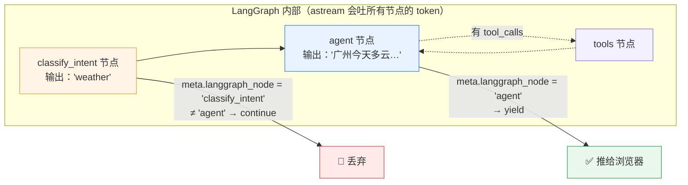
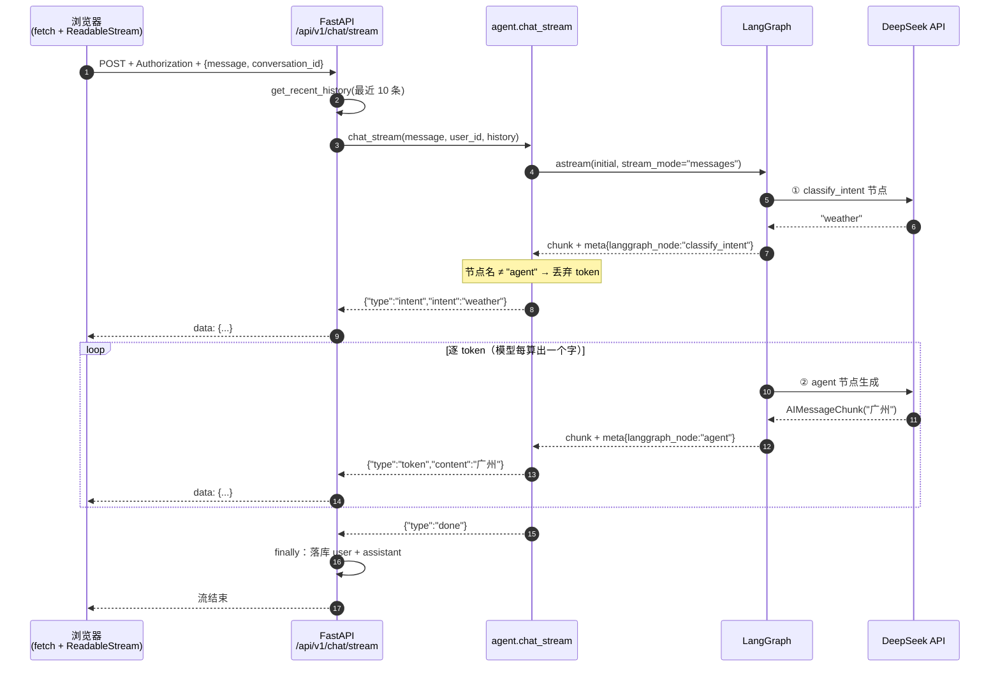

# 答案一个字一个字往外蹦，聊天记录却一条都没存下来

> 一个被 `fetch` 绕过的鉴权、一个会混进答案的节点，和 SSE 流式输出的三个真坑。

> 「AI Agent 工程化实战」系列 · 07
> 项目源码：**[Ticnix/weather-travel-recommend-system](https://github.com/Ticnix/weather-travel-recommend-system)**
> 基于气象大数据的出行推荐系统，AI Agent 全栈项目。FastAPI + PostgreSQL(TimescaleDB/pgvector/PostGIS) + Redis；
> LangGraph + MCP + Skill + RAG，对接 DeepSeek API；React/Vue 前后端分离，实现 3D 天气可视化、智能出行穿搭推荐。
> （项目仍在更新中）

---

## TL;DR

三句话讲清这篇在讲什么：

1. **怎么让答案逐字蹦出来**：后端用 `sse_starlette` 把 LLM 的 token 流原样推给浏览器，前端用 `fetch` + `ReadableStream` 手动解析（`axios` 读不了流，`EventSource` 又发不了带 `Authorization` 的 POST）。
2. **最难的不是推 token，是"不该推的别推"**：意图识别节点也在调 LLM，它吐出来的 `weather` 会混进答案开头——必须按 `langgraph_node` 过滤，只转发真正产出答案的那个节点。
3. **我踩的坑**：流式对话看起来一切正常，但登录用户的聊天记录是空的。原因是 `fetch` 绕过了 axios 拦截器，没带 token，后端把已登录用户当成了匿名——而"匿名不落库"是**静默**生效的，一行错误日志都没有。

---

## 目录

- [一、先看一个"什么都对，就是没存下来"的 bug](#一先看一个什么都对就是没存下来的-bug)
- [二、概念先行：SSE 到底是什么](#二概念先行sse-到底是什么)
- [三、协议设计：三种事件，各管一件事](#三协议设计三种事件各管一件事)
- [四、后端：从 LLM 的一个 token 到浏览器的一帧](#四后端从-llm-的一个-token-到浏览器的一帧)
- [五、前端：为什么用不了 axios，也用不了 EventSource](#五前端为什么用不了-axios也用不了-eventsource)
- [六、三个真坑（附实测数据）](#六三个真坑附实测数据)
- [七、多轮记忆：10 条消息、一个 SQL 陷阱，和一个一致性边界](#七多轮记忆10-条消息一个-sql-陷阱和一个一致性边界)
- [八、小结与下一篇](#八小结与下一篇)

---

## 一、先看一个"什么都对，就是没存下来"的 bug

这是这个项目里我排查得最久的一次，因为它**哪里都不报错**。

现象是这样的：

- 提问 → 答案逐字蹦出来，流式效果完全正常；
- 点开左侧"历史对话"侧栏 → 空的；
- 刷新页面 → 刚才聊的几轮，一条都没了。

第一反应是"数据库写失败了"，于是去看后端日志——**干干净净**。没有异常、没有报错，连一条 warning 都没有。

### 定位过程

顺着链路往回查，问题出在一段代码注释里（我后来把它写进了源码，就是为了不要再忘）：

```ts
// frontend-user/src/api/chat.ts

/**
 * 发起 SSE 流式对话，逐事件回调。
 *
 * ⚠️ 这里必须用原生 fetch（axios 不适合逐块读取流），
 * 但因此**需要手动带上 Authorization** —— axios 的请求拦截器管不到 fetch。
 * 此前漏了这一步，导致已登录用户被后端当成匿名：
 * 对话不落库、左侧历史里自然也看不到。
 */
```

`fetch` 是全局函数，不经过 axios 的实例拦截器。而项目的 token 是在 `http.ts` 的拦截器里统一注入的——所以 `streamChat` 发出去的请求**没有 `Authorization` 头**。

后端这边，对话接口用的是"可选鉴权"：

```python
# backend/app/routers/chat.py

@router.post("/stream")
async def chat_stream(body: ChatRequest, current: OptionalUser = None):
    ...
    user_id = current.id if current else None
```

没带 token → `current` 是 `None` → `user_id = None`。然后：

```python
# backend/app/services/chat_history_service.py

async def add_message(user_id, conversation_id, role, content, db=None):
    """保存一条消息。匿名用户（user_id=None）不持久化，仅返回。"""
    if user_id is None:
        return {"role": role, "content": content, "saved": False}
```

**它不抛异常，它返回 `saved: False`。**

而调用处是这么写的：

```python
# backend/app/routers/chat.py —— finally 里
if user_id is not None and full_answer:
    await chat_history_service.add_message(user_id, conversation_id, "user", body.message)
    await chat_history_service.add_message(user_id, conversation_id, "assistant", full_answer)
```

返回的 `{"saved": False}` 被丢在地上，没人看。

### 这里的教训

三件事叠加，凑出了一个"最难查"的 bug：

| 因素 | 为什么它让 bug 更难查 |
| --- | --- |
| **可选鉴权**（`OptionalUser`） | 未登录是**合法状态**，所以"没有 user_id"不会报错，只会静默降级 |
| **静默跳过**（`return {"saved": False}`） | 失败信号是一个返回值，不是异常——调用方不检查就等于没有 |
| **功能半失效** | 回答正常，只有"历史"这个次要功能没了。用户不一定会立刻反馈 |

我后来总结出一条经验：**"可选鉴权 + 静默跳过"是最容易埋雷的组合**。可选让异常状态变成正常状态，静默让正常状态看不出异常。如果要保留匿名可用（这是产品决策，是对的），那至少要满足其中一条：调用方**检查返回值**、或者失败时**打一条 info 日志**（`logger.info("匿名对话，跳过持久化")`）。

修法也很简单，返回真正的错误总比默默吞掉好：

```ts
const token = getToken()
const resp = await fetch('/api/v1/chat/stream', {
  method: 'POST',
  headers: {
    'Content-Type': 'application/json',
    ...(token ? { Authorization: `Bearer ${token}` } : {}),   // ← 这一行是关键
  },
  body: JSON.stringify({ message, conversation_id: conversationId }),
})
```

一行 `Authorization`，历史就回来了。

不过——**为什么这里非得用 `fetch`？** 用 axios 不就自动带上了吗？要回答这个，得先把 SSE 讲清楚。

---

## 二、概念先行：SSE 到底是什么

### 一句话定义

**SSE（Server-Sent Events）就是一个"只往一个方向流动的纯文本 HTTP 响应"。** 服务器不一次性把响应体发完，而是发一段、停一会儿、再发一段，浏览器边收边处理。

MDN 对它的描述是：

> The server-side script that sends events needs to respond using the MIME type `text/event-stream`. Each notification is sent as a block of text terminated by a pair of newlines.
>
> —— [MDN: Using server-sent events](https://developer.mozilla.org/en-US/docs/Web/API/Server-sent_events/Using_server-sent_events)

两个关键点：**MIME 必须是 `text/event-stream`**，**一条消息以"一对换行"结尾**。就这么朴素。

### 为什么大模型对话天生适合 SSE

因为 LLM 本身就是**一个 token 一个 token 往外吐的**。DeepSeek、OpenAI、通义千问，它们的接口都支持流式返回——模型每生成一个 token，HTTP 响应体就多几个字节。

所以链路的本质是：

```
模型在算第 1 个字  → 吐出来 → 立刻转发给浏览器
模型在算第 2 个字  → 吐出来 → 立刻转发给浏览器
...
```

用户看到的"打字机效果"不是前端做的动画，而是**真的在等模型算下一个字**。首字延迟（Time To First Token）几百毫秒，用户立刻有反馈；如果等整段生成完再返回，那就是"转圈 8 秒，然后唰一下出来一大段"。

这也是为什么流式不是"体验优化"，而是**把同一个延迟变成可感知的进度**。

### SSE vs WebSocket：别一看到"实时"就上 WebSocket

很多人第一反应是"实时推送 = WebSocket"。但这里的需求是**单向的**：用户的问题已经在请求体里发出去了，之后只需要服务端往回推。

| 维度 | SSE | WebSocket |
| --- | --- | --- |
| 通信方向 | 服务端 → 客户端（单向） | 双向 |
| 底层协议 | 就是普通 HTTP 请求 | 独立协议，需要 `Upgrade` 握手 |
| 浏览器 API | `EventSource`，或 `fetch` + 流 | `WebSocket` |
| 自动重连 | `EventSource` 内置 | 需自己实现 |
| 认证 | 复用 HTTP header | 握手时可带，后续帧没有 header 概念 |
| 适合 | LLM 逐 token、进度条、日志推送 | 聊天室、协同编辑、游戏 |

**结论**：LLM 对话用 SSE，是一个"需求匹配 + 少造轮子"的选择。

> 顺带说一句：`EventSource` 的**自动重连**在这里反而是**有害**的。想象一下网络抖了一下，浏览器默默把同一句"广州塔怎么去"又发了一遍——用户会看到答案从头开始重复蹦。而用 `fetch` 手动读流没有这个行为，流断了就是断了，前端可以自己决定怎么提示。这也是我们最终选 `fetch` 的原因之一。

---

## 三、协议设计：三种事件，各管一件事

服务端推的每一条消息，`data` 字段里是一个 JSON：

| `type` | 载荷 | 作用 | 谁在等它 |
| --- | --- | --- | --- |
| `intent` | `{"intent": "weather"}` | 意图识别结果 | 前端要立刻显示"正在查询天气…"这种过程提示 |
| `token` | `{"content": "广州今天"}` | 答案的一个片段 | 前端把它追加到气泡里 |
| `done` | 无 | 明确告知"推完了" | 见下 |

对应 `chat.py` 里的 docstring，就是这三行：

```python
"""
事件格式：
  - data: {"type": "intent", "intent": "weather"}    # 意图
  - data: {"type": "token", "content": "广州今天"}   # token 片段（可多个）
  - data: {"type": "done"}                            # 结束
"""
```

### 为什么 `intent` 要单独推一次

因为从"用户按下回车"到"第一个 token 到达"，中间有几百毫秒是**纯等待**。这段时间里模型在做意图识别和工具调用准备——用户看不到任何东西。

先推一个 `intent`，前端就能马上显示"正在查询天气数据…"。**这不是技术必需，是体验必需**：把"系统在干活"这件事尽早告诉用户。

前端消费它的代码长这样：

```tsx
// frontend-user/src/pages/Chat.tsx
if (evt.type === 'intent') {
  setMessages((prev) => {
    const next = [...prev]
    const last = next[next.length - 1]
    if (last?.role === 'assistant') last.intent = evt.intent   // 挂到最后那条 AI 消息上
    return next
  })
}
```

### 关于 `done` 的一个诚实说明

我翻了一遍前端的处理逻辑，目前**只消费了 `intent` 和 `token`**，`done` 落在了 `else` 分支里被忽略——因为 `streamChat` 的 `while (true)` 循环在 `reader.read()` 返回 `done: true` 时会 `break`，函数返回后 `finally` 里把 `streaming` 状态置为 `false`。也就是说，**流的结束本身已经充当了终止信号**。

那我为什么还留着它？

- 如果哪天换成 `EventSource`，"流结束"和"服务端主动结束"是两回事（浏览器会试图重连），那时一个明确的 `done` 就是必需的；
- 它让协议**自解释**：读代码或抓包的人，一眼能看出这是一次有始有终的对话，而不是"推着推着断了"。

**协议里留一个当下用不到的字段，只要它的语义是清晰的，就不是浪费。** 但前提是你知道它现在没被用——而不是以为它被用了。

---

## 四、后端：从 LLM 的一个 token 到浏览器的一帧

### 入口：一个 `EventSourceResponse` 包住一个 async generator

```python
# backend/app/routers/chat.py
from sse_starlette.sse import EventSourceResponse

@router.post("/stream")
async def chat_stream(body: ChatRequest, current: OptionalUser = None):
    user_id = current.id if current else None
    conversation_id = body.conversation_id or uuid.uuid4().hex[:16]
    history = await chat_history_service.get_recent_history(user_id, conversation_id)

    async def event_generator():
        full_answer = ""
        try:
            async for evt in agent.chat_stream(body.message, user_id=user_id, history=history):
                etype = evt.get("type")
                if etype == "token":
                    full_answer += evt.get("content", "")
                yield {"event": "message", "data": json.dumps(evt, ensure_ascii=False)}
        except Exception:  # noqa: BLE001
            yield {"event": "message", "data": json.dumps(
                {"type": "token", "content": "抱歉，AI 服务暂时不可用，请稍后重试。"},
                ensure_ascii=False)}
        finally:
            if user_id is not None and full_answer:
                await chat_history_service.add_message(user_id, conversation_id, "user", body.message)
                await chat_history_service.add_message(user_id, conversation_id, "assistant", full_answer)

    return EventSourceResponse(event_generator())
```

这段代码里藏着三个值得单独说的设计：

**① 路由层不碰 LLM，只做协议转换。** `agent.chat_stream` 是**同步语义的 async generator**——它 `yield` 的是 Python dict，不知道 SSE 存在。把 dict 翻译成 `data: {...}` 是路由层的活。**这是"业务逻辑与协议分层"，和第 02 篇 MCP 里 `tools.py` 只写纯函数、`server.py` 负责翻译是同一个思路。**

**② 边推边攒 `full_answer`。** 落库需要完整答案，但流已经开始推了，不可能回头。所以用一个累加器，在推的过程中同步记住。

**③ 落库放在 `finally` 里。** 因为流式过程中任何一步抛异常（工具超时、模型返回异常），前面已经推给用户的文字**已经发出去了，收不回来**。此时如果不落库，用户看到的内容和数据库里存的就对不上。放在 `finally` 里，至少保证"用户看到什么，就存什么"。

### 核心：只转发 `agent` 节点的 token

这是本篇技术含量最高的一处。先看代码：

```python
# backend/app/services/agent.py
# 再流式生成：逐 token 推送，仅输出「agent 生成节点」的文本增量，
# 跳过 classify_intent 节点的输出（其内容是意图标签，不应作为答案推送）
async for chunk in ag.astream(initial, stream_mode="messages"):
    msg_chunk = chunk[0] if isinstance(chunk, tuple) else chunk
    meta = chunk[1] if isinstance(chunk, tuple) else {}
    if meta.get("langgraph_node") != "agent":
        continue
    if isinstance(msg_chunk, AIMessageChunk):
        piece = msg_chunk.content
        if isinstance(piece, str) and piece:
            yield {"type": "token", "content": piece}
```

`astream(initial, stream_mode="messages")` 会**把图里每一个 LLM 调用产生的 token 都吐出来**——注意是"每一个"。而这个图里有两个节点会调 LLM：

- `classify_intent`：输入用户问题，输出一个意图标签（`weather` / `outfit` / `chat`…）；
- `agent`：真正的答案生成。

如果不过滤，用户会先看到答案开头莫名其妙多了几个字符。LangGraph 官方文档对这个场景的指引非常直白：

> To stream tokens only from specific nodes, use `stream_mode="messages"` and filter the outputs by the `langgraph_node` field in the streamed metadata.
>
> "Use the `messages` streaming mode to stream Large Language Model (LLM) outputs **token by token** from any part of your graph, including nodes, tools, subgraphs, or tasks. The streamed output from `messages` mode is a tuple `(message_chunk, metadata)`."
>
> —— [LangGraph Docs: Streaming](https://docs.langchain.com/oss/python/langgraph/streaming)

用图表示就是：



这里的 `chunk[0] if isinstance(chunk, tuple) else chunk` 是个**版本兼容写法**：不同 LangGraph 版本对 `astream` 的返回结构（裸 `AIMessageChunk` 还是 `(chunk, metadata)` 元组）有差异，这行代码让它两头都能跑。这种"不优雅但能活"的代码，在快速迭代的项目里其实很常见。

### 多智能体版本：同一个约束，更复杂的判断

项目里还有一条 Supervisor 多智能体路径（`AGENT_MODE=multi`）。它的过滤条件不是写死的节点名，而是**根据用户问题命中的领域数动态决定转发谁**：

```python
# backend/app/services/multi_agent.py
def stream_source_node(domains: list[str]) -> str:
    """流式时只转发哪个节点的 token（纯函数）。

    - 1 个领域 → 该领域节点（它的输出就是最终答案）
    - ≥2 个领域 → 汇总节点（转发领域节点会让用户把内容看两遍）
    - 0 个领域 → 通用回答节点
    """
    if len(domains) == 1:
        return f"domain_{domains[0]}"
    if len(domains) > 1:
        return "synthesize"
    return "general"
```

为什么 ≥2 个领域时不转发领域节点？因为那意味着穿搭、天气两个专员**并行**各写了一段，然后由一个 `synthesize` 节点汇总成最终答案。如果转发领域节点，用户会先看到两段"分部回答"，再看到一遍"汇总回答"——**内容看了两遍**。源码注释里就是这么写的：

> 与单 Agent 的流式实现同一个约束：**只转发最终产出节点的 token**，否则会把中间过程（领域分段的草稿）也推给用户，用户会先后看到"分段回答"和"汇总回答"，等于内容看了两遍。

**同一个坑，在拆架构之后换了个形态又出现了一次。** 这类问题不会报错，只是"答得不对味"——这也是我在第 06 篇里讲过的结论：架构演进时，隐式约束最容易静默丢失。

### 完整链路



---

## 五、前端：为什么用不了 axios，也用不了 EventSource

这里有个"双向堵死"的局面，值得单独讲。

### 为什么不用 `EventSource`

`EventSource` 是浏览器内置的 SSE 客户端，用起来极简单：

```js
const es = new EventSource('/api/v1/chat/stream')
es.onmessage = (e) => console.log(e.data)
```

但它有两个致命限制，恰好都撞在我们的需求上：

| 需求 | `EventSource` 的能力 | 结果 |
| --- | --- | --- |
| 发消息要用 **POST**，带 JSON 请求体 | 只能 GET，不能带请求体 | ❌ |
| 请求要带 **`Authorization: Bearer <jwt>`** | 不能自定义请求头 | ❌ |
| 服务端要主动结束 | 内置自动重连 | ❌（反效果） |

第一、二条基本就判了死刑：用户问题放在 URL 里既超长又难看，token 也没地方塞。

### 为什么不用 axios

那退一步，用 axios 发 POST，拿它的流式响应？也不行——**axios 把响应体当作整体处理**，它的 `response` 是一个已经读完的完整对象，拿不到"边到边读"的句柄。要逐块读，需要浏览器原生的 `ReadableStream`。

所以最终方案是：**`fetch` + `resp.body.getReader()`**。代价是——`fetch` 不走 axios 拦截器，`Authorization` 要手写。于是就有了第一章那个 bug。

> 这三件事其实是一条链：`EventSource` 不能用（发不了带鉴权的 POST）→ 换 `fetch` → `fetch` 绕过拦截器 → `Authorization` 漏带 → 后端当匿名 → 静默不落库。**一个技术选型，四步之后变成一个排查了三小时的 bug。**
> 这也是为什么我在源码注释里把这段因果完整写下来——下次有人想换个写法，能先看到代价。

### 手动解析：这 20 行是整篇文章最核心的代码

```ts
// frontend-user/src/api/chat.ts
const reader = resp.body.getReader()
const decoder = new TextDecoder()
let buffer = ''

while (true) {
  const { done, value } = await reader.read()
  if (done) break
  buffer += decoder.decode(value, { stream: true })

  const lines = buffer.split('\n')
  buffer = lines.pop() ?? ''        // ← 最后一段可能是不完整的，留到下一轮

  for (const line of lines) {
    const trimmed = line.trim()
    if (!trimmed.startsWith('data:')) continue
    const payload = trimmed.slice(5).trim()
    if (!payload) continue
    try {
      onEvent(JSON.parse(payload) as StreamEvent)
    } catch {
      // 忽略无法解析的行
    }
  }
}
```

四行代码，四个必须理解的细节：

**① `reader.read()` 给的是"任意长度的字节块"，不是"一条消息"。**
TCP 是字节流，没有消息边界。`reader.read()` 可能在任何一个字节处返回。所以**必须自己拼**。

**② `buffer = lines.pop() ?? ''` 是这段代码的灵魂。**
`split('\n')` 之后，最后一段很可能是一个被切断的半条消息（比如只收到了 `data: {"type":"tok`）。把它 `pop()` 出来留在 `buffer` 里，等下一块字节到了再拼起来。**没有这一行，就会丢消息——而且是偶发的、难以复现地丢。**

**③ `decoder.decode(value, { stream: true })` 的 `stream: true` 不能省。**
中文一个字 3 字节（UTF-8），完全可能被切在中间。`{ stream: true }` 告诉 `TextDecoder`："这还没完，不完整的字节序列先留住"——它是**跨块有状态**的。

**④ `trim()` 去的是协议层的空白，不是正文的空白。**
`sse-starlette` 默认用 `\r\n` 做行分隔，`split('\n')` 之后每行尾部会留一个 `\r`，靠 `trim()` 清掉。而形如 `" 前后有空格 "` 这种**正文里的**空格是安全的——它在 JSON 引号里面，`trim()` 碰不到它（这一点我实测过，见下一章）。

---

## 六、三个真坑（附实测数据）

### 坑 1：半包——不暂存就丢消息

上面第 ② 点我说"会丢消息"，但这个说法值不值得信？我写了个脚本实测了一下：**把后端真实会产生的字节流，按固定 7 字节切片喂给解析器**，对比"有 buffer"和"没 buffer"两种写法。

先看看后端真实产生的字节流长什么样（这段我用 Python 按 `sse-starlette` 的真实输出格式构造）：

```python
parts = [": ping - 2026-09-18 09:54:00\r\n\r\n"]
for e in evts:
    parts.append("event: message\r\n")
    parts.append("data: " + json.dumps(e, ensure_ascii=False) + "\r\n\r\n")
```

实测结果（同一份字节流、同样的切片方式，唯一差别是**要不要把最后一段不完整的行暂存到下一轮**）：

```
A（有 buffer，项目写法）：拿到 6 条事件，解析失败 0 条
[{type:intent,intent:weather}, {type:token,content:广州今天}, {type:token,content:多云，28℃},
 {type:token,content:第一行\n第二行}, {type:token,content: 前后有空格 }, {type:done}]

B（无 buffer，每次 read 直接切行）：只拿到 3 条，且 3 条全部解析失败
["PARSE_FAIL", "PARSE_FAIL", "PARSE_FAIL"]
```

**6 比 3，而且那 3 条还是坏的。** 这就是那一行 `buffer = lines.pop()` 的价值。

顺带这次实测还验证了两个我原本不确定的细节：

**（1）正文里的换行会不会破坏 SSE 的"一行一字段"结构？不会。**

```
json.dumps({"type": "token", "content": "第一行\n第二行"}, ensure_ascii=False)
→ '{"type": "token", "content": "第一行\\n第二行"}'
其中是否含真实换行: False
```

`json.dumps` 会把真实的换行符转义成 `\n` 两个字符。**所以 `data:` 这一行永远是一条完整的行，不会被正文里的换行劈成两半。** ——这正是"为什么不直接推裸文本、而要套一层 JSON"的答案：JSON 序列化顺手把控制字符转义了，等于免费得到了一层协议安全。

**（2）`trim()` 不会吃掉正文前后的空格。**
实测里 `" 前后有空格 "` 原样保留到了前端（因为它被 JSON 引号包着）。而它清掉的 `\r` 是协议分隔符。这个边界很容易写反——如果哪天有人把 `trim()` 去掉，换行符残留进 `payload`，`JSON.parse` 其实还能容忍（JSON 规范允许值前后有空白），但会更脆弱；如果有人在 `slice(5)` 之后**不做 trim** 且 payload 是裸文本，那空格就真丢了。

### 坑 2：心跳注释行

`sse-starlette` 默认每 **15 秒**发一次 ping，用来防止连接被中间设备掐断。看它的参数表：

| 参数 | 默认值 | 说明 |
| --- | --- | --- |
| `ping` | `15` | 心跳间隔（秒），`0` 表示关闭 |
| `sep` | `"\r\n"` | 行分隔符（`\r\n` / `\r` / `\n`） |
| `send_timeout` | `None` | 发送超时 |

> "`ping` | `int` | 15 | Ping interval in seconds (`0` disables keep-alive pings)"
> "`sep` | `str` | `"\r\n"` | Line separator (`\r\n`, `\r`, `\n`)"
>
> —— [sse-starlette README](https://github.com/sysid/sse-starlette)

这个 ping 长这样：`: ping - 2026-09-18 09:54:00`。**以冒号开头。**

MDN 对这个格式有明确定义：

> A colon as the first character of a line is in essence a comment, and is ignored.
> **Note:** The comment line can be used to prevent connections from timing out; a server can send a comment periodically to keep the connection alive.
>
> —— [MDN: Using server-sent events](https://developer.mozilla.org/en-US/docs/Web/API/Server-sent_events/Using_server-sent_events)

前端那句 `if (!trimmed.startsWith('data:')) continue` 正好把注释行跳过去了——**它看起来是为了跳过 `event:` 行，实际上顺手把心跳也挡了**。我在实测里特意在流中间插了一条 ping，结果 6 条事件一条不多一条不少。

如果那句 `continue` 没写，`JSON.parse(': ping - ...')` 会抛异常——好在外面有 `try/catch`，结果是"静默跳过"。**两道防线，恰好够用。** 但如果哪天有人觉得 `try/catch` 里那个空的 catch 块很丑、把它改成 `console.error`，那 15 秒一次的红色报错就会开始刷屏。

### 坑 3：反向代理缓冲（本地跑得好，上线就不蹦字了）

这个坑我还没在本项目的生产环境撞到，但它是 SSE 上线**必踩**的一个，值得先记下来：

**症状**：本地完美逐字蹦；部署到 Nginx 后面，变成"卡住几秒 → 唰一下出来一整段"。

**原因**：Nginx 默认会缓冲上游响应，攒到大约 16KB 才往客户端发。SSE 那些零散的 token 全被它攒起来了。

**解法**：给响应加 `X-Accel-Buffering: no` 头，或者在 Nginx 侧关掉该 location 的 `proxy_buffering`：

```nginx
location /api/v1/chat/stream {
    proxy_pass http://backend:8000;
    proxy_http_version 1.1;
    proxy_set_header Connection '';
    proxy_buffering off;
    chunked_transfer_encoding off;
}
```

> "**Problem**: Nginx buffers responses by default, delaying SSE events until ~16KB accumulates.
> **Solution**: Add the `X-Accel-Buffering: no` header."
>
> —— [sse-starlette README · Network-Level Gotchas](https://github.com/sysid/sse-starlette)

同类问题还会出现在 HAProxy（超时设置要大于心跳间隔）和 F5 上。**规律是：只要链路上多了一层"会缓冲的中间设备"，逐字蹦就可能退化成一次性蹦。** 排查时如果看到"后端日志里 token 是一条条推的，前端却一次性收到"，那基本就可以锁定是代理缓冲。

---

## 七、多轮记忆：10 条消息、一个 SQL 陷阱，和一个一致性边界

流式说完了，回头看"多轮"这一半。

### 存储结构

```python
# backend/app/models/chat_message.py
class ChatMessage(Base, TimestampMixin):
    __tablename__ = "chat_messages"

    id: Mapped[int] = mapped_column(primary_key=True, autoincrement=True)
    user_id: Mapped[int] = mapped_column(
        ForeignKey("users.id", ondelete="CASCADE"), nullable=False, index=True
    )
    conversation_id: Mapped[str] = mapped_column(String(64), nullable=False, index=True)
    role: Mapped[str] = mapped_column(String(16), nullable=False)   # user / assistant
    content: Mapped[str] = mapped_column(Text, nullable=False)
```

`user_id` 上带索引（多租户隔离，见第 05 篇），`conversation_id` 上带索引（按会话取消息）。一张表同时承载"多用户"和"多会话"两个维度，这是第 05 篇讲过的隔离思路在对话历史上的复用。

### 取最近的 N 条：一个很容易写反的 SQL

```python
# backend/app/services/chat_history_service.py
HISTORY_LIMIT = 10   # 拼进多轮上下文的历史条数（取最近 N 条消息，超出截断）

stmt = (
    select(ChatMessage)
    .where(
        ChatMessage.user_id == user_id,
        ChatMessage.conversation_id == conversation_id,
    )
    .order_by(ChatMessage.id.desc())      # ← 先倒序
    .limit(limit)
)
rows = (await s.execute(stmt)).scalars().all()
rows = list(reversed(rows))               # ← 再反转回来
return [{"role": r.role, "content": r.content} for r in rows]
```

**为什么不能直接 `.order_by(id.asc()).limit(10)`？** 那是取**最早**的 10 条，等于每次对话都拿开头那几句当上下文——用户聊到第 20 轮时，模型看到的还是第 1 轮的内容。必须"**先按倒序拿到最近的，再反转成时间正序**"，因为 LLM 的 `messages` 数组要求按时间排列。

一个小细节：`limit=10` 是**偶数**，这不是巧合。每轮对话都是 `user` + `assistant` 成对落库的，偶数才能保证从中间截断后，历史仍然以 `HumanMessage` 开头。如果写成奇数（比如 9），截断点就可能落在"用户提问"和"AI 回答"之间，拼出来的上下文会以 `AIMessage` 打头——虽然模型多数情况下也能处理，但这是个没必要的边界。

拼装的地方在 `_build_initial_state`：

```python
# backend/app/services/agent.py
messages: list = []
for msg in history or []:
    role = msg.get("role")
    content = msg.get("content", "")
    if role == "assistant":
        messages.append(AIMessage(content=content))
    elif role == "user":
        messages.append(HumanMessage(content=content))
messages.append(HumanMessage(content=user_input))   # 最后才是本轮问题
```

### 匿名用户：不查、也不存

```python
async def get_recent_history(user_id, conversation_id, limit=HISTORY_LIMIT, db=None):
    if user_id is None:
        return []          # 匿名：没有历史
```

```python
async def add_message(user_id, conversation_id, role, content, db=None):
    if user_id is None:
        return {"role": role, "content": content, "saved": False}   # 匿名：不落库
```

同一份代码，前面读了半天，现在应该觉得很眼熟了——**这就是第一章那个 bug 的"另一面"**。同一行 `if user_id is None`，在正确的调用下是"匿名用户不记忆"的合理设计；在漏带 token 的情况下，就变成了"登录用户被当成匿名"的静默故障。

**同一段代码是特性还是 bug，取决于它的输入。** 这句话在这个项目里出现了两次（另一次是 RAG 检索里的 `WHERE user_id`）。

### 会话列表：取标题的一个小技巧

```python
# 标题取会话中**最早一条用户提问**的前 40 字
rows = (await s.execute(stmt)).scalars().all()   # 按 id 倒序
groups: dict[str, dict[str, Any]] = {}
for r in rows:            # 按 id 倒序遍历：首次遇到即该会话最新一条
    g = groups.setdefault(r.conversation_id, {...})
    g["count"] += 1
    if r.role == "user":
        # 倒序遍历中最后赋值的是最早的用户提问 → 用它当标题
        g["title"] = r.content[:40].replace("\n", " ")
```

这段代码没有用 `GROUP BY` 聚合，而是"取最近 500 条消息（`CONVERSATION_SCAN_LIMIT`），在内存里分组"。为什么？**因为要取的是"最早一条用户提问"**——用 SQL 聚合要实现 `FIRST_VALUE` 之类的窗口函数，而"倒序遍历 + 覆盖赋值"这个技巧，用 3 行 Python 就表达完了。数据量不大的场景下，这是很务实的取舍。

### 一个我还留着的一致性边界

两条对话路径的落库时机**不一样**：

| 路径 | 落库时机 | 风险 |
| --- | --- | --- |
| `POST /chat`（非流式） | `agent.chat()` 返回后**立即**落库 | 低 |
| `POST /chat/stream` | 边推边攒，在 `finally` 里落库 | **进程被强杀时，用户看到了回答，历史里却没有** |

流式路径的判断是 `if user_id is not None and full_answer:`——也就是说，**只有真正推出了内容才落库**，这一点是对的（避免把空回答存进去）。但它是一个"要么两条都写、要么一条都不写"的原子操作，如果写第一条时进程挂了，连用户的那句提问也丢了。

我在源码注释里把改进方向记了一句：**先单独写 `user` 消息（流式开始前），流式结束后再补 `assistant`**。这样即使中途崩溃，至少用户的问题还在——**半条记录，也好过什么都没有**。

---

## 八、小结与下一篇

### 一句话记住

**流式输出的难处，不在"怎么把 token 推出去"，而在"什么该推、什么不该推、以及推的时候怎么接得住"。**

### 可复用清单

| 场景 | 做法 |
| --- | --- |
| 需要逐块读响应体 | 用 `fetch` + `resp.body.getReader()`，不要用 axios |
| 需要 POST + 自定义请求头 + 流式 | 用 `fetch`，**手动补 `Authorization`**（拦截器管不到它） |
| 前端分块解析 | `buffer = lines.pop()` 暂存半条消息；`decoder.decode(value, {stream:true})` |
| 只转发某个节点的 LLM token | `astream(..., stream_mode="messages")` + 按 `meta["langgraph_node"]` 过滤 |
| 心跳/注释行 | 只处理 `startsWith('data:')` 的行，其余忽略（冒号开头是注释） |
| 上线后逐字蹦失效 | 检查反向代理缓冲：`X-Accel-Buffering: no` / `proxy_buffering off` |
| 取最近 N 条历史 | `order_by(id.desc()).limit(N)` **再反转**，且 N 取偶数 |
| 可选鉴权的接口 | 别用静默 `return`，至少检查返回值或记一条日志 |

### 本篇涉及的真实文件

- `backend/app/routers/chat.py` —— SSE 路由、事件协议、落库时机
- `backend/app/services/agent.py` —— `chat_stream`、`langgraph_node` 过滤、`_build_initial_state`
- `backend/app/services/multi_agent.py` —— `stream_source_node`、多智能体流式
- `backend/app/services/chat_history_service.py` —— 多轮上下文的读取与截断
- `backend/app/models/chat_message.py` —— 对话历史表
- `frontend-user/src/api/chat.ts` —— `fetch` + `ReadableStream` 手动解析
- `frontend-user/src/pages/Chat.tsx` —— 事件消费、会话侧栏

### 下一篇预告

下一篇是**搜索增强与内容处理**（选题 #14）：当内置知识库和 MCP 工具都答不上"最近有什么新政策"时，Agent 会去调 `web_search`；而搜回来的网页怎么从一坨 HTML 里提取出正文、不同平台的反爬差异有多离谱、以及"实时信息"和"知识库"在提示词里怎么分工——都是些很脏但很真实的细节。

---

## 参考资料

1. **MDN · Using server-sent events** —— SSE 的事件流格式、字段定义、注释行的作用
   https://developer.mozilla.org/en-US/docs/Web/API/Server-sent_events/Using_server-sent_events
2. **WHATWG HTML Standard · Server-sent events** —— `data:` 多行拼接等协议细节的规范来源
   https://html.spec.whatwg.org/multipage/server-sent-events.html
3. **sse-starlette（GitHub）** —— `EventSourceResponse` 的参数表（`ping=15`、`sep="\r\n"`）与 Network-Level Gotchas 章节
   https://github.com/sysid/sse-starlette
4. **LangGraph Docs · Streaming** —— `stream_mode="messages"` 返回 `(message_chunk, metadata)`、按 `langgraph_node` 过滤
   https://docs.langchain.com/oss/python/langgraph/streaming
5. **MDN · Streams API / ReadableStream** —— `getReader()` 与 `TextDecoder` 流式解码
   https://developer.mozilla.org/en-US/docs/Web/API/ReadableStream
6. **项目源码（仍在更新中）** —— Ticnix/weather-travel-recommend-system
   https://github.com/Ticnix/weather-travel-recommend-system
