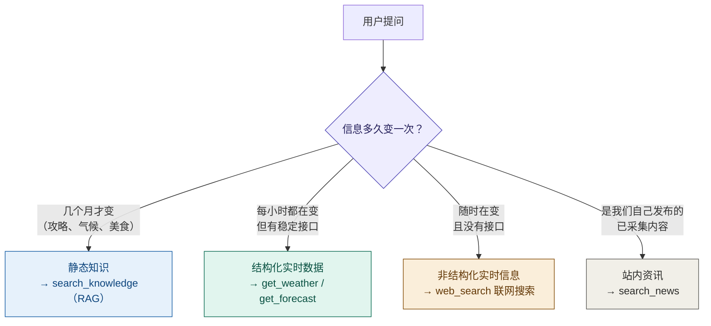
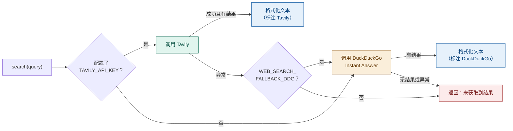

# "多数新闻站都禁止内嵌"——这句话我信了很久，直到测了 16 个站点

> 联网搜索、正文提取，和一个被当成结论写进注释的假设。

> 「AI Agent 工程化实战」系列 · 08
> 项目源码：**[Ticnix/weather-travel-recommend-system](https://github.com/Ticnix/weather-travel-recommend-system)**
> 基于气象大数据的出行推荐系统，AI Agent 全栈项目。FastAPI + PostgreSQL(TimescaleDB/pgvector/PostGIS) + Redis；
> LangGraph + MCP + Skill + RAG，对接 DeepSeek API；React/Vue 前后端分离，实现 3D 天气可视化、智能出行穿搭推荐。
> （项目仍在更新中）

---

## TL;DR

三句话讲清这篇在讲什么：

1. **知识库答不上来的问题，只能靠搜索**：我按"信息的三档时效"把工具分了四类——静态知识走 RAG、结构化实时数据走天气 API、非结构化实时信息（活动/门票/开放状态）只能走联网搜索。
2. **我实测推翻了项目里的一句话**：源码注释写着"多数新闻站会设置 `X-Frame-Options` / CSP `frame-ancestors`，iframe 会显示空白"。我测了 16 个站点，**禁止内嵌的只有 4 个**（知乎/简书/豆瓣/今日头条），另外 12 个压根没设置。
3. **但"抓正文"这个决策仍然是对的**，只是理由写错了。真正的理由是：搜索接口只给 300 字摘要、第三方策略随时会变、内嵌页面控制不了阅读体验、**抓下来入库的内容才真正属于你**（可搜索、可引用、可离线）。

---

## 目录

- [一、当知识库答不上来的时候](#一当知识库答不上来的时候)
- [二、概念先行：信息的三档时效与四个工具](#二概念先行信息的三档时效与四个工具)
- [三、降级链：Tavily → DuckDuckGo，和一次打脸的实测](#三降级链tavily--duckduckgo和一次打脸的实测)
- [四、正文提取：那个被我当成结论的假设](#四正文提取那个被我当成结论的假设)
- [五、60 行启发式：正文提取器是怎么写的](#五60-行启发式正文提取器是怎么写的)
- [六、顺手测出来的另外两件事](#六顺手测出来的另外两件事)
- [七、小结与下一篇](#七小结与下一篇)

---

## 一、当知识库答不上来的时候

先看三个问题，它们看起来都是"问广州"：

| 用户提问 | 知识库有答案吗 | 天气 API 有答案吗 |
| --- | --- | --- |
| 广州塔怎么坐地铁去？ | ✅ 有（交通攻略） | ❌ 不归它管 |
| 明天去广州塔穿什么？ | ⚠️ 有原则但没数据 | ✅ 有温度和降水 |
| **广州塔今天开放吗？** | ❌ 没有（这是动态信息） | ❌ 不归它管 |

第三个问题才是麻烦。**它不是"知识不够"，而是"这个知识根本不在库里"**——开放时间可能因检修调整、台风临时闭园、节假日延长营业，这些信息在爬下来的离线文档里永远是过期的。

这就是 `web_search` 工具存在的理由。项目提示词里对它的使用条件写得很克制：

```python
# backend/app/services/agent.py —— System Prompt 第 3 条
"3. 若问题涉及实时性/时效性信息且上述工具覆盖不到（如景区当天开放情况、"
"最新活动、门票价格、时事新闻），则调用 web_search 联网搜索。\n"
```

注意这句话的定语：**"且上述工具覆盖不到"**。这不是废话，是刻意加的约束——因为联网搜索是所有工具里最慢、最贵、最不可靠的一个。**如果模型一遇到"广州"就顺手联网，那本地知识库和天气 API 白建了。**

> 这是第 06 篇讲过的那个原则的又一例：**提示词里光说"该用 A"不够，还得说清"什么时候不该用 A"。** 工具越多，边界越要写死。

---

## 二、概念先行：信息的三档时效与四个工具

在写任何代码之前，我先把"Agent 要处理的信息"按**变化速度**分了三档。这个分类后来直接决定了工具划分：



四类信息对应四个工具：

| 工具 | 数据来源 | 为什么不用别的 |
| --- | --- | --- |
| `search_knowledge` | 本地知识库（pgvector 语义检索） | 最快、零成本、可离线，能答的都用它 |
| `get_weather` / `get_forecast` | 和风天气 / Open-Meteo | 天气有结构化接口，**用搜索去查天气是降级** |
| `search_news` | 自己库里的 `news` 表 | 已采集内容不需要再联网，且能排序、能置顶 |
| `web_search` | Tavily / DuckDuckGo | 前三个都覆盖不到时的最后手段 |

**这张表最重要的一列是第三列。** 很多人做 Agent 的通病是"能联网就用联网"——但联网的延迟是 3~10 秒，天气 API 是 200 毫秒，知识库检索是 50 毫秒。**把便宜的路径用足，贵的路径留作兜底**，这是工具路由的第一原则。

---

## 三、降级链：Tavily → DuckDuckGo，和一次打脸的实测

### 为什么选 Tavily

Tavily 是专门为 LLM 场景设计的搜索接口。它和通用搜索引擎的区别在于**它返回的是"已经洗干净的结果"**，而不是一堆等着你去爬的链接：

```python
# backend/app/services/web_search_service.py
async def _search_tavily(query: str, max_results: int) -> list[dict[str, Any]]:
    payload = {
        "api_key": settings.TAVILY_API_KEY,
        "query": query,
        "max_results": max_results,
        "search_depth": "basic",
        "include_answer": False,
    }
    ...
    results.append({
        "title": item.get("title", ""),
        "url": item.get("url", ""),
        "content": (item.get("content") or "")[:300],   # ← 记住这个 300
        "score": round(float(item.get("score", 0)), 4),
    })
```

官方文档里 `search_depth` 有四个档位：

> `search_depth` — enum<string> — default: `basic`
> Available options: `advanced`, `basic`, `fast`, `ultra-fast`
> `advanced`: 2 API Credits
>
> —— [Tavily Search API 文档](https://docs.tavily.com/documentation/api-reference/endpoint/search)

项目选了 `basic`：不追求最强相关性，也不追求最快，**先保证够用且成本可控**（搜索额度是要花钱的）。

### 一个关键设计：工具返回的是"给模型读的文本"

注意 `search()` 的返回类型是 `str`，不是 `list[dict]`：

```python
async def search(query: str, max_results: int = 5) -> str:
    """联网搜索，返回格式化文本供 LLM 阅读。"""
    ...
    lines = [f"联网搜索（{engine}）结果如下："]
    for r in results:
        lines.append(f"- {r['title']}\n  来源：{r['url']}\n  摘要：{r['content']}")
    return "\n".join(lines)
```

**这个细节决定了工具能不能被模型用好。** 工具返回的两条路：

- **返回 JSON**：模型得先理解结构、再自己决定怎么呈现，中间多一层转述，容易漏字段；
- **返回已经排好版的文本**：模型直接当"参考资料"读，写进答案里就是自然的。

顺带还解决了一件事：`engine` 变量会把"这次用的是哪个引擎"写进结果里（`联网搜索（Tavily）结果如下：`）。**模型因此知道自己在引用什么来源**，如果用的是兜底引擎，它在措辞上可以更保守。这是把元信息交给模型的一种轻量做法。

### 降级链

```python
# 优先 Tavily
if settings.TAVILY_API_KEY:
    try:
        results = await _search_tavily(query, max_results)
        engine = "Tavily"
    except Exception as exc:
        logger.warning("Tavily 搜索失败，降级 DuckDuckGo: %s", exc)

# 兜底 DuckDuckGo
if not results and settings.WEB_SEARCH_FALLBACK_DDG:
    try:
        results = await _search_ddg(query, max_results)
        engine = "DuckDuckGo"
    except Exception as exc:
        logger.warning("DuckDuckGo 搜索也失败: %s", exc)

if not results:
    return "联网搜索未获取到结果，可能是网络问题或搜索服务暂不可用。"
```

用图表示：



### 打脸的实测：这个兜底其实不兜底

DuckDuckGo 的 `_search_ddg` 调的是 `api.duckduckgo.com` 的 Instant Answer 接口（不用 Key，所以适合做兜底）。代码注释里已经埋了一句诚实的提醒：

```python
"""调用 DuckDuckGo Instant Answer API 兜底（无需 Key）。

注意：这是 DDG 的公开 Instant Answer 接口，返回字段较简单，
拿不到完整网页摘要时，退化为返回相关主题链接。
"""
```

"字段较简单"这个说法太温柔了。我直接用**项目里会真实发的那些中文查询词**测了一遍：

| query | AbstractText | RelatedTopics | 实际可用内容 |
| --- | --- | --- | --- |
| 广州塔 | 0 字 | 0 条 | **无** |
| 广州天气预警 | 0 字 | 0 条 | **无** |
| 广州塔门票价格 | 0 字 | 0 条 | **无** |
| 广州 台风 最新 | 0 字 | 0 条 | **无** |

四个全空，响应的字节数都是固定的 1252（空响应体）。

我又换成英文试了同一接口：

| query | AbstractText | RelatedTopics |
| --- | --- | --- |
| Guangzhou | **854 字** | **18 条** |
| Guangzhou Tower | **625 字** | **9 条** |
| python | 126 字 | 4 条 |
| weather | 0 字 | 0 条 |

**结论很清楚：这个接口对中文 query 基本没有数据**（它返回的是百科类摘要，背后主要靠英文数据源；`weather` 这种过于宽泛的词也是空）。

所以项目里这条降级链的真实行为是：

```
Tavily 未配置 / 调用失败  →  DuckDuckGo 返回空  →  "联网搜索未获取到结果"
```

链路是通的、不会报错，但**用户感受到的是"这个助手连网都上不了"**。我把这个现象叫作"**形式上的降级**"——代码上多了一条分支，能力上没有任何变化。

**这里有两个我打算改进的方向**：

1. **换一个真能兜底的引擎**（Bing / Serper / SearXNG 自建），或者至少把"中文不可用"这件事写进注释；
2. **别让它静默**：当前 `engine = "DuckDuckGo"` 在返回空时仍会被赋值，最后却走到"未获取到结果"的提示。既然 DDG 实际不可用，那么"未配置 Tavily"应该是一个**配置层面的明确警告**，而不是等用户在对话里发现搜不出来。

> 顺带说一句：这个接口的官方文档非常薄，我找了几处都没拿到明确的能力边界说明。**所以这次我不引用文档，只引用实测数据**。第三方接口的能力边界，文档经常缺位——**这时候唯一的可靠信源是你自己跑的一遍**。

### 顺手可以改进的一处：Tavily 的官方参数没用上

项目用"往中文 query 里塞关键词"的方式表达时效性意图：

```python
TAVILY_LOCAL_QUERIES: tuple[str, ...] = (
    "广州 天气 预警 新闻",
    "广州 暴雨 台风 最新",
    "广州 气象 通报",
)
```

但 Tavily 官方本来就提供了时效和类型的参数：

> 参数：`topic` — Available options: `general`, `news`, `finance`
> `time_range` — Available options: `day`, `week`, `month`, `year`, `d`, `w`, `m`, `y`
> `country` — Available options: … `china` …
>
> —— [Tavily Search API 文档](https://docs.tavily.com/documentation/api-reference/endpoint/search)

用 `topic="news"` + `time_range="week"` 比在 query 里写"最新"两个字的约束力强得多——**前者是引擎层面的过滤，后者只是提示引擎"我大概想要这个"**。这是我在写这篇时翻文档才注意到的，属于"能用官方能力就别自己拼字符串"。

---

## 四、正文提取：那个被我当成结论的假设

### 起因：一个只有 300 字的详情页

上面代码里那个 `[:300]` 是个伏笔。搜索接口返回的 `content` 是**摘要**，被截断到 300 字。

于是详情页面临一个尴尬：标题有了、链接有了、摘要只有 300 字。用户点进来想看全文，看到的是半截话。

第一版方案很自然——**用 iframe 把原文嵌进来**。为此项目还专门做过两件配套的事：

```python
# backend/app/services/weather_news_service.py
# 原文链接统一用 https：详情页会以 iframe 内嵌展示原文，
# 若用 http 会与站点的 https 冲突，被浏览器按"混合内容"拦截
NMC_BASE = "https://www.nmc.cn"
```

```python
url = url.replace("http://", "https://")   # 统一 https，避免 iframe 混合内容
```

然后在某个时间点，方案改了。改动理由写在了 `article_extractor.py` 的 docstring 里：

```python
"""网页正文提取：把外部资讯原文抓成纯文本，供详情页直接阅读。

背景：联网搜索（Tavily）采集的资讯此前只保存搜索摘要、且不设 source_url，
导致详情页既没有 iframe、也看不到完整内容。
更根本的问题是——多数新闻站会设置 `X-Frame-Options` / CSP `frame-ancestors`，
即使补上 source_url，iframe 同样会被浏览器拒绝而显示空白。

因此改为「后端抓正文 → 存库 → 详情页直接渲染」：
不依赖目标站点允许内嵌，阅读体验也更干净。
"""
```

**"多数新闻站会设置 `X-Frame-Options` / CSP `frame-ancestors`"** —— 这句话我盯了很久。它读起来像个事实，但它其实是个**假设**。而我从来没验证过。

### 那就测一下

我写了个脚本，对 16 个中文内容站点发一次 GET，只看两个响应头：`X-Frame-Options` 和 `Content-Security-Policy` 里的 `frame-ancestors`。

判定依据来自 MDN 对 `X-Frame-Options` 的说明：

> If this header is not sent, and the website has not implemented any other mechanisms to restrict embedding (such as the `frame-ancestors` CSP directive), then **the browser will allow other sites to embed this document**.
>
> —— [MDN: X-Frame-Options](https://developer.mozilla.org/en-US/docs/Web/HTTP/Reference/Headers/X-Frame-Options)

也就是说：**没设置 = 允许内嵌**。这条规范原文很重要，它把"我看不出有什么限制"变成了一个明确的判定。

实测结果：

| 站点 | 状态码 | 内嵌策略 |
| --- | --- | --- |
| 知乎 | 200 | **`SAMEORIGIN`** —— 禁止第三方内嵌 |
| 简书 | 200 | **`SAMEORIGIN`** |
| 豆瓣 | 200 | **`SAMEORIGIN`** |
| 今日头条 | 200 | **CSP 白名单**：`frame-ancestors 'self' *.bytedance.net *.snssdk.com …` |
| 微信公众号 | 200 | 未设置 → 可内嵌 |
| CSDN | 200 | 未设置 → 可内嵌 |
| 微博 | 200 | 未设置 → 可内嵌 |
| 哔哩哔哩 | 200 | 未设置 → 可内嵌 |
| 小红书 | 200 | 未设置 → 可内嵌 |
| 36氪 | 200 | 未设置 → 可内嵌 |
| 虎嗅 | 200 | 未设置 → 可内嵌 |
| 百度 | 200 | 未设置 → 可内嵌 |
| 中央气象台 | 200 | 未设置 → 可内嵌 |
| 中国政府网 | 200 | 未设置 → 可内嵌 |
| 人民网 | 200 | 未设置 → 可内嵌 |
| 新华网 | 200 | 未设置 → 可内嵌 |

**合计：禁止或受限 4 个，未设置 12 个。**

我又顺着项目真实采集路径测了 5 个**文章详情页**（中国天气网的），5 个都是 200、都未设置内嵌限制：

```
[200] 秋雾登场 北京今晨能见度不佳     内嵌限制：(未设置 -> 浏览器允许内嵌)
[200] 一树三色 浙江金华栾树花开       内嵌限制：(未设置 -> 浏览器允许内嵌)
[200] 自然把夏秋转变写在万物上       内嵌限制：(未设置 -> 浏览器允许内嵌)
[200] 全国入秋进程图出炉 京津冀等地跑步入秋   内嵌限制：(未设置 -> 浏览器允许内嵌)
[200] 一日两季！全国乱穿衣预警地图来了        内嵌限制：(未设置 -> 浏览器允许内嵌)
```

**"多数新闻站禁止内嵌"这个判断，在我的样本里站不住。** 12:4，多数是允许的。

### 但……这个决策不该改

到这里很容易产生一个冲动："那我把 iframe 改回来不就行了？"——**不建议**。因为那个假设虽然错了，但要抓正文的理由不止一条，而且更硬的那些一直都在：

| 真正的理由 | 说明 |
| --- | --- |
| **摘要只有 300 字** | 这是最直接的动机。不抓正文，详情页永远只有半截话，跟能不能内嵌无关 |
| **第三方策略随时会变** | 今日头条的白名单就是活证据：它允许的是一串自家/关联域名，**说明策略是可以细粒度调整的**。今天让你嵌，明天就不一定 |
| **内嵌页面你控制不了** | 对方的广告、导航、弹窗、跳转都是别人的。用户在你这儿点两下就跑到对方站去了，视觉也完全割裂 |
| **抓下来的内容才真正属于你** | 入库之后可以全文检索、可以被 RAG 引用、可以离线看、原文 404 了也还在 |

最后一条尤其重要。**搜索给你的是"别人服务器上的一份可引用片段"，抓正文给你的是"你自己的一份资产"。** 这两种东西的价值不一样。

我把这次反思总结成一句话：

> **结论对了，理由是猜的——这是最危险的一种"对"。**
> 因为下一次遇到类似场景，你会继续用那个错理由做判断，而它恰好可能把这次引向错误的方向（比如"反正都不能内嵌，那摘要我随便存存算了"）。**正确的做法是：让注释里只留下验证过的事实，把推测标成推测。**

所以我把 `article_extractor.py` 的注释改成了这样（后文会给完整改法）：

```python
背景：联网搜索（Tavily）采集的资讯此前只保存搜索摘要（content 截断 300 字）、
且不设 source_url，导致详情页既没有 iframe、也看不到完整内容。

实测（16 个中文内容站点）：禁止内嵌的只有 4 个（知乎/简书/豆瓣 SAMEORIGIN、
今日头条 CSP 白名单），其余 12 个未设置相关响应头。
—— 也就是说「多数站点禁止内嵌」这个说法并不成立。

改为「后端抓正文」的真正理由是：
1. 搜索摘要只有 300 字，详情页需要全文；
2. 不依赖第三方策略（对方随时可能收紧）；
3. 阅读体验可控（无对方广告/导航/跳转）；
4. 入库内容可检索、可被 RAG 引用、不受原文 404 影响。
```

**四个理由里，只有一个（第 2 条）和"能不能内嵌"有关**——而它还不是主要理由。这就是"假设写进注释"的代价：真正重要的动机被一个没验证过的借口盖住了。

---

## 五、60 行启发式：正文提取器是怎么写的

既然要抓正文，那"怎么从一坨 HTML 里抠出文章"就是下一个问题。项目没用 BeautifulSoup，用的是**标准库 `html.parser`**——`backend/app/services/article_extractor.py` 总共 230 行，核心逻辑 60 行左右。

### 核心策略：优先只取 `<p>` 里的文字

```python
class _ArticleParser(HTMLParser):
    """提取 HTML 中的可见文本。

    策略：优先只取 `<p>` 段落（新闻正文通常在 p 里，
    这样能自然滤掉标题栏、导航、时间戳等噪音）；
    若 p 段落过少（非典型新闻页），退化为全文提取。
    """

    def text(self) -> str:
        p_text = self._clean("".join(self._p))
        if len(p_text) >= 150:
            return p_text
        return self._clean("".join(self._all))
```

这个思路值得单独夸一句：**与其用一堆正则去"删掉噪音"，不如想办法"只保留信号"。** 新闻站的排版千奇百怪，但正文段落大概率在 `<p>` 里——这个先验比任何黑名单都稳。

150 字是个经验阈值：如果 `<p>` 里凑不够 150 字，说明这不是典型新闻页（可能是产品页、导航页），那就退化为全量文本提取。

### 五道过滤闸门

提取出来的原始文本还要过五关：

```python
# ① 逐行过滤：中文段落短于 10 字的丢掉（导航、按钮、时间戳）
_MIN_LINE_LEN = 10
lines = [ln for ln in raw.split("\n")]
lines = [ln for ln in lines if len(ln) >= _MIN_LINE_LEN]

# ② 全文字数下限：低于 250 字视为"没抓到真正文"
_MIN_TEXT_LEN = 250

# ③ 页脚特征词：命中 2 个以上且篇幅很短 → 判定为无效正文
_JUNK_MARKERS = (
    "ICP备", "公网安备", "网站标识码", "版权所有",
    "主办单位", "联系方式：", "网站地图", "免责声明",
)

# ④ 空白压缩：连续空格压成一个，3 个以上换行压成 2 个
text = re.sub(r"[ \t\u3000]{2,}", " ", text)
text = re.sub(r"\n{3,}", "\n\n", text)
```

第 ③ 条里藏着一个我觉得很妙的细节：

```python
def _looks_like_junk(text: str) -> bool:
    """判断抓到的内容是否只是页脚/导航碎片（而非文章正文）。"""
    if len(text) >= 600:      # ← 长文本基本是正文，不做特征词误伤
        return False
    return sum(1 for m in _JUNK_MARKERS if m in text) >= 2
```

**为什么先判长度？** 因为"免责声明""版权所有"这些词**也可能出现在正文里**（比如一篇讲版权纠纷的新闻）。如果无脑用特征词判断，会把正常长文误杀。而"只有一两百字、还满屏页脚词"的，才是真正的抓取失败。**先按长度分档，再在短文本里用特征词——这是启发式的正确写法：让规则的适用条件足够窄。**

### 第五道闸门：编码

国内站点还有编码地狱，`_decode` 用了三级兜底：

```python
def _decode(resp: httpx.Response) -> str:
    """解码响应体：优先响应头声明的编码，否则按 UTF-8 / GBK 兜底。"""
    if resp.charset_encoding:
        return resp.text
    for enc in ("utf-8", "gb18030"):
        try:
            return resp.content.decode(enc)
        except UnicodeDecodeError:
            continue
    return resp.content.decode("utf-8", errors="ignore")
```

顺序是：**响应头声明的（最可信）→ UTF-8 → GB18030（向下兼容 GBK/GB2312）→ 强行忽略错误**。

> 顺带说一个 Python 的坑：`gb18030` 是 GBK 的超集，能解更多生僻字，所以它比 `gbk` 更适合做兜底。但它**几乎能解码任意字节序列**（不会抛 `UnicodeDecodeError`），所以它必须放在 `utf-8` **后面**——如果顺序反过来，所有 UTF-8 页面都会被它"成功"解成乱码，而且不报错。**兜底链的顺序，取决于每一环的"宽容度"，宽容的必须排在后面。**

### 实测效果

用项目自己的提取器，抓 5 篇真实文章：

| 文章 | 提取字数 | 判定 |
| --- | --- | --- |
| 秋雾登场 北京今晨能见度不佳 | 429 | 通过 |
| 一树三色 浙江金华栾树花开 | 451 | 通过 |
| 自然把夏秋转变写在万物上 | 518 | 通过 |
| 全国入秋进程图出炉 京津冀等地跑步入秋 | 1017 | 通过 |
| 一日两季！全国乱穿衣预警地图来了 | 1492 | 通过 |

5/5 通过，而且**抓出来的开头就是正文第一句**——标题栏、时间戳、导航都没混进来：

```
秋雾登场 北京今晨能见度不佳 | 中国天气网讯 进入秋季后，雾天开始增多。
今天（9月17日）早晨，北京雾气笼罩，能见度不佳，远处景色若隐…
```

（中间那个 `|` 是段落分隔符，我把换行替换成了它。）

### 并发抓取：5 个一起抓

采集一批资讯要抓十几个页面，串行会慢到离谱。所以：

```python
async def fetch_article_texts(urls, max_chars=3000, concurrency=5) -> dict[str, str]:
    """并发抓取多个 URL 的正文，返回 {url: text}。失败的 URL 不在结果中。"""
    semaphore = asyncio.Semaphore(concurrency)

    async def _one(u: str) -> tuple[str, str]:
        async with semaphore:
            return u, await fetch_article_text(u, max_chars=max_chars)

    pairs = await asyncio.gather(*(_one(u) for u in urls), return_exceptions=True)
```

三个细节：

- **`Semaphore(5)`**：并发但不失控。对方站点也是无辜的，5 个并发是个礼貌且稳妥的值；
- **`return_exceptions=True`**：任何一个 URL 失败都不会让整批挂掉。抓取失败是常态（超时、403、改版），必须当成正常分支；
- **`max_chars=3000`**：入库前截断。存全文会让库迅速膨胀，而 3000 字对"能读"已经绰绰有余。

还有一条兜底逻辑贯穿始终——**抓不到就返回空字符串，由调用方降级**：

```python
# backend/app/services/weather_news_service.py
texts = await fetch_article_texts([a["url"] for a in articles]) if articles else {}
...
full_text = texts.get(a["url"], "")
db.add(News(
    title=...,
    content=...,                      # 摘要 + 原文链接（永远有）
    full_text=full_text or None,      # 正文（可能没有）
    source_url=a["url"],              # 原文链接（永远有）
))
```

`full_text` 是**可空字段**，这一点是刻意的：采集必须成功，正文是加分项。**抓不到正文的资讯仍然有价值**（有标题、有摘要、有原文链接），不能因为它抓失败就整条丢掉。这是"采集"和"抓正文"两件事解耦的好处。

---

## 六、顺手测出来的另外两件事

### ① 本地化过滤的产出率：20 条候选，0 条命中

项目要求资讯板块"全部与广州相关"，所以 `fetch_weather_news(local_only=True)` 会用关键词过滤：

```python
LOCAL_KEYWORDS: tuple[str, ...] = (
    "广州", "广东", "华南", "粤", "珠江", "珠三角", "花城", "羊城",
)
```

我顺着这个逻辑跑了一遍今天的列表页：

```
列表页候选文章：20 条
命中本地关键词：0 条

× 秋雾登场 北京今晨能见度不佳
× 一树三色 浙江金华栾树花开
× 全国入秋进程图出炉 京津冀等地跑步入秋
× 四川重庆湖北等地较强降雨持续 周末北方迎降温
× 北京 | 今明天秋雨上线 最高气温降至28℃左右
× 安徽 | 雨势增强凉意显现 今明天降雨逐渐停歇
...
```

**20 条里 0 条是广州的。** 这很合理——中国天气网是全国站，广州本地新闻在上面的出现频率本来就不高。

这恰好解释了项目为什么要额外配一组 Tavily 本地搜索词：

```python
TAVILY_LOCAL_QUERIES: tuple[str, ...] = (
    "广州 天气 预警 新闻",
    "广州 暴雨 台风 最新",
    "广州 气象 通报",
)
```

**单一数据源做不成"本地化"**：权威全国站给你可靠但泛化，搜索引擎给你本地但质量参差。项目最后是让 `collect_all` 把四个来源合并（预警/新闻/搜索/自产简报），并靠**标题去重**避免重复入库——这是个很务实的做法。

> 一个可以直接得出的结论：**如果某天的资讯板块空了，先别怀疑代码，去看看那天是不是真的没有广州本地新闻。** 数据源覆盖率是运维问题，不是 bug。

### ② `GENERIC_TITLE_MARKERS`：搜索结果的"导航页噪音"

用搜索引擎采集内容时，会捞回来一堆没有正文的页面——天气预报查询页、城市列表页、信息公开索引页。项目用一个特征词表把它们丢掉：

```python
# 通用天气导航页特征词：这类页面只有预报入口、没有资讯内容，采集时丢弃
GENERIC_TITLE_MARKERS: tuple[str, ...] = (
    "天气预报", "天气查询", "15天", "7天天气",
    "气象台,tqyb", "城市预报", "信息公开", "门户网站", "网站首页",
)
```

注意里面的 `"气象台,tqyb"` —— 这个带逗号的词是**某类站点标题里真实的拼接痕迹**（栏目名和拼音缩写被连在了一起）。这种词只有真跑过采集、看过数据的人才能写出来。**它比任何"通用最佳实践"都更有信息量。**

---

## 七、小结与下一篇

### 一句话记住

**"能不能内嵌"是个技术问题，"该不该抓正文"是个产品问题——我把后者写成了前者的理由，差点让一个正确的决策背着一个错误的依据。**

### 可复用清单

| 场景 | 做法 |
| --- | --- |
| 工具路由 | 按"信息时效 + 是否有接口"分层，**便宜的路径优先，联网留兜底** |
| 工具返回值 | 返回**给模型读的格式化文本**，而不是裸 JSON |
| 内置降级链 | 降级要**实测验证**，别默认"有分支就等于有兜底" |
| 判断能否 iframe 内嵌 | 看 `X-Frame-Options` 与 CSP `frame-ancestors`；**未设置 = 允许** |
| 写注释 | **只写验证过的事实**，推测明确标注为推测 |
| 从 HTML 提正文 | 优先取 `<p>` 文本（保留信号）而非用正则删噪音 |
| 启发式规则 | 给适用条件加边界（如"仅当文本 < 600 字才查页脚特征词"） |
| 编码兜底顺序 | 按"宽容度"排序：最严格的在前面（utf-8 在 gb18030 前） |
| 并发抓取 | `Semaphore` 限并发 + `return_exceptions=True` + 单点失败降级 |
| 采集入库 | 主字段必成功、正文可空；**正文抓失败不该拖垮整条采集** |

### 本篇涉及的真实文件

- `backend/app/services/web_search_service.py` —— Tavily / DDG 双引擎与降级
- `backend/app/services/article_extractor.py` —— 正文提取器（`_ArticleParser`、五道闸门、编码兜底、并发抓取）
- `backend/app/services/weather_news_service.py` —— 气象资讯采集（多源合并、本地化过滤、标题去重）
- `backend/mcp_server/tools.py` —— `search_knowledge` / `search_news` / `web_search` 三个工具
- `backend/app/models/news.py` —— `full_text` 与 `source_url` 两个可空字段的设计意图
- `backend/app/services/agent.py` —— System Prompt 第 2、3 条（工具路由规则）

### 下一篇预告

到这里，"AI 链路"这条主线基本走完了：意图识别 → Agent 编排 → 工具（MCP + 本地）→ RAG → 流式输出 → 搜索增强。下一篇换个视角，讲**这个项目里最容易被忽略、但面试最爱问的一块**——**降级与容错体系**：为什么这个对话接口"永远不会 500"、四层降级分别兜什么、以及 `Celery + asyncpg` 那个让人头大的事件循环坑。

---

## 参考资料

1. **MDN · X-Frame-Options** —— "If this header is not sent… the browser will allow other sites to embed this document."；`SAMEORIGIN` / `DENY` 的确切语义
   https://developer.mozilla.org/en-US/docs/Web/HTTP/Reference/Headers/X-Frame-Options
2. **MDN · CSP `frame-ancestors`** —— 更细粒度的内嵌白名单机制（今日头条用的就是它）
   https://developer.mozilla.org/en-US/docs/Web/HTTP/Reference/Headers/Content-Security-Policy/frame-ancestors
3. **Tavily Search API 文档** —— 请求参数（`search_depth` / `topic` / `time_range` / `country`）与响应字段（`title` / `url` / `content` / `score`）
   https://docs.tavily.com/documentation/api-reference/endpoint/search
4. **DuckDuckGo Instant Answer API** —— 项目兜底引擎所用的接口（官方文档很薄，能力边界以实测为准）
   https://duckduckgo.com/api
5. **Python 官方文档 · `html.parser`** —— `HTMLParser` 的事件模型（`handle_starttag` / `handle_data` / `handle_endtag`）
   https://docs.python.org/3/library/html.parser.html
6. **Python 官方文档 · `asyncio.Semaphore` 与 `asyncio.gather`** —— 限并发与异常收集
   https://docs.python.org/3/library/asyncio-sync.html
7. **项目源码（仍在更新中）** —— Ticnix/weather-travel-recommend-system
   https://github.com/Ticnix/weather-travel-recommend-system
