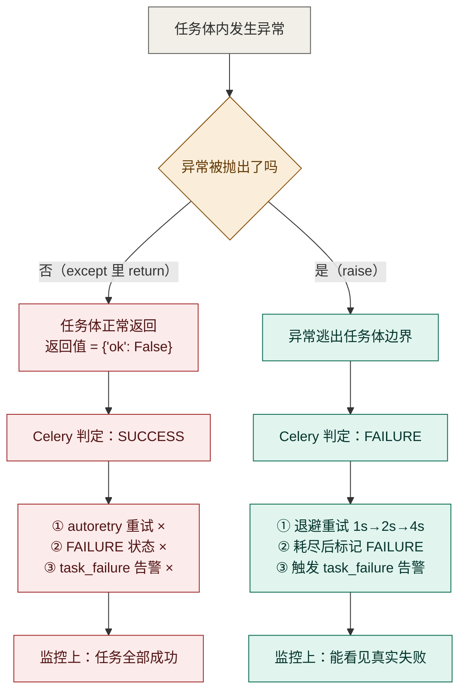
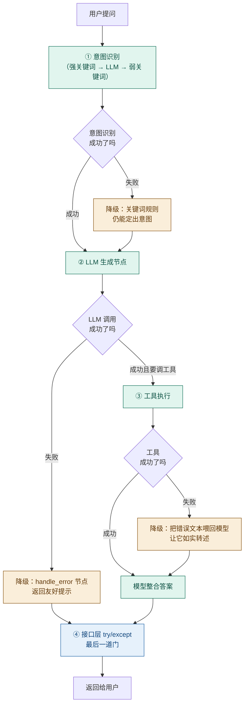

# 我写了 20 行 try-except，亲手废掉了整套重试机制

> 四层降级各自兜什么、`asyncpg` 那个"事件循环"的坑，以及一个比不处理更隐蔽的错误。

> 「AI Agent 工程化实战」系列 · 09
> 项目源码：**[Ticnix/weather-travel-recommend-system](https://github.com/Ticnix/weather-travel-recommend-system)**
> 基于气象大数据的出行推荐系统，AI Agent 全栈项目。FastAPI + PostgreSQL(TimescaleDB/pgvector/PostGIS) + Redis；
> LangGraph + MCP + Skill + RAG，对接 DeepSeek API；React/Vue 前后端分离，实现 3D 天气可视化、智能出行穿搭推荐。
> （项目仍在更新中）

---

## TL;DR

三句话讲清这篇在讲什么：

1. **"永不 500"不是一句口号，是四层各司其职的降级**：意图识别降级到关键词、LLM 失败降级到兜底节点、工具失败降级成模型能读的错误文本、接口层最后兜一次。**每一层都只兜自己能兜的**。
2. **最隐蔽的 bug 是"吞异常"**：定时任务里加一句 `try/except` 返回 `{"ok": False}`，Celery 会把这次失败当成**成功**——重试没了、告警没了，而日志里一切正常。我实测验证了这一点。
3. **`Celery + asyncpg` 的坑不在代码写错，在两个世界的规则不同**：Celery 是同步的、每个任务可能起新的事件循环，而 SQLAlchemy 的连接池用 `asyncio.Queue` 实现——连接绑在旧循环上，换循环就炸。

---

## 目录

- [一、先看一个"比不处理更糟"的错误](#一先看一个比不处理更糟的错误)
- [二、概念先行：降级是什么，为什么需要四层](#二概念先行降级是什么为什么需要四层)
- [三、第一层：意图识别的三级降级](#三第一层意图识别的三级降级)
- [四、第二层：图内的兜底节点（以及它为什么不生效）](#四第二层图内的兜底节点以及它为什么不生效)
- [五、第三层：工具失败要变成"模型能读的话"](#五第三层工具失败要变成模型能读的话)
- [六、第四层：接口层，最后一道门](#六第四层接口层最后一道门)
- [七、Celery + asyncpg：两个世界规则不同](#七celery--asyncpg两个世界规则不同)
- [八、小结与下一篇](#八小结与下一篇)

---

## 一、先看一个"比不处理更糟"的错误

先看代码。这是项目早期某个定时任务的样子（现在是修好的版本，问题在注释里留下了）：

```python
# backend/app/tasks/weather_tasks.py
"""气象数据同步 Celery 任务。

...
    失败处理：异常向上抛给 Celery —— 触发 autoretry 重试，
    重试耗尽后任务标记 FAILURE 并触发全局告警（celery_app.task_failure）。
    此前这里曾捕获异常返回 {"ok": False}，Celery 会把失败当成 SUCCESS，
    重试与告警全部失效——「吞异常」比「不处理」更隐蔽。
"""
```

"此前这里曾捕获异常返回 `{"ok": False}`" —— 那个"此前"的写法，大概是很多人的第一反应：

```python
# ❌ 曾经的写法
@celery_app.task(autoretry_for=(Exception,), retry_kwargs={"max_retries": 3})
def sync_weather_hourly(...):
    try:
        bundle = _run(fetch_and_store(...))
        return {"ok": True, ...}
    except Exception as e:                      # 加个兜底，别让任务挂掉
        logger.warning("同步失败: %s", e)
        return {"ok": False, "error": str(e)}   # ← 灾难就在这一行
```

看起来很稳：**不让异常逃出去、不让任务失败、日志里也记了一笔**。

但它同时废掉了三件事：

| 被废掉的东西 | 为什么 |
| --- | --- |
| `autoretry_for` 重试 | 任务**没有抛异常**，Celery 认为执行成功，不会重试 |
| 任务状态为 `FAILURE` | 返回值是"正常返回"，状态是 `SUCCESS` |
| `task_failure` 全局告警 | 信号只在失败时发出，这里没有失败 |

**结果是：一次网络抖动导致的数据没同步，在监控上表现为"任务全部成功"。**

两种写法在 Celery 眼里是两个完全不同的世界：



### 我实测验证了这一点

为了确认这不是我的一厢情愿，我写了两个任务，一个吞异常、一个抛异常，直接调任务体：

```
swallow（吞异常）
  直接调用返回：{'ok': False, 'error': '外部 API 挂了'}
  任务体会被执行几次：1
  -> 结论：异常被吞，没有重试的机会，调用方只看到一个正常返回值

raise_it（抛出）
  直接调用抛出：RuntimeError: 外部 API 挂了
  -> 结论：异常向上传递，Celery 才能据此触发 autoretry / task_failure 告警
```

Celery 的判断依据非常朴素：**它只看任务体有没有把异常抛出来**。官方对 `autoretry_for` 的定义就一句话：

> "A list/tuple of exception classes. **If any of these exceptions are raised during the execution of the task**, the task will automatically be retried. By default, no exceptions will be autoretried."
>
> —— [Celery: Tasks](https://docs.celeryq.dev/en/stable/userguide/tasks.html)

定语是 **"are raised"**（被抛出）。你把异常接住了，就等于告诉 Celery"没事，一切正常"。

### 一句话总结这个坑

> **不处理异常，是"不知道出了事"；吞掉异常，是"明明出了事，还举手报告一切正常"。后者更糟。**

所以我后来在项目里定了一条规矩：**定时任务的任务体不允许吞异常。** 想记日志可以，记完必须重新抛（`raise`）。现在的写法是这样——整个任务体里没有任何 `except`：

```python
@celery_app.task(
    name="app.tasks.weather_tasks.sync_weather_hourly",
    # 失败重试：指数退避（1s/2s/4s...上限 60s）+ 抖动，最多 3 次。
    # 前提是异常必须抛出 Celery 才能感知——所以函数体内不再吞异常。
    autoretry_for=(Exception,),
    retry_backoff=True,
    retry_backoff_max=60,
    retry_jitter=True,
    retry_kwargs={"max_retries": 3},
)
def sync_weather_hourly(...) -> dict:
    bundle = _run(fetch_and_store(..., use_celery_engine=True))
    logger.info("天气同步成功: loc=%s temp=%s", bundle.location_code, bundle.current.temperature)
    return {"ok": True, ...}
```

---

## 二、概念先行：降级是什么，为什么需要四层

### 先讲清"降级"这个词

**降级（fallback / degradation）= 当首选方案不可用时，退到一个"差一些但还能用"的方案。**

关键在"**还能用**"三个字。降级不是"出错就返回一个错误码"，而是"出错后仍然把这件事办完，只是办得糙一点或慢一点"。

举个生活里的例子：导航软件首选实时路况最优路线；路况服务挂了，它退到"按距离最短规划"——**你还是能到目的地，只是可能堵一会儿**。这就是降级。如果路况服务挂了就直接报错"无法规划"，那不叫降级，那叫崩溃。

### 为什么是"四层"而不是"一层"

因为**不同的环节,失败原因根本不同**：

| 环节 | 会怎么失败 | 该退到哪里 | 谁来兜 |
| --- | --- | --- | --- |
| 意图识别 | LLM 输出不稳定/超时 | 关键词规则 | **第一层** |
| LLM 生成 | 网络/限流/超时 | 友好提示 | **第二层** |
| 工具调用 | 外部 API 挂了/超时 | 把错误告诉模型 | **第三层** |
| 整个请求 | 谁都没兜住的意外 | 兜底文案 | **第四层** |

**如果只有一层"最外层 try/except"，会怎样？**

用户问"明天穿什么"，LLM 超时了 → 外层 catch → 返回"AI 服务暂时不可用"。这个回答是**技术上正确、体验上很差**的：明明只要把用户输入降级成按关键词处理，也能给一个像样的穿搭建议。

**分层降级的价值在于：让失败发生在离用户最近的地方，然后再退。** 越靠内的层能兜得越精细，越靠外的层兜得越粗糙但也越保险。

用图看整体结构：



---

## 三、第一层：意图识别的三级降级

意图识别是整条链路的第一环，它挂了后面全乱。所以这里的降级做得最细——**一共三级**。

```python
async def _classify_intent(state: AgentState) -> dict:
    """意图识别节点：强关键词预判 > LLM 分类 > 弱关键词兜底。"""
    user_text = state["messages"][-1].content

    # 1) 强关键词预判：高置信命中直接定意图，跳过 LLM 分类
    pre = _strong_keyword_intent(user_text)
    if pre:
        logger.info("强关键词预判命中: %s（用户：%s）", pre, user_text)
        return {"intent": pre}

    # 2) 未命中强词：调用 LLM 分类，失败则弱关键词兜底
    llm = get_llm()
    try:
        resp = await llm.ainvoke([...])
        raw = ...
        intent = ...
        kw = _keyword_intent(user_text)
        llm_unclear = (intent not in ("weather", "outfit", "travel", "knowledge") or intent == "other")
        if llm_unclear and kw != "other":
            intent = kw
        logger.info("意图识别 raw=[%s] -> %s", raw[:60], intent)
    except Exception as exc:  # noqa: BLE001 LLM 失败降级到关键词
        logger.warning("意图识别 LLM 调用失败，降级到关键词规则: %s", exc)
        intent = _keyword_intent(user_text)
    logger.info("识别意图: %s（用户：%s）", intent, user_text)
    return {"intent": intent}
```

三级的分工：

| 级别 | 手段 | 成本 | 什么时候生效 |
| --- | --- | --- | --- |
| ① 强关键词 | `_STRONG_INTENT_KEYWORDS` 匹配 | **零成本**（不调 LLM） | 命中高置信词时 |
| ② LLM 分类 | 一次 LLM 调用 | ~500ms + token | 强词没命中时 |
| ③ 弱关键词 | `_INTENT_KEYWORDS` 匹配 | **零成本** | LLM 失败或输出不明确时 |

### 为什么要有"强关键词"这一级

这一级的动机写在了注释里，而且是个**真实事故的复盘**：

```python
def _strong_keyword_intent(text: str) -> str | None:
    """强关键词预判：命中即视为高置信意图，未命中返回 None。

    背景：HTTP 层 /api/v1/chat 曾出现意图识别稳定返回 other 的问题
    （直接调用 chat() 却正常），根因是 LLM 分类输出不稳定。
    因此对高置信关键词直接定意图，不依赖 LLM 分类稳定性，
    顺带省掉一次 LLM 调用（省 token、降延迟）。
    """
```

注意那句"**直接调用 `chat()` 却正常**"——这是个很典型的排查线索：同样的输入，命令行跑没问题、走 HTTP 就有问题。根因是**LLM 输出本身不稳定**，不是代码逻辑错了。

于是解法不是"想办法让 LLM 更稳定"（做不到），而是**对确定性高的场景绕开 LLM**：

```python
_STRONG_INTENT_KEYWORDS: dict[str, tuple[str, ...]] = {
    "weather": ("天气", "气温", "多少度", "下雨", "台风", "降水", "湿度", "预报", "冷吗", "热吗"),
    "outfit": ("穿搭", "穿什么", "怎么穿", "该穿", "穿衣服", "着装", "穿多少", "穿鞋"),
    "travel": ("路线", "怎么走", "怎么去", "出行", "交通", "地铁", "公交", "打车", "行程", "多远"),
    "knowledge": ("景点", "美食", "好吃", "好玩", "攻略", "酒店", "住宿", "特产", "历史", "文化"),
}
```

而"弱关键词"是另一张更宽的表：

```python
_INTENT_KEYWORDS: dict[str, tuple[str, ...]] = {
    "weather": ("天气", "气温", "温度", "下雨", "晴天", "台风", "降水", "湿度", "预报"),
    "outfit": ("穿", "穿搭", "衣服", "着装", "打扮"),
    "travel": ("去", "行程", "路线", "出行", "旅游", "交通", "地铁", "高铁", "航班", "怎么走"),
    "knowledge": ("景点", "美食", "好吃", "好玩", "攻略", "推荐", "酒店", "住宿", "历史", "文化"),
}
```

### 两张表的关键差异

对比一下就明白了：`outfit` 的**强词**是"穿什么/怎么穿/该穿"，**弱词**只有一个"穿"。

- **强词必须"高置信、歧义小"**——"穿什么"几乎只可能是穿搭问题，可以直接定意图；
- **弱词可以宽**——因为它的使用场景是"LLM 已经失败了，总得给个答案"，宁可猜错一点。

源码注释里明确写了这个原则：

```python
# 说明：仅收录「高置信、歧义小」的词，避免把闲聊误判为工具意图；
#       弱词（如「去」「推荐」）仍只作为 LLM 分类失败时的兜底。
```

**想想"去"这个字**："我去了趟北京"是闲聊，"去白云山怎么走"是出行。强词表里因此放的是"怎么去/怎么走"，而不是光秃秃的"去"。**同一个字，在不同层级的表里出现或消失，就是"置信度"的具象化。**

### 还有一个容易漏的细节：判定顺序

```python
# 资讯类优先判定：归入 knowledge（该意图下会绑定 search_news 工具）
if any(kw in text for kw in _NEWS_KEYWORDS):
    return "knowledge"

for label, keywords in _STRONG_INTENT_KEYWORDS.items():
    for kw in keywords:
        if kw in text:
            return label
```

`_NEWS_KEYWORDS = ("资讯", "新闻", "公告", "报道", "通知", "动态")` 必须先判，注释也说明了原因：

```python
# 资讯类关键词：需要优先于天气词判定
# （如「台风资讯」应归为资讯检索，而不是被"台风"抢先判成 weather）
```

"台风资讯"这四个字里，"台风"是 weather 的强词，"资讯"是 knowledge 的词。**先判哪个，结果就不一样**。这里选了"资讯优先"——因为用户说的是"资讯"，他要的是新闻列表，不是实况温度。

> 这类"顺序决定结果"的规则，在关键词匹配里到处都是。**写关键词表的时候，必须同时想清楚优先级**，否则表越全、冲突越多。

---

## 四、第二层：图内的兜底节点（以及它为什么不生效）

LangGraph 里有一个专门用来兜底的节点：

```python
async def _handle_error(state: AgentState) -> dict:
    """异常兜底节点：LLM 调用失败时返回友好提示。"""
    logger.error("Agent 执行失败: %s", state.get("error"))
    return {
        "answer": "抱歉，AI 服务暂时不可用，请稍后重试。",
        "error": state.get("error", "unknown"),
    }


def _should_error(state: AgentState) -> str:
    """路由：有 error 则进入兜底，否则继续。"""
    return "error" if state.get("error") else "agent"
```

它的接线方式：

```python
graph.add_node("classify_intent", _classify_intent)
graph.add_node("agent", _agent_node)
graph.add_node("tools", ToolNode(tools))
graph.add_node("handle_error", _handle_error)

graph.add_edge(START, "classify_intent")
graph.add_conditional_edges(
    "classify_intent",
    _should_error,
    {"error": "handle_error", "agent": "agent"},     # ← 只挂在这里
)
graph.add_conditional_edges("agent", _should_continue, {"tools": "tools", END: END})
graph.add_edge("tools", "agent")
graph.add_edge("handle_error", END)
```

### 这里有个真实的缺陷

我把这段接线抠了很久，最后确认：**`handle_error` 节点实际不可达。**

理由分两步：

**① `_should_error` 只挂在 `classify_intent` 后面**，而 `_classify_intent` 自己已经 catch 了所有异常：

```python
except Exception as exc:  # noqa: BLE001 LLM 失败降级到关键词
    logger.warning("意图识别 LLM 调用失败，降级到关键词规则: %s", exc)
    intent = _keyword_intent(user_text)     # ← 降级了，不返回 error
```

它**永远不返回 `error`**，所以 `_should_error` 永远返回 `"agent"`。

**② `_agent_node` 失败时确实会返回 `error`**，但它后面接的是 `_should_continue`：

```python
async def _agent_node(state: AgentState) -> dict:
    ...
    except Exception as exc:
        logger.exception("LLM 生成节点调用失败: %s", exc)
        return {"error": str(exc)}          # ← 设了 error，但没人看

def _should_continue(state: AgentState) -> str:
    """路由：最后一条消息若含 tool_calls 则执行工具，否则结束。"""
    last = state["messages"][-1]
    if getattr(last, "tool_calls", None):
        return "tools"
    return END                              # ← 直接结束
```

`_agent_node` 抛异常时**没有往 `messages` 里追加任何消息**，所以 `state["messages"][-1]` 还是用户那句提问（没有 `tool_calls`）→ `_should_continue` 返回 `END` → 图结束。

**而 `answer` 字段是空的**（只有成功路径才会设置 `answer`）。于是最后返回给用户的是：

```python
{"intent": result.get("intent", ""), "answer": result.get("answer", "")}   # answer = ""
```

**一个空字符串。** 用户看到的是一个空白的气泡。

### 修法

问题很清楚：**`_should_error` 挂错了地方**。它需要挂在 `agent` 后面，并且**要先判 error、再判 tool_calls**：

```python
# 方案：把 error 判定前置到 agent 之后
graph.add_conditional_edges(
    "agent",
    lambda s: "error" if s.get("error") else _should_continue(s),
    {"tools": "tools", "error": "handle_error", END: END},
)
```

或者更清晰一点，抽成一个独立的判断函数：

```python
def _route_after_agent(state: AgentState) -> str:
    """agent 之后的统一路由：先看有没有 error，再看要不要调工具。"""
    if state.get("error"):
        return "error"
    return _should_continue(state)
```

### 这个 bug 最有价值的地方

不是"有 bug"，而是**它暴露了一个设计陷阱**：

> **降级节点的存在 ≠ 降级生效。**
> 一个兜底分支如果永远不会被走到，它在架构图上是"有容错"，在运行时是"没容错"。**而且这种情况下代码不会报错、测试也不容易发现——因为要构造"LLM 生成节点抛异常"才能触发它。**

这也解释了为什么第 01 篇里我花了很大篇幅讲"边画错了图照样跑"——**LangGraph 不会告诉你某条边永远沉默**。它只会沉默地跑完整张图，然后返回一个空答案。

所以我现在的做法是：**每加一个降级分支，都要同时写一条能走到它的测试。** 走不到的分支，不如不画。

---

## 五、第三层：工具失败要变成"模型能读的话"

工具层（MCP）的降级只有一行配置：

```python
# backend/app/services/mcp_client.py
_client = MultiServerMCPClient(
    connections={"weather_travel": connection},
    handle_tool_errors=True,  # 工具出错时返回错误文本而非抛异常
)
```

**这一个 `True`，是理解"Agent 里的错误处理"的关键。**

### 为什么工具报错不该抛异常

在传统后端里，调用一个下游服务失败 → 抛异常 → 上层处理。但在 Agent 里，工具失败的**"上层"是模型**，而模型只会思考、不会 `catch`。

假设 `get_weather` 因为外部 API 超时挂了：

- **如果抛异常**：整个 LangGraph 执行中断。要么走兜底节点给个"服务不可用"，要么 500。用户拿不到任何有用信息——**哪怕"天气查不到，但穿搭建议还是能给的"这个可能性也被抹掉了**。
- **如果返回错误文本**：`ToolNode` 把 `"工具执行失败：连接超时"` 当成工具的**返回结果**写进 `messages`。模型读到这句话后，可以自己决定怎么办：转述给用户、换个工具试试、或者"我也查不到天气，只能给你一般性建议"。

**第二种才是 Agent 该有的行为**——因为**决策权应该在模型手里**，而不是被一个异常硬生生掐断。

这个设计在项目里到处呼应。比如 `search_knowledge` 工具自己就把失败包装成了文本：

```python
# backend/mcp_server/tools.py
try:
    items = await rag_service.search(query.strip(), top_k=...)
except Exception as exc:  # noqa: BLE001 检索失败降级
    return f"知识库检索失败：{exc}"          # ← 返回文本，不是抛异常

if not items:
    return "未找到相关知识。可尝试换一种说法，或询问天气、出行、穿搭类问题。"
```

还有 `web_search`：

```python
if not results:
    return "联网搜索未获取到结果，可能是网络问题或搜索服务暂不可用。"
```

注意这些返回值的写法：**它们都是"给模型看的句子"，不是错误码。** 尤其是 `"未找到相关知识。可尝试换一种说法…"` 这句——它不只是报告失败，还**顺手给了模型一个下一步建议**（换种说法）。

### 与之呼应的是提示词里的那条约束

```python
"禁止编造数据，工具未返回的数据一律不得臆造；数据不足时如实说明。"
```

**这两件事必须成对出现**：

- 工具层说"我失败了"（返回错误文本）
- 提示词说"失败就如实说，别编"

如果只有前者，模型可能自己脑补一个温度来回答；如果只有后者而工具层抛异常，模型根本没机会说话。**一个负责"把坏消息传达到"，一个负责"接到坏消息后别乱来"。**

---

## 六、第四层：接口层，最后一道门

最后这层最简单，但必须有：

```python
# backend/app/services/agent.py
async def chat(user_input: str, user_id: int | None = None, history: list[dict] | None = None) -> dict:
    ...
    try:
        ag = await _get_agent()
        result = await ag.ainvoke(initial)
        return {"intent": result.get("intent", ""), "answer": result.get("answer", "")}
    except Exception as exc:
        logger.exception("对话异常: %s", exc)
        return {"intent": "other", "answer": "抱歉，AI 服务暂时不可用，请稍后重试。"}
    finally:
        reset_current_user_id(token)
```

SSE 那条路径也一样，而且它更特殊——**流已经开始推了，不能再返回 HTTP 500**：

```python
# backend/app/routers/chat.py
async def event_generator():
    full_answer = ""
    try:
        async for evt in agent.chat_stream(...):
            ...
    except Exception:  # noqa: BLE001
        yield {
            "event": "message",
            "data": json.dumps({"type": "token", "content": "抱歉，AI 服务暂时不可用，请稍后重试。"},
                               ensure_ascii=False),
        }
    finally:
        # 流式结束后持久化（登录用户）
        ...
```

**注意这里用 `yield` 而不是 `raise`。** 因为响应头已经发出去了、状态码已经定了 200，此时唯一的办法是**把错误当成一条正常的消息推给前端**。这是 SSE 这种"单向流"的固有约束——**一旦开始说话，就没法再改口说"其实我报错了"**。

> 这层兜底的价值在于**保底**：不管前面哪一层漏了，用户至少能看到一句人话，而不是一个 500 错误页或一个空白。它兜得最粗糙，但它兜得最全。

---

## 七、Celery + asyncpg：两个世界规则不同

前面讲的都是"请求内"的降级。这一节讲的是**请求外**——定时任务。

### 现象

Celery 是**同步框架**，而项目的数据访问层是**纯异步的**（SQLAlchemy async + asyncpg）。想把它们接起来，最直觉的写法是：

```python
def my_task():
    return asyncio.run(some_async_func())    # ❌ 每次调用都新建一个事件循环
```

这段代码在第一次跑时通常没问题，但会**间歇性**抛出这类错误：

```
RuntimeError: Task ... got Future attached to a different loop
RuntimeError: Event loop is closed
```

**"间歇性"是最恶心的**——它取决于这次任务是不是复用了上次的连接。

### 根因：连接绑在循环上

SQLAlchemy 官方文档把原因说得很直接：

> An application that makes use of multiple event loops, for example in the uncommon case of combining asyncio with multithreading, **should not share the same `AsyncEngine` with different event loops when using the default pool implementation.**
>
> If an `AsyncEngine` is be passed from one event loop to another, the method `AsyncEngine.dispose()` should be called before it's reused on a new event loop. **Failing to do so may lead to a `RuntimeError` along the lines of `Task <Task pending ...> got Future attached to a different loop`**
>
> —— [SQLAlchemy: Asynchronous I/O (asyncio)](https://docs.sqlalchemy.org/en/20/orm/extensions/asyncio.html)

而为什么连接会"绑在循环上"？因为**连接池本身是用 asyncio 的队列实现的**：

> the underlying SQLAlchemy connection pool is also using the Python built-in `asyncio.Queue` for pooling connections.

`asyncio.Queue`、`asyncio.Lock` 这类原语**都是绑定到创建它们的那个事件循环的**。所以：

```
事件循环 A 创建了连接池 → 池里有个连接，绑在循环 A 上
asyncio.run() 结束，循环 A 关闭
事件循环 B 启动（下次任务）→ 从池里拿到那个旧连接 → 它属于已关闭的循环 A → 炸
```

### 项目的解法：两条约定

看多个任务模块，会发现完全相同的 20 行代码被重复了 5 遍：

```python
# backend/app/tasks/news_tasks.py
"""...
与 weather_tasks 同样的处理：Celery 是同步框架，这里复用一个事件循环 +
NullPool 独立引擎，避免 asyncpg 连接跨事件循环失效。
"""

_loop: asyncio.AbstractEventLoop | None = None


def _get_loop() -> asyncio.AbstractEventLoop:
    global _loop
    if _loop is None or _loop.is_closed():
        _loop = asyncio.new_event_loop()
    return _loop


def _run(coro):
    return _get_loop().run_until_complete(coro)
```

**约定一：复用同一个事件循环。** 不再用 `asyncio.run()`（它每次都会新建并关闭一个循环），而是把循环缓存在模块级变量里。`_loop.is_closed()` 的判断是必要的防御——万一被别处关了，能自动重建。

**约定二：Celery 侧的数据库操作全部使用 NullPool 独立引擎。**

```python
# backend/app/tasks/news_tasks.py
engine = create_async_engine(settings.DB_URL, poolclass=NullPool, pool_pre_ping=True)
factory = async_sessionmaker(bind=engine, class_=AsyncSession, expire_on_commit=False)
try:
    async with factory() as db:
        return await collect_all(db, ...)
finally:
    await engine.dispose()          # ← 用完就还，不留连接
```

`NullPool` 的意思是"**不池化**"：每次要连接就新建，用完立刻关。看起来是性能倒退，但在这里恰恰是**正解**——官方原话：

> If the same engine must be shared between different loop, it should be configured to disable pooling using `NullPool`, preventing the Engine from using any connection more than once

**"防止引擎多次复用任何连接"** —— 一旦不复用连接，就不存在"拿到一个属于旧循环的连接"的问题。

### 两条约定分别在解决什么

| 约定 | 解决的问题 |
| --- | --- |
| 复用同一个循环（`_get_loop`） | 循环不再频繁创建/关闭，任务间状态一致 |
| `NullPool` + `dispose()` | 即使循环换了，也不会有**跨循环复用的连接**残留 |

项目里还有一份明确的设计声明：

```python
# backend/app/tasks/alert_tasks.py
"""...
引擎在本任务内创建（NullPool 独立引擎，与 Web 进程连接池隔离），
任务结束后 dispose——沿用项目里「Celery 与 Web 进程不共享 asyncpg 连接」的约定。
"""
```

**"Celery 与 Web 进程不共享 asyncpg 连接"** —— 这条约定是整套方案的核心。Web 进程有自己长期存活的循环和连接池（性能优先），Celery 任务用一次性引擎（正确性优先）。**不是为了复用而共享，而是为了正确而隔离。**

### 顺带一个测试上的坑

项目的 `test_celery_failure.py` 里有一段注释，是踩过之后写下来的：

```python
class TestNoSwallow:
    # 下面三个测试必须是**同步**的：任务体内的 _run() 会 run_until_complete，
    # 而 async 测试运行在 pytest-asyncio 的事件循环里，嵌套起循环会报
    # 「Cannot run the event loop while another loop is running」。
    # 生产环境无此问题：Celery worker 线程里没有运行中的事件循环。
```

测试本身也验证了那条"不许吞异常"的规矩：

```python
def test_天气任务失败不再被吞掉(self, monkeypatch):
    async def boom(*args, **kwargs):
        raise RuntimeError("外部API挂了")

    monkeypatch.setattr("app.tasks.weather_tasks.fetch_and_store", boom)
    with pytest.raises(RuntimeError, match="外部API挂了"):
        sync_weather_hourly()
```

**注意 `pytest.raises`** —— 这个断言的语义是"**异常必须逃出来**"。如果有人哪天又在任务体里加了 `try/except`，这条测试会立刻失败。**用测试把架构约定钉住**，这比写在文档里可靠得多。

### 顺便核对了一下项目的真实重试配置

我直接导入项目真实的 Celery 应用，把 8 个任务的失败处理参数打了出来：

| 任务 | 声明了重试 | max_retries | 退避 | 抖动 |
| --- | --- | --- | --- | --- |
| `weather_tasks.sync_weather_hourly` | ✅ | 3 | True | True |
| `news_tasks.collect_weather_news` | ✅ | 3 | True | True |
| `rag_tasks.build_index_task` | ✅ | 3 | True | True |
| `alert_tasks.poll_weather_alerts` | ❌ | 3 | - | - |
| `reminder_tasks.dispatch_itinerary_reminders` | ❌ | 3 | - | - |
| `report_tasks.dispatch_morning_reports` | ❌ | 3 | - | - |
| `clean_tasks.run_clean` | ❌ | 3 | - | - |
| `weather_tasks.sync_weather_manual` | ❌ | 3 | - | - |

**规律很清晰：声明了重试的三个任务，全都是"依赖外部服务"的**（气象 API、多个资讯源、embedding 服务）——正是 Celery 官方建议用指数退避的场景：

> "If your tasks depend on another service, like making a request to an API, then it's a good idea to use exponential backoff to avoid overwhelming the service with your requests."

而"不依赖外部服务"的任务（轮询自己的库、扫描提醒、清理数据）就没有声明重试。**这个区分是对的**：内部操作失败了重试通常也没用，而外部 API 的失败大多是瞬时的。

退避序列（`retry_backoff=True`，jitter 关掉看上限）：

```
第1次 1s → 第2次 2s → 第3次 4s → 第4次 8s → 第5次 16s …
```

官方文档确认了翻倍规律：

> "If this option is set to `True`, autoretries will be delayed following the rules of **exponential backoff**. The first retry will have a delay of 1 second, the second retry will have a delay of 2 seconds, the third will delay 4 seconds, the fourth will delay 8 seconds, and so on."

而 `retry_jitter=True`（Celery 默认值）的作用是**把计算出的延迟当成上限，实际取 `[0, 上限]` 的随机值**：

> "Jitter is used to introduce randomness into exponential backoff delays, to prevent all tasks in the queue from being executed simultaneously. If this option is set to `True`, the delay value calculated by `retry_backoff` is treated as a maximum, and the actual delay value will be a random number between zero and that maximum."

**为什么需要抖动？** 假设 3 个任务同时挂了，没有抖动就是同时 1s 后重试、同时 2s 后重试——**再次同时打向已经出问题的外部服务**。加上随机抖动，它们就散开了。

项目还把退避上限从默认的 600s 压到了 60s：

```python
retry_backoff_max=60,   # Celery 默认 600s
```

这个改动很务实：定时任务本身是每小时/每 10 分钟跑一次，如果单次失败要等 10 分钟才重试，**下一次调度已经来了**，重试窗口和调度窗口重叠，反而乱。压到 60s 之内完成 3 次重试，一轮调度内就能自愈。

### 失败告警：一个信号覆盖所有任务

```python
# backend/app/celery_app.py
from celery.signals import task_failure

alert_logger = logging.getLogger("celery.alert")


@task_failure.connect
def _alert_on_task_failure(sender=None, task_id=None, exception=None, retries=0, **_):
    """任务最终失败（重试耗尽）时的统一告警入口。"""
    alert_logger.error(
        "Celery 任务最终失败",
        extra={"task": getattr(sender, "name", str(sender)), "task_id": task_id, "retries": retries},
        exc_info=exception,   # 异常实例（logging 3.5+ 支持），自动附上堆栈
    )
```

`task_failure` 信号的定义很明确：

> `task_failure` — Dispatched when a task fails. Sender is the task object executed.
> Provides arguments: `task_id`, `exception`（Exception instance raised）, `args`, `kwargs`, `traceback`, `einfo`

**"Dispatched when a task fails"** —— 这就是为什么前面那个"吞异常"的坑会连带废掉告警：没失败（从 Celery 视角），信号就不发。

这个写法的好处是**一处代码覆盖所有任务**：新增任务不需要单独配告警，只要它允许异常抛出来，就自动纳入监控。注释里也说明了为什么走结构化日志而不是邮件：

```python
# 设计说明：告警走结构化日志而不是邮件——本机没有 SMTP 配置，
# 且日志已按 JSON 字段化，接告警平台时按 level=ERROR + logger=celery.alert 过滤即可。
# 邮件等通知渠道等真有值守需求时再作为扩展点接入。
```

**"等真有值守需求时再接入"** —— 这是一个很成熟的判断：**告警渠道的存在意义，取决于有没有人值守**。没有人半夜看邮件的团队，配了邮件告警只是自欺欺人。先把结构化的失败日志留好，接平台只是一天的事。

---

## 八、小结与下一篇

### 一句话记住

**降级不是"出错兜底"这一个动作，而是一套分层设计——每一层只兜自己能兜的，越靠内兜得越精细，越靠外兜得越保险。**

### 可复用清单

| 场景 | 做法 |
| --- | --- |
| 定时任务 | **任务体内不要 catch 异常**；要记日志就记完 `raise` |
| 判断任务是否失败 | Celery 只看异常有没有**被抛出**——吞掉 = 报告成功 |
| 重试策略 | 依赖外部服务的任务用 `retry_backoff=True` + `retry_jitter=True` |
| 退避上限 | 按调度频率定，别超过"下一次调度"的时间（项目用 60s，默认 600s 太长） |
| 告警 | 用 `task_failure` 信号做统一入口，一处代码覆盖所有任务 |
| Celery + 异步 DB | 复用同一个事件循环；用 `NullPool` + 用完 `dispose()` |
| 跨进程连接 | **Web 进程和 Celery 任务不共享连接池**（性能 vs 正确性分开） |
| Agent 工具报错 | 用 `handle_tool_errors=True` 返回错误**文本**，让模型自己决策 |
| 工具的错误文案 | 不只报错，顺手给模型一个下一步建议（"可换一种说法"） |
| 分层降级 | 每加一个降级分支，**同时写一条能走到它的测试**——走不到的分支等于没画 |

### 本篇涉及的真实文件

- `backend/app/tasks/weather_tasks.py` —— 吞异常的反面教材与修法
- `backend/app/celery_app.py` —— beat 调度表、`task_failure` 全局告警
- `backend/app/tasks/{news,rag,alert}_tasks.py` —— 事件循环复用 + NullPool 约定
- `backend/app/services/agent.py` —— 三级意图识别、`handle_error` 节点（含不可达缺陷）
- `backend/app/services/mcp_client.py` —— `handle_tool_errors=True`
- `backend/app/services/llm_client.py` —— 多提供商抽象、结构化输出降级
- `backend/tests/unit/test_celery_failure.py` —— 用测试钉住"不许吞异常"
- `backend/app/routers/chat.py` —— SSE 路径的接口层兜底

### 下一篇预告

"AI 链路"和"可靠性"两条线都讲完了。下一篇我想换个更实操的角度——**讲讲这个项目是怎么被验证的**：一个没有测试团队的个人项目，怎么保证改一处不崩另一处？意图识别的关键词表怎么测、Celery 任务怎么在不连 Redis 的情况下测、"两个 Agent 架构哪个更好"这种问题怎么用数据而不是感觉来回答。

---

## 参考资料

1. **Celery 官方文档 · Tasks** —— `autoretry_for`（"If any of these exceptions are **raised**…"）、`retry_backoff` 指数退避规律、`retry_backoff_max` 默认 600s、`retry_jitter` 的语义
   https://docs.celeryq.dev/en/stable/userguide/tasks.html
2. **Celery 官方文档 · Signals** —— `task_failure`（"Dispatched when a task fails"）与 `task_retry` 的参数定义
   https://docs.celeryq.dev/en/stable/userguide/signals.html
3. **SQLAlchemy 官方文档 · Asynchronous I/O (asyncio)** —— "should not share the same `AsyncEngine` with different event loops"、`got Future attached to a different loop`、`NullPool` 的适用场景、连接池用 `asyncio.Queue` 实现
   https://docs.sqlalchemy.org/en/20/orm/extensions/asyncio.html
4. **Python 官方文档 · `asyncio` 事件循环** —— `new_event_loop` / `run_until_complete` / `is_closed`
   https://docs.python.org/3/library/asyncio-eventloop.html
5. **LangGraph 官方文档 · Error handling / Retries** —— 图内错误处理节点的设计模式
   https://docs.langchain.com/oss/python/langgraph/errors
6. **项目源码（仍在更新中）** —— Ticnix/weather-travel-recommend-system
   https://github.com/Ticnix/weather-travel-recommend-system
