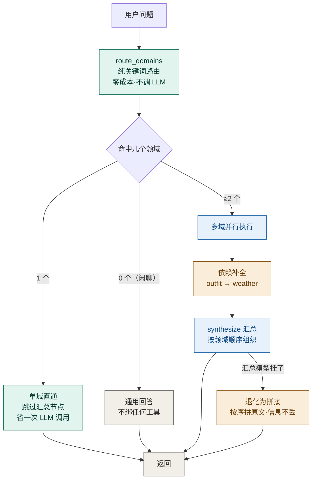

# 我改了 3 行关键词，测试立刻红了——因为有人提前把"坑"写成了断言

> 一个没有测试团队的项目，怎么保证改一处不崩另一处？以及"两个 Agent 架构哪个更好"这个问题的数据化回答。

> 「AI Agent 工程化实战」系列 · 10
> 项目源码：**[Ticnix/weather-travel-recommend-system](https://github.com/Ticnix/weather-travel-recommend-system)**
> 基于气象大数据的出行推荐系统，AI Agent 全栈项目。FastAPI + PostgreSQL(TimescaleDB/pgvector/PostGIS) + Redis；
> LangGraph + MCP + Skill + RAG，对接 DeepSeek API；React/Vue 前后端分离，实现 3D 天气可视化、智能出行穿搭推荐。
> （项目仍在更新中）

---

## TL;DR

三句话讲清这篇在讲什么：

1. **测试要测"我们怎么组织调用"，不是"模型说了什么"**。LLM 的输出内容不该断言（那是模型的事），该断言的是路由对不对、工具绑没绑对、失败有没有降级——这些是**你的代码**。
2. **最值钱的测试是"把坑写成断言"**：关键词表的一致性、注册表与真实工具名逐字相同、定时任务不许吞异常。这些约定一旦破了，代码不会报错，只会静默降级。
3. **架构之争要用数据结束**：项目里有一套进程内指标（`AgentMetrics`），按模式聚合延迟 / LLM 调用次数 / token / 领域命中分布。**没有数据，架构讨论就只是审美偏好**——这句话是源码注释里的原话。

---

## 目录

- [一、先看效果：改坏 3 行，测试红了几条](#一先看效果改坏-3-行测试红了几条)
- [二、概念先行：测试到底该测什么](#二概念先行测试到底该测什么)
- [三、三层测试策略与一个能离线跑的数字](#三三层测试策略与一个能离线跑的数字)
- [四、把"坑"写成断言：三组最值钱的测试](#四把坑写成断言三组最值钱的测试)
- [五、假模型：不调 LLM 也能测完整张图](#五假模型不调-llm-也能测完整张图)
- [六、"两个 Agent 架构哪个更好"——用数据回答](#六两个-agent-架构哪个更好用数据回答)
- [七、小结与全系列回顾](#七小结与全系列回顾)

---

## 一、先看效果：改坏 3 行，测试红了几条

先做个小实验。关于意图识别我们在第 09 篇讲过：项目用一张"强关键词"表对高置信问题直接定意图，绕开 LLM。

现在把这张表里 `weather` 的词全部删掉（模拟"手抖改坏了"），然后跑测试：

```
== 反例 A：清空 weather 强关键词 ==
exit=1
  FAILED test_agent_intent.py::TestStrongKeywordIntent::test_高置信问题直接命中意图[明天会下雨吗-weather]
  FAILED test_agent_intent.py::TestStrongKeywordIntent::test_高置信问题直接命中意图[今天气温多少度-weather]
  FAILED test_agent_intent.py::TestStrongKeywordIntent::test_高置信问题直接命中意图[有台风预警吗-weather]
  FAILED test_agent_intent.py::TestIntentTables::test_每个意图都有强关键词
  5 failed, 22 passed in 4.47s
```

不只是那几条参数化用例挂了，还有一条专门的**表完整性**断言跳出来：`test_每个意图都有强关键词`。

再试一个更刁钻的：从**弱关键词表**里删掉"天气"这一个词（弱词只在 LLM 失败时兜底，平时根本用不到，最容易被人当成冗余删掉）：

```
== 反例 B：从弱词表删掉「天气」 ==
exit=1
  FAILED test_agent_intent.py::TestWeakKeywordIntent::test_命中天气关键词
  1 failed, 26 passed in 4.17s
```

**两条都被抓住了，而且第二条把"这个测试存在的意义"演示得很清楚**——弱词表平时不参与主链路，删掉它不会有任何线上症状，只有测试会立刻变红。

> 这就是这套测试最核心的价值观：**它守的不是"功能能不能用"，而是"约定有没有被破坏"。**

---

## 二、概念先行：测试到底该测什么

### 一个反直觉的原则

带 AI 的项目里，最诱人的测试是这种：

```python
# ❌ 别这么写
answer = await chat("明天穿什么")
assert "冲锋衣" in answer        # 模型可能说"外套"、"夹克"、"冲锋衣"
```

**这个断言测的不是你的代码，是模型的脾气。** 换一次模型版本、调一次温度参数它就可能变红，而且它红了也不能说明你有 bug。

项目里的原则写在测试文件的 docstring 里，说得非常干脆：

```python
"""Supervisor 多智能体测试（Day 41）。

**不调真实 LLM**：这里用「按节点分辨身份的假模型」驱动整张图，
验证的是**编排逻辑**——路由对不对、单域是否跳过汇总、
并行分支有没有串味、失败降级是否有效。

与 Day 40 同一个思路：LLM 输出的内容不需要断言（那是模型的事），
要断言的是"我们怎么组织这些调用"。
"""
```

**"我们怎么组织这些调用"** —— 这句话是整篇文章的钥匙。

### 那么"编排逻辑"具体包括什么

把 AI 链路拆开看，能测的部分其实很多：


①～④ 全是**确定性**的，可以钉死；⑤ 是概率的，只能靠人工评估或 LLM-as-judge 那类手段。

**把 ①～④ 测扎实，你就有了重构的底气**——因为改错了立刻知道，而不是上线后用户来告诉你。

---

## 三、三层测试策略与一个能离线跑的数字

项目的 `backend/tests/` 下 **33 个测试文件**，分两层目录：

```
tests/
├── conftest.py          # 全局夹具（独立测试库、清表、ASGI 客户端）
├── unit/                # 26 个：纯逻辑、不连外部服务
│   ├── test_agent_intent.py        # 意图识别（27 用例）
│   ├── test_agent_registry.py      # 领域注册表一致性（21 用例）
│   ├── test_multi_agent.py         # 多 Agent 编排（25 用例）
│   ├── test_celery_failure.py      # 定时任务不许吞异常（8 用例）
│   └── ...
└── api/                 # 7 个：走 FastAPI 全链路（auth/home/notes/...）
```

我实测跑了一组纯单测（`unit/` 里的 4 个 AI 相关文件），**完全离线、不需要 Redis、不需要 LLM API Key**：

| 测试文件 | 用例数 | 耗时 |
| --- | --- | --- |
| `test_agent_intent.py` | 27 | 5.71s |
| `test_agent_registry.py` | 21 | 5.98s |
| `test_multi_agent.py` | 25 | 5.82s |
| `test_celery_failure.py` | 8 | 1.28s |
| **合计** | **81** | **49.01s** |

**81 个用例、49 秒、全绿。** 这个是"改代码前的安全网"——比开一次后端的耗时还短。

### 为什么能离线跑

`conftest.py` 的三条设计，每一条都在解决一个真实踩过的坑：

```python
"""三个关键设计（也是这套测试能不能"跑得干净、跑得独立"的关键）：

1. **独立测试库** —— DB_URL 指向 weather_db_test，与开发库**物理隔离**
   ⚠️ 必须在导入 app 之前设置——settings 是模块级单例，导入即固化。

2. **为什么不用「同库 + 事务回滚」** —— 部分 Service 在未传 db 时
   会**自建 AsyncSession 并 commit**，事务回滚方案挡不住，会真写进开发库。

3. **外部依赖必须 Mock** —— 和风 / 高德 / Tavily / LLM 全部用 respx 拦截，
   测试不依赖网络与 API Key（断网也能全绿）。
"""
```

第 3 条里有个很巧的设计：

```python
# respx_mock 未匹配到的外部请求会直接报错——这本身就是一道防线，
# 能暴露出"某个用例偷偷访问了真实网络"。
```

**默认拒绝，而不是默认放行。** 如果某个测试偷偷发了真实请求，`respx` 不匹配就报错，你会立刻发现。这比"允许真实网络、偶尔超时挂掉"可靠得多。

### 顺带一个 CI 才会暴露的坑

`pytest.ini` 里有一行注释，是一个很典型的"本地永远复现不了"的问题：

```ini
# ⚠️ 这一行是必需的，别删。
#
# 背景：`pytest` 与 `python -m pytest` 的 sys.path 行为**不一样**——
#   `python -m pytest` 会把当前目录加进 sys.path，所以 `from app import ...` 能成功；
#   直接执行 `pytest` 则不会，于是 conftest 里的 `from app import models` 直接
#   抛 ModuleNotFoundError，pytest 以退出码 4（usage error）结束。
#
# 这个坑的迷惑之处在于：本地习惯用 `python -m pytest` 跑，永远复现不了；
# 一到 CI（直接跑 `pytest`）就挂，而且报错信息看起来像参数用错了。
pythonpath = .
```

**"报错信息看起来像参数用错了"** —— 退出码 4、没有 traceback，看着像命令写错。实际是 import 失败。

---

## 四、把"坑"写成断言：三组最值钱的测试

### 第一组：关键词表的自洽性

第 09 篇讲过，项目有两张关键词表（强词、弱词）。这两张表之间有个不成文的约定：**强词应该是弱词的"高置信子集"**。

这个约定写成了测试：

```python
def test_强关键词覆盖弱关键词(self):
    """强词表应是弱词表的"高置信子集"，不应出现强词没有而弱词有的意图。"""
    assert set(agent._STRONG_INTENT_KEYWORDS) <= set(agent._INTENT_KEYWORDS) | {"outfit"}
```

还有一组"防止改坏"的护栏：

```python
def test_强关键词只包含有效意图(self):
    assert set(agent._STRONG_INTENT_KEYWORDS) <= {"weather", "outfit", "travel", "knowledge"}

def test_每个意图都有强关键词(self):
    for intent in ("weather", "outfit", "travel", "knowledge"):
        assert agent._STRONG_INTENT_KEYWORDS.get(intent), f"{intent} 缺少强关键词"
```

**注意最后那条**——它就是第一节反例 A 里抓到问题的那条断言。你不可能"不小心"把某个意图的词全删掉而不被发现。

### 第二组：注册表与真实工具名逐字一致

第 09 篇提到项目注册了 7 个 MCP 工具。多 Agent 架构把它们按领域分给 5 个领域 Agent。这里有个极隐蔽的失效模式，源码注释写得比我好：

```python
⚠️ **工具名必须与 MCP server / local_tools 里注册的名字逐字一致**：
写错不会报任何错，只会让某个 Agent 手里没有工具、于是凭记忆瞎答。
所以这里配了一组「注册表 ↔ 真实工具」的一致性测试守着。
```

"**于是凭记忆瞎答**" —— 拼错一个工具名，Agent 拿不到工具，模型就自己编。**整个链路不报错，只是答案开始不可信。**

测试的解法是**用 AST 解析真实的注册处**，而不是读某个手写清单：

```python
def _mcp_tool_names() -> set[str]:
    """MCP Server 实际注册的工具名（解析 server.py 里的 @mcp.tool()）。

    一开始我图省事，直接用「tools.py 里的公开协程函数」当工具清单——
    结果把 `fetch_weather` 这种内部辅助函数也算成了工具，测试报出
    "有工具没登记"，查半天才发现是提取方式错了。
    **工具清单必须以注册处为准**（server.py 的装饰器），不是以实现模块为准。
    """
```

这段注释里藏着一个真实的调试故事。然后是三向校验：

```python
def test_每个领域引用的工具都真实存在(self):
    """注册表里写的工具名，必须能在真实注册处找到。"""

def test_所有真实工具都被分配到了领域(self):
    """没有孤儿工具：新增工具却忘了登记，应该在这里失败。"""

def test_工具名称未被重复分配(self):
    """同一个工具不能同时属于两个领域。"""
```

**正着查、反着查、再查重**。三个方向都堵上，工具名这块就基本不可能出静默问题了。

还有一条我特别喜欢的断言：

```python
def test_分组函数不丢弃未登记的工具(self):
    """新工具没登记时要能被发现，而不是静默消失。"""
    grouped = group_tools([FakeTool("brand_new_tool")])
    assert [t.name for t in grouped["_unassigned"]] == ["brand_new_tool"]
```

对应的是实现里的这个设计：

```python
# 未在任何领域出现的工具放进 `_unassigned`——**不静默丢弃**：
# 将来加了工具却忘了登记，应该能从返回值里看出来（有测试守着）。
```

**"不静默丢弃"** —— 这类设计在带 AI 的系统里特别重要，因为静默的失效在 AI 链路上极难通过观察发现。

### 第三组：定时任务不许吞异常

第 09 篇花了大篇幅讲"吞异常废掉重试"。这个约定现在被测试钉住了：

```python
def test_天气任务失败不再被吞掉(self, monkeypatch):
    async def boom(*args, **kwargs):
        raise RuntimeError("外部API挂了")

    monkeypatch.setattr("app.tasks.weather_tasks.fetch_and_store", boom)
    with pytest.raises(RuntimeError, match="外部API挂了"):
        sync_weather_hourly()
```

**注意 `pytest.raises` 的语义**：它断言的不是"任务挂了"，而是"**异常必须逃出来**"。哪天有人又在任务体里加 `try/except`，这条测试立刻红。

这里有两个技术细节值得抄：

**① 测试不用 `.delay()`，直接调任务函数。**

```python
sync_weather_hourly()      # 不是 sync_weather_hourly.delay()
```

Celery 的 `task` 装饰器返回的对象**本身可调用**，直接调用就是同步执行任务体。所以**不需要 broker、不需要 Redis、不需要 worker**——这是"Celery 任务怎么测"的答案。

**② 这三个测试必须是同步的。**

```python
class TestNoSwallow:
    # 下面三个测试必须是**同步**的：任务体内的 _run() 会 run_until_complete，
    # 而 async 测试运行在 pytest-asyncio 的事件循环里，嵌套起循环会报
    # 「Cannot run the event loop while another loop is running」。
    # 生产环境无此问题：Celery worker 线程里没有运行中的事件循环。
```

还记得第 09 篇那个 `_get_loop()` + `run_until_complete` 吗？它在这里反噬了测试——**测试环境有正在跑的事件循环，而生产环境（Celery worker 线程）没有**。

**这就是"测试环境与生产环境不一致"的典型案例，而且原因是架构选择本身的副作用。** 好在解法简单：测试写成同步函数，问题消失。

---

## 五、假模型：不调 LLM 也能测完整张图

这是我觉得整个测试体系里最精彩的一段。

要测多 Agent 的编排（路由对不对、单域会不会跳过汇总、并行有没有串味），必须让图跑起来。但跑真 LLM 有三个问题：慢、贵、结果不稳定。

项目的解法是**写一个假模型**，它靠"节点绑定了哪些工具"来分辨自己是谁：

```python
class FakeLLM:
    """按「绑定了哪些工具 / 系统提示词」判断自己是谁，返回对应内容。

    这么设计是为了让断言不依赖提示词原文：
    领域节点靠 `bind_tools` 传入的工具名识别，汇总与通用节点靠提示词特征识别。
    """

    def bind_tools(self, tools: list) -> "FakeLLM":
        self.bound = True
        self.tool_names = [getattr(tool, "name", "") for tool in tools]
        return self

    def _domain_key(self) -> str | None:
        """用绑定的工具名反查自己属于哪个领域。"""
        for key, domain in DOMAINS.items():
            if set(domain.tools) & set(self.tool_names):
                return key
        return None
```

**为什么用工具名辨身份，而不是用提示词文本？** 因为提示词是会改的——如果假模型靠 `"你是天气查询助手"` 这个字符串判断身份，那改一次提示词文案就会让一堆测试红掉，而这些测试本来不该关心文案。

**用"绑了哪些工具"当身份标识，就把测试绑在了结构上，而不是文案上。** 这一点很值得学。

而这个假模型的第一个版本就挂过：

```python
def _content_of(item: Any) -> str:
    """取消息内容：LangChain 的调用有两种写法——

    - 领域节点传的是 SystemMessage/HumanMessage 对象
    - 通用/汇总节点传的是 ("system", "...") / ("human", "...") 元组

    假模型得同时认这两种，否则会报 `'tuple' object has no attribute 'content'`
    （第一次就是这么挂的）。
    """
```

写完假模型，就能断言编排行为了：

```python
async def test_单领域直通不调用汇总(self, monkeypatch):
    result = await multi_agent.chat_multi("明天天气怎么样")

    assert result["domains"] == ["weather"]
    # 关键：只有领域节点跑过，没有 synthesize——单域直通省掉一次 LLM 调用
    assert recorder == ["bind:get_weather,get_forecast", "weather"]
    assert result["metrics"]["llm_calls"] == 1
```

**`recorder` 记录的是"谁被调用了、按什么顺序"** —— 这就是"测编排不测内容"的具象化。

再看一条：

```python
async def test_每个领域只拿到自己的工具(self, monkeypatch):
    """这是多智能体的核心收益：工具候选从 10 个降到 1~3 个。"""
    await multi_agent.chat_multi("明天天气怎么样")
    await multi_agent.chat_multi("广州有什么好吃的")

    assert "bind:get_weather,get_forecast" in recorder
    assert "bind:search_knowledge,search_news,web_search" in recorder
```

**这条测试的断言对象不是"答案对不对"，而是"工具隔离有没有生效"**——正好对应多 Agent 架构的核心卖点。

还有一条覆盖了绝大多数人不会想到的边界：

```python
async def test_反复调用工具时会被步数上限截断(self, monkeypatch):
    """没有硬上限的话，模型反复调工具会一直烧 token 直到超时。"""
    run = await multi_agent.run_domain_agent("weather", "天气", [FakeTool("get_weather")], max_steps=2)

    assert run.llm_calls == 3  # max_steps + 1 次后强制结束
    assert run.answer          # 仍要有内容返回，不能是空
```

**"仍要有内容返回，不能是空"** —— 这个断言呼应了第 09 篇那个 `handle_error` 不可达的缺陷（最后返回了空字符串）。**同样的坑，在这里被测试提前堵住了。**

---

## 六、"两个 Agent 架构哪个更好"——用数据回答

这是全篇我最想推荐的一段，因为它把"架构争论"变成了可执行的事。

项目里同时存在**单 Agent（ReAct）**和**多 Agent（Supervisor）**两套架构，由配置项一键切换：

```python
def use_multi_agent() -> bool:
    """当前是否启用 Supervisor 多智能体（配置可一键回退）。

    默认 single：新架构上线第一步是"能一键回退"，
    出问题改一行配置即可退回旧路径，不必重新发版。
    """
    return (settings.AGENT_MODE or "single").strip().lower() == "multi"
```

而"哪个更好"这个问题，靠一个进程内指标组件来回答。它的 docstring 值得完整引用：

```python
"""Agent 运行指标（Day 41）。

**为什么需要它**：多智能体架构"看起来更优雅"不是理由。
要判断值不值，必须能回答三个问题：

1. 延迟高了多少？（多 Agent 意味着多次 LLM 调用）
2. token 花了多少？（每个领域 Agent 都要带自己的系统提示与工具描述）
3. 复合问题是不是真的路由对了？（领域命中分布）

没有数据，架构讨论就只是审美偏好。
"""
```

> **"没有数据，架构讨论就只是审美偏好。"** —— 这句话我建议所有做技术选型的人都记一下。

### 指标记录了什么

```python
def observe(self, mode: str, *, duration_ms: float, llm_calls: int = 0,
            tool_calls: int = 0, prompt_tokens: int = 0, completion_tokens: int = 0,
            domains: list[str] | None = None, error: bool = False) -> None:
    """记录一次 Agent 运行。"""
```

`mode` 就是 `"single"` 或 `"multi"`，所以两套架构的数据天然分开聚合：

```python
def snapshot(self) -> dict[str, Any]:
    """各模式的汇总（含均值，便于直接比较）。"""
```

对比维度是现成的：

| 维度 | 说明 | 谁更该赢 |
| --- | --- | --- |
| `avg_ms` | 平均延迟 | 单 Agent（多 Agent 至少要 N 次 LLM 调用） |
| `avg_llm_calls` | 平均 LLM 调用次数 | 单 Agent |
| `total_tokens` | token 总消耗 | 单 Agent |
| `domain_hits` | 领域命中分布 | 多 Agent（证明路由有没有生效） |
| `errors` | 错误次数 | —— |

**这套指标没有预设答案，它只是把账算清楚。** 而且它的取舍也很诚实：

```python
进程内聚合、重启归零——与 core/observability.Metrics 同样的取舍：
当前的需求是"跑一批对比看趋势"，几十行足够，等要做可视化再换实现。
```

**"几十行足够，等要做可视化再换实现"** —— 不提前上 Prometheus，先解决"有没有数据"这个问题。这是个很成熟的判断。

### 一个必须补回来的细节

多 Agent 拆分后有个静默退化风险：**拆分让每个 Agent 只看自己那摊，于是有些"顺便该做的事"就没人做了。**

项目把这个风险显式写进了依赖表：

```python
# 领域依赖：命中左边时，右边也要一起跑。
#
# 目前只有一条：**穿搭依赖天气**。用户问"明天爬山穿什么"时，
# 他想要的不只是"建议穿冲锋衣"，还有"明天 18℃ 有雨"这个前提——
# 少了它，穿搭建议就是悬空的。实测单 Agent 的提示词里也是这么要求的，
# 多 Agent 拆分后这条约束必须显式补回来，否则会静默地比原来答得少。
#
# 反过来刻意**不加**：
# - route → weather：路线评分内部已经含天气，再加一次是重复调用
# - itinerary → weather：check_itinerary_weather 本身就会取当天天气
DOMAIN_DEPENDS: dict[str, tuple[str, ...]] = {
    "outfit": ("weather",),
}
```

**"否则会静默地比原来答得少"** —— 又是"静默"。做架构重构时最危险的不是报错，是**答案变差了但没人发现**。加一次天气查询就能补回来，但前提是你意识到它被弄丢了。

用图看这套编排怎么处理各种情况：



注意右下那条"汇总挂 → 退化为拼接"的降级路径，它也有测试守着：

```python
async def test_汇总失败时退化为拼接而不是报错(self, monkeypatch):
    result = await multi_agent.chat_multi("明天去广州塔穿什么、怎么走")

    # 拼接兜底按领域顺序把原文拼起来，信息不丢
    assert "天气回答" in result["answer"]
    assert "穿搭回答" in result["answer"]
```

**"信息不丢"** —— 汇总模型可以挂，但已经查到的内容不能白查。这是降级设计里最实用的原则之一，也是第 09 篇"分层降级"的延续。

---

## 七、小结与全系列回顾

### 可复用清单

| 场景 | 做法 |
| --- | --- |
| 带 LLM 的测试 | 断言**编排**（路由/绑定/调用次数/降级），不断言模型输出内容 |
| 假模型的身份识别 | 用"绑定了哪些工具"判断，**不要用提示词文本**——文案会改 |
| 关键词表 | 写"表完整性"测试：每个意图都有词、词表只含有效意图、强弱表有包含关系 |
| 注册表类配置 | 用 AST 解析**真实注册处**，三向校验：正查、反查孤儿、查重复 |
| 未登记项 | 放进 `_unassigned` 而非静默丢弃——静默失效在 AI 链路里最难发现 |
| 定时任务测试 | 直接调任务函数（不用 `.delay()`），**不需要 Redis 和 worker** |
| 任务不许吞异常 | 用 `pytest.raises` 断言"异常必须逃出来"，把约定钉死 |
| 嵌套事件循环 | Celery 任务测试写成**同步**函数（`_run()` 的 `run_until_complete` 会冲突） |
| 测试库 | 用独立库 + 自动清表，别用"同库 + 事务回滚"（自建 Session 的写入挡不住） |
| 外部依赖 | Mock 默认**拒绝**而非放行——偷偷发真实请求应该报错 |
| `pytest.ini` | 加 `pythonpath = .`，消除 `pytest` 与 `python -m pytest` 的差异 |
| 架构选型 | 先埋指标（按模式聚合延迟/token/命中分布），**没有数据别讨论架构** |
| 架构切换 | 必须能**一键回退**（改配置而非重新发版） |
| 拆分重构 | 显式补回"跨域依赖"，否则会静默地比原来答得少 |

### 全系列回顾

十篇写下来，这条 AI 链路的全貌大概是这样的：

| 篇 | 主题 | 核心一句话 |
| --- | --- | --- |
| 01 | LangGraph 状态循环 | 边画错了，图照样跑 |
| 02 | MCP 工具层解耦 | 工具是"声明"，不是"函数调用" |
| 03 | contextvars 用户隔离 | 请求级状态不该靠传参 |
| 04 | pgvector RAG | 维度对齐和分块是 RAG 的地基 |
| 05 | 多租户 RAG | 隔离要在查询层，不是过滤层 |
| 06 | 提示词工程 | 决策逻辑能写进提示词，就不用写 if-else |
| 07 | SSE 流式 | 一旦开始说话，就没法再改口 |
| 08 | 搜索增强 | 结论对了不代表理由是对的 |
| 09 | 降级与容错 | 吞异常比不处理更糟 |
| 10 | 验证与测试 | 没有数据，架构讨论就只是审美偏好 |

**如果只能记一句**：带 AI 的系统里，**最贵的 bug 都是静默的**。工具名拼错不报错、降级分支走不到不报错、吞掉异常不报错、拆分后少答一个领域不报错。这十篇里反复出现的"静默"二字，就是这套工程方法真正在对付的东西。

### 下一篇预告

系列的主线到这里告一段落了。如果还想继续，下一篇可以聊**部署与运维侧**：一个跑在单机上的全栈 AI 项目，`.env` 里到底该有多少配置、Docker 起不来时怎么用原生进程兜底、日志怎么做到"出问题时一眼能定位"。这些是"能跑起来"和"能一直跑着"之间的距离。

---

## 参考资料

1. **pytest 官方文档 · Configuration** —— `pythonpath` 配置项（解决 `pytest` 与 `python -m pytest` 的 import 差异）
   https://docs.pytest.org/en/stable/reference/reference.html#confval-pythonpath
2. **pytest 官方文档 · `pytest.raises`** —— 断言异常必须抛出的语义
   https://docs.pytest.org/en/stable/reference/reference.html#pytest-raises
3. **Celery 官方文档 · Calling Tasks** —— 任务对象可直接调用（同步执行），无需 broker 与 worker
   https://docs.celeryq.dev/en/stable/userguide/calling.html
4. **Python 官方文档 · `ast`** —— 用 AST 解析真实注册处，而不是维护手写清单
   https://docs.python.org/3/library/ast.html
5. **respx 文档** —— httpx 的请求 Mock，未匹配请求默认报错
   https://lundberg.github.io/respx/
6. **LangChain 官方文档 · Testing** —— 用假模型测编排（fake LLM 的官方推荐做法）
   https://python.langchain.com/docs/contributing/testing/
7. **项目源码（仍在更新中）** —— Ticnix/weather-travel-recommend-system
   https://github.com/Ticnix/weather-travel-recommend-system
