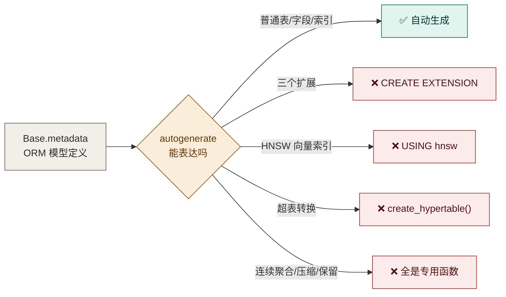

# 迁移脚本能跑通，不代表你回滚得回来

> TimescaleDB 超表、PostGIS 地理字段、pgvector 向量列——这些"非标准 DDL"怎么跟 Alembic 配合，以及一次只在下行路径暴露的翻车。

> 「AI Agent 工程化实战」系列 · 12
> 项目源码：**[Ticnix/weather-travel-recommend-system](https://github.com/Ticnix/weather-travel-recommend-system)**
> 基于气象大数据的出行推荐系统，AI Agent 全栈项目。FastAPI + PostgreSQL(TimescaleDB/pgvector/PostGIS) + Redis；
> LangGraph + MCP + Skill + RAG，对接 DeepSeek API；React/Vue 前后端分离，实现 3D 天气可视化、智能出行穿搭推荐。
> （项目仍在更新中）

---

## TL;DR

1. **Alembic 默认模板搞不定这个项目**：三个扩展、HNSW 索引、超表转换都不是标准的 `create_table` 能表达的，得用 `op.execute()` 手写 DDL，并且换成**异步模板**。
2. **回滚路径才是坑最多的地方**：`downgrade()` 在正常开发中几乎从不执行，所以它的 bug 能潜伏很久。我这次就踩了一个——把超表关压缩之前，必须先解压已压缩的 chunk。
3. **同一个聚合 SQL 必须在三处一致**：生产是连续聚合、测试是普通视图、对账时手跑。所以它被抽成了一个常量——否则迟早出现"测试通过的和线上跑的不是同一段 SQL"。

---

## 目录

- [一、先看那条"回滚时才暴露"的错误](#一先看那条回滚时才暴露的错误)
- [二、概念先行：为什么 ORM 建表不够用](#二概念先行为什么-orm-建表不够用)
- [三、11 个迁移里，三个非标准 DDL 怎么写](#三11-个迁移里三个非标准-ddl-怎么写)
- [四、改字段时，历史数据怎么办](#四改字段时历史数据怎么办)
- [五、把"同一段 SQL"变成常量](#五把同一段-sql-变成常量)
- [六、一个真实的隐患：两条建表路径](#六一个真实的隐患两条建表路径)
- [七、小结与下一篇](#七小结与下一篇)

---

## 一、先看那条"回滚时才暴露"的错误

`0011_timescale_analytics.py` 这个迁移做了四件事：建连续聚合、加自动刷新策略、开启压缩、加保留策略。`upgrade()` 一切正常。

问题出在 `downgrade()`。源码注释直接写了：

```python
    # ⚠️ 关压缩之前必须先把已压缩的 chunk 解压：
    # 压缩任务一旦跑过（这里就跑了），直接
    # `SET (timescaledb.compress = false)` 会报
    # `cannot disable columnstore on hypertable with columnstore chunks`。
    # 这个坑是回滚时才暴露的——正常升级路径根本走不到这一段。
```

**"正常升级路径根本走不到这一段"** —— 这就是 `downgrade()` 被轻视的代价。你写它、它也在 CI 里存在，但很少有人真的执行它。

而且踩到坑之后，解法还踩了第二个坑：

```python
    # 写法上用 `show_chunks()` 而不是"查出名字再传参"：
    # `decompress_chunk` 的第一个形参是 **regclass**，
    # 传字符串绑参（`:c`）会被 asyncpg 当成 unknown 类型，
    # 报 `relation "_hyper_1_3_chunk" does not exist`（实测）。
    # `show_chunks()` 直接产出 regclass，顺带把解压写成一条集合语句。
    conn.execute(text("SELECT decompress_chunk(c, true) FROM show_chunks('weather_history') AS c"))
```

**"传字符串绑参会被 asyncpg 当成 unknown 类型"** —— 报错信息 `relation "_hyper_1_3_chunk" does not exist` 极具误导性：那个 chunk 明明存在。真实原因是**参数类型没被识别成 `regclass`**。

一个更稳妥的写法反而更简洁：让 `show_chunks()` 在 SQL 里直接产出 `regclass`，一条集合语句解决所有 chunk。

### 顺带一个顺序问题

```python
    # 策略先于对象删除：留着策略指向已删对象，后台任务会持续报错
    conn.execute(text("SELECT remove_retention_policy('weather_history', if_exists => TRUE)"))
    conn.execute(text("SELECT remove_compression_policy('weather_history', if_exists => TRUE)"))
```

**"留着策略指向已删对象，后台任务会持续报错"** —— 策略是 TimescaleDB 后台作业，删了对象但没删策略，作业会一直失败刷日志。**先删策略、再删对象**，这个顺序不能反。

---

## 二、概念先行：为什么 ORM 建表不够用

### Alembic 是什么

一句话：**数据库结构的版本控制**。你改表结构，就写一个"迁移脚本"；脚本按顺序执行，数据库就从旧结构变成新结构。和 Git 管代码是一个思路。

它有两种用法：

| 命令 | 作用 |
| --- | --- |
| `alembic revision --autogenerate -m "..."` | 对比模型和数据库，**自动生成**迁移脚本 |
| `alembic upgrade head` | 执行所有未执行的迁移 |
| `alembic downgrade -1` | **回滚一步** |

### 为什么 autogenerate 在这里不够

`--autogenerate` 的原理是"对比 `Base.metadata` 和真实数据库，把差异写成 `create_table` / `add_column`"。但项目里有三样东西**表达不了**：



这些东西**在 PostgreSQL 里是普通 DDL，但在 SQLAlchemy 的模型定义里没有对应概念**——模型里没法声明"这张表要变成超表"。

所以项目的迁移脚本里全是 `op.execute()` 手写 SQL。这**不是偷懒，是唯一可行的做法**。

### 还有一个必须改的地方：异步模板

`alembic init` 默认生成的 `env.py` 是同步的。项目的 `env.py` 换成了异步版本：

```python
async def run_async_migrations() -> None:
    """在线模式（异步）。"""
    connectable = async_engine_from_config(
        config.get_section(config.config_ini_section, {}),
        prefix="sqlalchemy.",
        poolclass=pool.NullPool,          # ← 就是第 09 篇那个坑
    )

    async with connectable.connect() as connection:
        await connection.run_sync(do_run_migrations)

    await connectable.dispose()


def run_migrations_online() -> None:
    asyncio.run(run_async_migrations())
```

**`poolclass=pool.NullPool` 又出现了** —— 这是第 09 篇（Celery 跨事件循环）和第 10 篇（测试库）的同一个坑的第三次现身。**"用了 `asyncio.run()` 的地方，就不该有连接池缓存"**，这已经成了这个项目的一条不变式。

还有一行值得一提：

```python
# 覆盖数据库连接串为 .env 中的配置
config.set_main_option("sqlalchemy.url", settings.DB_URL)
```

对应的 `alembic.ini` 里 `sqlalchemy.url = ` 是**空的**。

**为什么不写在 ini 里？** 因为那样就得把带密码的连接串写进一个入库的文件。**让配置从 `.env` 统一来，ini 里留空** —— 跟第 11 篇的配置三段式是同一个原则。

---

## 三、11 个迁移里，三个非标准 DDL 怎么写

项目从 `0001_initial` 到 `0011_timescale_analytics` 一共 11 个迁移。抽三个典型看。

### ① 扩展必须在建表之前

```python
def upgrade() -> None:
    op.execute("CREATE EXTENSION IF NOT EXISTS timescaledb")
    op.execute("CREATE EXTENSION IF NOT EXISTS vector")
    op.execute("CREATE EXTENSION IF NOT EXISTS postgis")

    op.create_table("users", ...)
```

**顺序不能反**。因为下面 `landmarks` 表要用 `Geometry` 类型（PostGIS）、`knowledge_chunks` 要用 `Vector(1024)`（pgvector），扩展没启用时这些列的类型根本不存在。

这也解释了第 10 篇 CI 里那段"补装 PostGIS"的步骤——**CI 用的 `pgvector/pgvector:pg17` 镜像自带 vector，但没有 PostGIS**，得单独装：

```yaml
      - name: 为测试库补装 PostGIS 扩展
        run: |
          docker exec ${{ job.services.postgres.id }} bash -c \
            "apt-get update -qq && \
             apt-get install -y -qq --no-install-recommends postgresql-17-postgis-3"
```

### ② HNSW 索引要手写

```python
    op.execute(
        "CREATE INDEX IF NOT EXISTS ix_knowledge_chunks_embedding_hnsw "
        "ON knowledge_chunks USING hnsw (embedding vector_cosine_ops)"
    )
```

`USING hnsw` 这个索引方法在 `op.create_index()` 的签名里没有位置。**只能手写。**

注意它和模型定义是**分头维护**的——模型里只有 `Vector(1024)` 这一列，索引完全不存在于 ORM 层。这意味着：**如果有人 `--autogenerate` 生成了一版新迁移，它可能不包含这个索引**（autogenerate 有时会认为"数据库里这个索引模型里没有，应该删掉"）。所以这段是手写并加了 `IF NOT EXISTS` 保护的。

### ③ 超表转换：模型里声明不了

```python
    op.execute(
        "SELECT create_hypertable('weather_history', 'time', "
        "if_not_exists => TRUE, migrate_data => TRUE)"
    )
```

`create_hypertable` 是 TimescaleDB 的函数，它的作用是**把一张普通表转换成"按时间分片"的超表**。三个参数各有含义：

| 参数 | 含义 |
| --- | --- |
| `'weather_history', 'time'` | 表名 + 按哪一列分片（时间列） |
| `if_not_exists => TRUE` | 已是超表就跳过，保证**幂等** |
| `migrate_data => TRUE` | **表里已有数据时也转换**（把历史数据搬进分片） |

**`migrate_data` 这个参数很关键** —— 没有它，对一张有数据的表调用 `create_hypertable` 会直接报错。而第 11 篇的 `deploy.sh` 正是"停应用 → 备份 → 换镜像 → 启动"的流程：**迁移会在一张已有数据的老表上执行**，所以这个参数是必需的。

`if_not_exists` 则是另一层保险：**迁移脚本可能被执行两次**（比如手动跑过一次，又跑 `upgrade head`），必须幂等。

---

## 四、改字段时，历史数据怎么办

这是"数据演化"里最实际的问题。看 `0010_notification_categories.py` —— 给通知记录加一个类型字段：

```python
def upgrade() -> None:
    op.execute(
        "ALTER TABLE notification_prefs ADD COLUMN IF NOT EXISTS "
        "alert_enabled BOOLEAN NOT NULL DEFAULT true"
    )
    op.execute(
        "ALTER TABLE notification_prefs ADD COLUMN IF NOT EXISTS "
        "itinerary_enabled BOOLEAN NOT NULL DEFAULT true"
    )
    # 历史行按 system 处理：它们确实不属于任何一个可关闭的类型
    op.execute(
        "ALTER TABLE notification_logs ADD COLUMN IF NOT EXISTS "
        "category VARCHAR(16) NOT NULL DEFAULT 'system'"
    )
```

**最后那条注释就是"历史数据怎么办"的答案**：

- 列声明为 `NOT NULL`，所以必须有值；
- 历史行没有类型信息，**不能编造一个"预警"或"行程"给它们**；
- 于是给一个**语义正确的默认值** `'system'`——"这些是系统通知，不属于任何可关闭的类型"。

**"它们确实不属于任何一个可关闭的类型"** —— 这句话体现的是**数据语义上的诚实**。如果当初随手填了 `'alert'`，那这些历史行就会出现在"预警通知"的统计里，而它们根本不是。

### 一个反例：加字段时不能随便给默认值

看 `0003_news_source_url.py`：

```python
def upgrade() -> None:
    op.execute("ALTER TABLE news ADD COLUMN IF NOT EXISTS source_url VARCHAR(512)")
```

这里**故意不给 `NOT NULL` 和默认值** —— 因为"这篇资讯的原文链接是什么"是一个**客观事实**，历史数据里就是没有。填个空字符串会让"有原文链接"的查询多出一堆假阳性。

**两条规则对比一下就清楚了：**

| 情况 | 做法 |
| --- | --- |
| 历史数据可以**被合理归类** | 给一个语义正确的默认值（`'system'`） |
| 历史数据**客观缺失** | 允许 `NULL`，不要编造 |

### 顺带看一个"文档滞后"的痕迹

`0004_news_full_text.py` 里有一段话，读过第 08 篇的会眼熟：

```python
"""add news full_text

为资讯增加「原文正文」字段：采集类资讯抓取原文正文后存入，
详情页可直接阅读完整内容，不再依赖 iframe 内嵌
（多数新闻站设置了 X-Frame-Options / CSP frame-ancestors，内嵌会被浏览器拒绝而空白）。
"""
```

**"多数新闻站设置了 X-Frame-Options"** —— 第 08 篇实测的结论是：16 个中文内容站点里只有 4 个真的禁止内嵌。当时我以为这个错误说法只存在于 `article_extractor.py` 的 docstring 里，**现在发现它已经随迁移脚本一起写进了版本历史**。

> 这就是"结论对了，理由是猜的"的传播路径：一个未经验证的假设写进注释 → 后来的迁移文件引用它 → 再后来的人读到两次，就当它是事实了。**迁移文件是历史记录，改不了；但至少可以在新代码里不再复述它。**

---

## 五、把"同一段 SQL"变成常量

`0011` 这个迁移引用了一个常量：

```python
from app.db.analytics import DAILY_AGGREGATE_SELECT

    conn.execute(
        text(
            f"CREATE MATERIALIZED VIEW IF NOT EXISTS {DAILY_VIEW} "
            f"WITH (timescaledb.continuous) AS {DAILY_AGGREGATE_SELECT} "
            f"WITH NO DATA"
        )
    )
```

**为什么从业务模块 `import` 一个字符串进迁移脚本？** `analytics.py` 的注释解释了：

```python
"""时序聚合的统一定义（Day 42）。

**为什么把这段 SQL 单独放一个模块**：同一个聚合要在三处出现——

1. 生产环境：连续聚合（continuous aggregate）的定义，迁移 0011 里创建
2. 测试环境：测试库不建超表也不建连续聚合，用一个**同名的普通视图**顶上
3. 离线核对：需要手跑一遍聚合来对账时

如果三处各写一份，迟早会出现"测试通过的逻辑和线上跑的不是同一个 SQL"。
所以聚合定义在这里写一次，三处引用同一常量。
"""
```

**"测试通过的逻辑和线上跑的不是同一个 SQL"** —— 这是第 10 篇"测的是编排不是内容"的另一种体现。测试环境为了轻量（不建超表、不建连续聚合），用一个**同名普通视图**顶上：

```python
# 不建超表，但要建**同名普通视图**（Day 42）：
# 线上是连续聚合 weather_daily，测试库用普通视图顶上，
# 两边引用同一段聚合 SQL（app/db/analytics.py），
# 这样"测试通过的聚合逻辑"与"线上跑的"是同一份。
```

**"同名"是这里的关键设计**：业务代码只 `SELECT ... FROM weather_daily`，完全不知道背后是连续聚合还是普通视图。测试环境和生产环境的**查询接口一致**，只有实现不同。

### 这段 SQL 里还有一个真实的语义 bug

`DAILY_AGGREGATE_SELECT` 上方有一段很长的注释，讲的是项目早期的设计让聚合算错了：

```python
# ⚠️ 这张表里其实混了**两种行**（Day 4 的设计），聚合必须分别对待：
#
# | 行类型 | 来源 | temperature | feels_like | humidity |
# | --- | --- | --- | --- | --- |
# | 实测行 | 接口 current | 当时的温度 | 体感 | 有值 |
# | 日统计行 | 接口 daily | **日最高** | **日最低** | 为空 |
#
# 直接用 `avg(temperature)` 会把日统计行当成"当天的一个温度观测"，
# 于是"日均温"实际算成了"日最高温的均值"——数字看着正常，语义是错的。
# 所以用 `raw ? 'daily'` 区分两类行
```

**"数字看着正常，语义是错的"** —— 这又是全篇那个"静默 bug"的主题。日均温算出个 28℃ 你不会觉得有问题，但它其实是"日最高温的平均"。

修法是在 SQL 里区分两类行：

```sql
    avg(
        CASE WHEN raw ? 'daily' THEN (temperature + feels_like) / 2
             ELSE temperature END
    ) AS temp_avg,
```

`raw ? 'daily'` 是 JSONB 的存在性判断——靠数据里的一个标记来分辨行类型。

还有两处细节：

```python
# 降水用 sum（日累计）而不是 avg：问"那天下多少雨"时答案是总量；
# 同时保留 avg，因为旧的 /weather/stats 返回的是平均值，两者都留着
# 才能既满足新需求又不破坏既有前端。
```

**两个字段都留着** —— 加新语义时不动老语义，前端按需选。这是**兼容性**的正确处理方式。

```python
# samples 记录当日样本数：某天只有 1 个样本时，"最高/最低"其实没有代表性，
# 前端据此可以弱化展示（诚实标注数据质量，而不是假装精确）。
```

**"诚实标注数据质量，而不是假装精确"** —— 输出样本数让调用方自己判断可信度。这个思路在数据类接口里非常值得抄。

### 还有一个时区坑

```python
**日切为什么用 Asia/Shanghai**：`time_bucket('1 day', time)` 默认按 UTC 切，
广州（东八区）的"今天"会比北京时间晚 8 小时才归日——
晚上 8 点之后的数据会被算进前一天。所以显式传时区。
```

```sql
    time_bucket('1 day', time, 'Asia/Shanghai') AS day,
```

**不传时区默认按 UTC 切** —— 这意味着"北京时间晚上 8 点之后的数据会被算进前一天"。对一个月度报表这种误差无所谓，但对"今天天气怎么样"就是直接错。

---

## 六、一个真实的隐患：两条建表路径

写这篇时发现项目里**同时存在两条建表路径**，而且**细节不一致**。

**路径 A：`alembic upgrade head`** —— 用 11 个迁移脚本逐步建表。

**路径 B：`python -m app.scripts.init_db`** —— README 里也写着的初始化方式：

```python
async def run() -> None:
    async with engine.begin() as conn:
        print(">>> 启用扩展 ...")
        await conn.execute(text("CREATE EXTENSION IF NOT EXISTS timescaledb"))
        ...
        print(">>> 创建数据表 ...")
        await conn.run_sync(Base.metadata.create_all)
```

它用 `Base.metadata.create_all()` **直接按模型建表**，完全绕过 Alembic。

问题出在超表转换这一步——**同样是 `create_hypertable`，两处参数不同**：

```python
# ✅ app/scripts/init_db.py —— 有 migrate_data
"SELECT create_hypertable('weather_history', 'time', "
"if_not_exists => TRUE, migrate_data => TRUE)"

# ⚠️ app/db/session.py 里的 init_db() —— 漏了 migrate_data
text("SELECT create_hypertable('weather_history', 'time', if_not_exists => TRUE)")
```

**`migrate_data => TRUE` 的作用是"表里已有数据时也能转换"。** 少了它，在一张**已有数据的表**上执行会直接报错。

`session.py` 里那个 `init_db()` 的 docstring 也是旧的：

```python
async def init_db() -> None:
    """初始化数据库：启用扩展 -> 建表 -> 转换为 TimescaleDB 超表。"""
```

它导入的模型列表还是老的（只有 10 个模块，缺少 `new` 的通知、行程、天气预警等），而 `app/models/__init__.py` 里已经有 14 个模型了。

**为什么这是个真隐患：**

| 风险 | 说明 |
| --- | --- |
| 空库场景 | 两条路径建出来的表**结构可能不同**（比如缺新模型、缺 HNSW 索引、缺超表转换参数） |
| 有数据的库 | `session.py` 那条路径会因缺 `migrate_data` **直接报错** |
| 迁移链断裂 | 用 `create_all` 建的库，`alembic_version` 表是空的——之后 `alembic upgrade head` 会从 `0001` 开始重放，报"表已存在" |

**根因是"两套机制各管一半"**：Alembic 管结构版本，`create_all` 管快速起步。它们各能跑通，但**混用时会出现分裂**。

**建议的收敛方向**（写在这里备忘）：

1. 保留 Alembic 为**唯一**的建表路径，`init_db` 改为只做"扩展 + 播种管理员 + `alembic upgrade head`"；
2. 若确实需要 `create_all` 快速起步，则必须补上 `alembic stamp head`，把版本号对齐，避免之后重放；
3. 把 `create_hypertable` 的参数**抽成一个常量**（就像 `DAILY_AGGREGATE_SELECT` 那样），消除两处不一致的可能。

第 3 条尤其重要——**这个项目已经用"抽常量"解决过一次同类问题**（聚合 SQL 三处共用），这条经验完全可以复用到 DDL 上。

---

## 七、小结与下一篇

### 可复用清单

| 场景 | 做法 |
| --- | --- |
| 扩展依赖 | `CREATE EXTENSION IF NOT EXISTS` 必须在建表**之前**，且每个都带 `IF NOT EXISTS` |
| 非标准索引（HNSW/GIN） | 只能 `op.execute()` 手写；记得加 `IF NOT EXISTS` |
| 超表转换 | `create_hypertable(..., if_not_exists => TRUE, migrate_data => TRUE)` |
| `migrate_data` | **对有数据的老表必须加**，否则转换直接报错（部署场景一定会遇到） |
| 异步 Alembic | `env.py` 换异步模板；连接必须用 `NullPool`（同 Celery / 测试库那个坑） |
| 连接串 | 不要在 `alembic.ini` 里写死，从 `.env` 读——ini 是要入库的 |
| 加 NOT NULL 字段 | 历史数据**能被合理归类** → 给语义正确的默认值；**客观缺失** → 允许 NULL，别编造 |
| 回滚脚本 | `downgrade()` 一定要**真的执行一次**验证，它平时没人跑，bug 全藏这里 |
| 对象与策略 | 删对象前**先删策略**，否则后台作业会持续报错刷日志 |
| 关压缩前 | 必须 `decompress_chunk` 所有已压缩 chunk，用 `show_chunks()` 让它产出 `regclass` |
| 跨环境同名 | 生产用连续聚合、测试用**同名普通视图**，业务代码无需感知差异 |
| 共享 SQL | 抽成一个常量模块，避免"测试通过的和线上跑的不是同一段 SQL" |
| 时区 | `time_bucket` 必须显式传时区，否则日切按 UTC，晚上 8 点后的数据归到前一天 |
| 混合数据行 | 靠数据里的标记（如 `raw ? 'daily'`）区分行类型，别用统一聚合函数 |
| 数据质量 | 返回样本数，让调用方自己判断"最高/最低"有没有代表性 |
| 建表路径 | **只能有一条**；若保留 `create_all` 兜底，必须 `alembic stamp head` 对齐版本号 |

### 下一篇预告

迁移这条线告一段落。如果继续，下一篇想聊**项目的"知识"是怎么组织的**：`backend/skills/` 下的 4 个 Skill 是什么结构、`knowledge_base/` 里的 16 个 Markdown 怎么被切分进 RAG、以及"什么该写成 Skill、什么该写成知识文档、什么该写成工具"这条边界怎么划。要的话我接着写，还是这个体量。

---

## 参考资料

1. **Alembic 官方文档 · Autogenerate** —— 自动生成的边界（哪些改动检测不到，如索引方法、物化视图）
   https://alembic.sqlalchemy.org/en/latest/autogenerate.html
2. **Alembic 官方文档 · Cookbook: 在异步环境使用** —— 异步 `env.py` 模板与 `run_sync`
   https://alembic.sqlalchemy.org/en/latest/cookbook.html
3. **TimescaleDB 官方文档 · `create_hypertable`** —— `migrate_data` 参数：已有数据的表也能转换
   https://docs.tigerdata.com/api/latest/hypertable/create_hypertable/
4. **TimescaleDB 官方文档 · 压缩与 `decompress_chunk`** —— 关压缩前必须先解压所有 chunk
   https://docs.tigerdata.com/api/latest/compression/decompress_chunk/
5. **TimescaleDB 官方文档 · 连续聚合** —— `WITH NO DATA` 与 `add_continuous_aggregate_policy` 的 `end_offset`
   https://docs.tigerdata.com/use-timescale/latest/continuous-aggregates/create-a-continuous-aggregate/
6. **pgvector 官方 README · HNSW** —— `USING hnsw (col vector_cosine_ops)` 的建索引语法
   https://github.com/pgvector/pgvector#hnsw
7. **PostgreSQL 官方文档 · 时区与 `time_bucket`** —— 时间分桶与时区参数
   https://www.postgresql.org/docs/current/datatype-datetime.html#DATATYPE-TIMEZONES
8. **项目源码（仍在更新中）** —— Ticnix/weather-travel-recommend-system
   https://github.com/Ticnix/weather-travel-recommend-system
