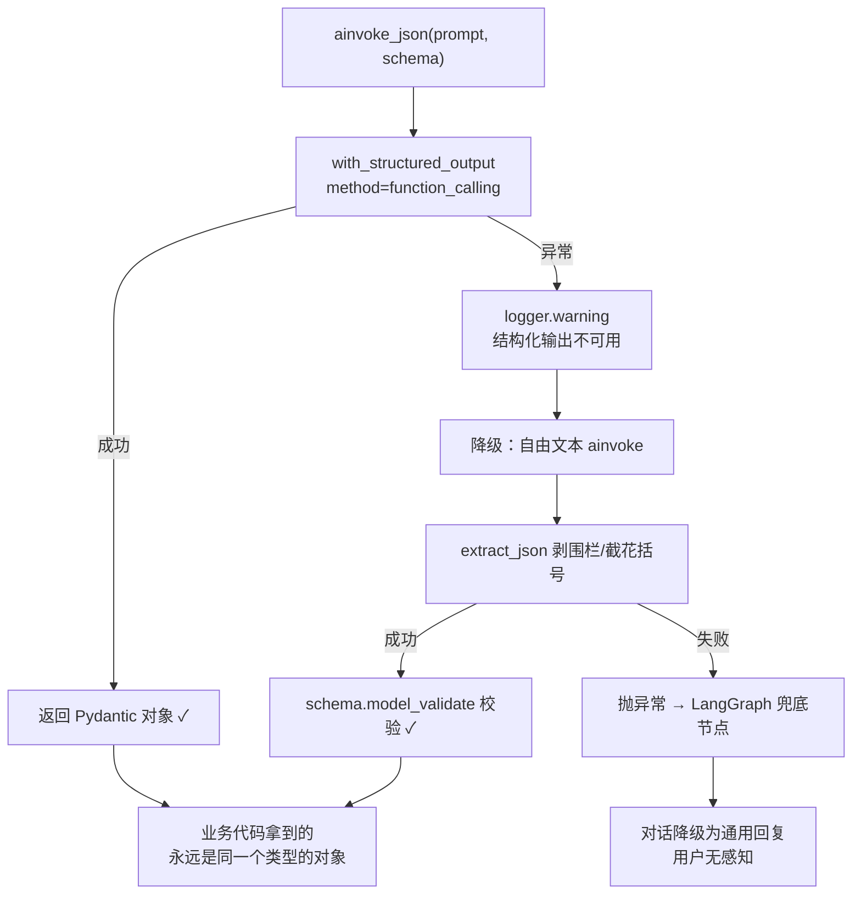

# 接一个大模型只要 3 行代码，剩下的 250 行都在防它"不听话"

> **模型与推理：一个 Agent 项目的模型层到底长什么样**
>
> 📦 项目源码：[weather-travel-recommend-system](https://github.com/Ticnix/weather-travel-recommend-system) —— 基于气象大数据的出行推荐系统，AI Agent 全栈项目。FastAPI + PostgreSQL(TimescaleDB/pgvector/PostGIS) + Redis；LangGraph + MCP + Skill + RAG，对接 DeepSeek API。

> **TL;DR**：网上教程里"接入大模型" = 3 行代码调 API。但我项目里管模型的文件（`llm_client.py`）全文 252 行，真正"发请求"的部分不到 20 行——剩下 230 行全在处理另一件事：**模型是不可控的外部供应商**。Key 会失效、输出会裹 Explanation、`json_schema` 会在某家厂商那里返回 400。这篇把这些"看不见的 230 行"摊开讲：OpenAI 兼容三元组、temperature=0.3 怎么定的、三种"不听话"的兜法、一个真实的 400 事故、一个 600 秒的自愈降级。读完你会知道：模型层的工作量，从来不在"调通"，而在"调通之后它变脸怎么办"。

## 目录

1. 为什么 252 行里没有一个"接模型"的玄学
2. 那几个默认值不是随手写的
3. 模型"不听话"的三种方式
4. 比"事后救"更好的是"事前约束"——一个真实的 400
5. Key 无效比不配更糟：600 秒 TTL 自愈
6. 可复用清单

---

## 1. 为什么 252 行里没有一个"接模型"的玄学

先看这个文件最核心的一个数据结构——252 行里，真正决定"能接几家"的只有这一个 dict：

```python
# llm_client.py 第 38-45 行
_PROVIDERS: dict[str, tuple[str, str, str]] = {
    "deepseek": ("DEEPSEEK_API_KEY", "DEEPSEEK_BASE_URL", "DEEPSEEK_LLM_MODEL"),
    "qwen":     ("QWEN_API_KEY",     "QWEN_BASE_URL",     "QWEN_LLM_MODEL"),
    "zhipu":    ("ZHIPU_API_KEY",    "ZHIPU_EMBED_BASE_URL", "ZHIPU_LLM_MODEL"),
    "openai":   ("OPENAI_API_KEY",   "OPENAI_BASE_URL",   "OPENAI_LLM_MODEL"),
    "moonshot": ("MOONSHOT_API_KEY", "MOONSHOT_BASE_URL", "MOONSHOT_LLM_MODEL"),
    "ollama":   ("OLLAMA_API_KEY",   "OLLAMA_BASE_URL",   "OLLAMA_LLM_MODEL"),
}
```

六家厂商，每家只有三个字符串：**api_key、base_url、model**。没有第六个字段，因为没有别的差异——这就是"OpenAI 兼容"这个事实标准的意义。

DeepSeek、通义、智谱、Kimi，甚至本地跑的 Ollama，全都实现了同一套 `/chat/completions` 协议（OpenAI 官方在 [API Reference](https://platform.openai.com/docs/api-reference/chat) 里定义的请求/响应格式）。所以我复用 `langchain-openai` 的 `ChatOpenAI`，切换 base_url 就等于切换厂商，**一行适配代码都不用写**。

这个设计换来的东西很实际：某天厂商涨价、限流、跑路，我把 `.env` 里 `LLM_PROVIDER=deepseek` 改成别的，业务代码一行不动。文件开头的 docstring 里我专门写了一句："**只收录 OpenAI 兼容格式的对话模型**……避免引入不兼容适配器"——这句话是故意写死的边界，谁想加个不兼容的厂商进来，先过这道 review。

## 2. 那几个默认值不是随手写的

`get_llm()` 里实例化模型就一段：

```python
# llm_client.py 第 89-97 行
_llm_cache[cache_key] = ChatOpenAI(
    model=chosen_model,
    api_key=api_key,
    base_url=base_url,
    temperature=0.3,
    timeout=60.0,
    max_retries=2,
    **kwargs,
)
```

四个数字，每个都有理由：

**temperature=0.3**。出行推荐是"工具型"场景：用户问明天穿什么，两次提问最好得到稳定一致的结论——所以不能开 0.7 让它放飞。但也不设 0：完全为 0 时输出风格死板，而且有些实现里 0 会走贪婪解码的极端路径。0.3 是"基本可复现，留一点弹性"的位置。（temperature 的原理见 [OpenAI 文档](https://platform.openai.com/docs/api-reference/chat/create#chat-create-temperature)：越低分布越尖，越高越随机。）

**timeout=60 + max_retries=2**。LLM 的延迟是长尾分布——P50 可能 2 秒，P99 能到 40 秒。不设超时的话，一次网络抖动就挂死一个请求。

还有两个不太显眼但更重要的设计：

**缓存键是 `provider:model`，不只是 provider**。这个项目里视觉模型和文本模型是分开的（视觉用 `glm-4v-flash`，文本用 `deepseek-chat`）。如果缓存键只记 provider，那"先要了文本模型、后面再要视觉模型"时会拿到错误实例——症状很隐蔽：请求照发、不报错，只是模型一直在用错的。注释里我把这个坑写明了。

**Key 没配时用占位符实例化，而不是直接抛异常**：

```python
# llm_client.py 第 84-88 行
if not api_key:
    logger.warning("提供商 %s 未配置 API Key，实际调用将失败", provider)
    api_key = "sk-placeholder"
```

为什么？因为"实例化"发生在应用启动期，而"调用"发生在请求期。如果启动时就炸，整个服务都起不来——但模型不可用本该只是**功能降级**，不是**服务不可用**。占位符让启动继续，真正的鉴权错误在第一次调用时爆出来，交给 LangGraph 的兜底节点统一处理。**"缺一个外部依赖"和"整个应用挂掉"是两种严重程度完全不同的事故，代码里不该把它们合并。**

## 3. 模型"不听话"的三种方式

结构化输出最怕的不是模型答错，而是模型**答对了但格式不对**。`extract_json` 的 docstring 里我总结了三种常见姿势：

```python
# llm_client.py 第 182-206 行
def extract_json(text: str) -> Any:
    """模型常见的三种「不听话」：包了 ```json 围栏、前后加了说明文字、
    只给对象但外面裹着解释。前两种在这里处理掉——
    **不要因为模型多写了一句"好的，以下是行程："就让整个功能失败**。"""
```

具体就两层防线：

1. 先用正则剥掉 ` ```json ... ``` ` 围栏，能 `json.loads` 就直接返回；
2. 失败的话，截取**第一个 `{` 到最后一个 `}`** 之间的内容再试一次——专治"好的，以下是行程：{...}，希望对您有帮助！"这种前后废话。

第二层看起来粗糙，实际非常耐用：JSON 对象的边界就是花括号，废话再多也不影响首尾定位。

但要强调一句：`extract_json` 是**兜底**，不是正路。它在 `ainvoke_json` 里只出现在异常分支——正路是下一章的事。

## 4. 比"事后救"更好的是"事前约束"——一个真实的 400

让模型输出结构化对象，LangChain 提供了 `with_structured_output`，官方文档里它有 [两种 method](https://python.langchain.com/docs/how_to/structured_output/)：`json_schema`（用 `response_format` 参数约束输出）和 `function_calling`（把你的 schema 伪装成一个工具定义让模型"调用"）。

我用的不是默认值：

```python
# llm_client.py 第 242 行
structured = llm.with_structured_output(schema, method="function_calling")
```

为什么绕过默认？docstring 里记着一次真实事故：

> DeepSeek（本项目的默认提供商）对 `response_format=json_schema` 会返回 `This response_format type is unavailable now`，而 function calling 是支持的。这个差异是跑 **Day 41** 的架构对比时暴露的——当时每个问题都白多花了一次失败调用，日志里只有一行 400。

这个事故的典型性在于：**它不报错在你的代码里**。代码逻辑全对，测试全绿，只有运行时每个请求多挨一次 400，然后掉进兜底。如果不是翻日志对请求次数，可能一直以为"兜底机制工作正常"是设计如此。

所以这条链路最终长这样（每一层都有真实代码对应）：



注意最下面那条：即使两级全失败，异常也不是甩给用户的，而是交给 LangGraph 的错误处理——业务代码拿到的要么是合法对象，要么是通用回复，**中间形态不存在**。

## 5. Key 无效比不配更糟：600 秒 TTL 自愈

模型层还有一个反直觉的降级设计，在视觉链路上。

这个项目支持用户上传图片识别旅行场景，走的是视觉模型（`glm-4v-flash`）。配了 Key 的情况下，请求失败自动退 OCR 是没有的——OCR 是给"没配 Key"的场景准备的。于是出现一个诡异的不等式：

> **配了一个无效的 Key，比不配更糟。**

不配 Key：走 OCR，功能正常。配了过期 Key：每次都请求视觉模型 → 401 → 失败 → 用户每张图都看不到结果。降级路径反而被"更高级的配置"堵死了。

`llm_client.py` 第 101-128 行就是给这个准备的：

```python
_VISION_BROKEN_TTL = 600.0  # 10 分钟
_vision_broken: tuple[float, str] | None = None  # (时间戳, 原因)

def mark_vision_broken(reason: str) -> None:
    """视觉模型被服务商拒绝（401/403/404）时调用，暂时禁用视觉路径。"""
```

机制很简单：视觉模型一被拒，记一个时间戳，之后 600 秒内附件层直接走 OCR，不再浪费请求；600 秒后状态自动过期，下次再试视觉——这样你**换了个有效 Key 之后什么都不用做，系统自己恢复**。

TTL 是整个设计的灵魂。没有它就只有一个单向开关："坏过一次就永久禁用"，那你换了 Key 也不会生效。**带 TTL 的降级 = 会在下一次自动重试的降级**，这两者的运维成本天差地别。

这也是第 09 篇那条不变式在模型层的化身：**降级路径必须真能返回东西**——"配了 Key"这个状态不能反而成为功能不可用的原因。

## 6. 可复用清单

- **接多厂商只收 OpenAI 兼容**：一个 `dict[provider -> (key, url, model)]` 解决，不为不兼容协议写适配器。加厂商 = 加一行。
- **实例缓存键带 model**：同一 provider 的不同模型（文本/视觉）必须各存一份，否则静默用错模型。
- **启动期不因缺 Key 而死**：占位符实例化，错误延迟到真正调用时爆，交给统一兜底。"缺依赖 ≠ 服务不可用"。
- **JSON 兜底两层**：剥围栏 → 截首尾花括号。但兜底永远只该出现在异常分支，正路是结构化输出。
- **`with_structured_output` 的 method 要按厂商实测**：默认的 `json_schema` 不是到处支持（DeepSeek 返回 400），`function_calling` 兼容面更广。
- **降级要带 TTL**：带 TTL 的降级会自愈，不带的是单向开关——换了 Key 也不生效。

---

### 下一篇预告

模型层聊完了，A 辑下一篇想讲 **A3「检索与记忆」**：Embedding 到底把文字变成了什么、向量相似度为什么能"理解"语义、以及对话记忆（短期）和知识库（长期）在工程上分别怎么落地——A1 里那些名词，到这一篇就都能落到实处了。要的话我接着写。

### 参考资料

1. [项目源码（仍在更新中）](https://github.com/Ticnix/weather-travel-recommend-system) —— 本文所有代码来自 `backend/app/services/llm_client.py` 与 `backend/app/core/config.py`
2. [OpenAI API Reference - Chat](https://platform.openai.com/docs/api-reference/chat) —— OpenAI 兼容协议的源头定义
3. [DeepSeek API 文档 - 首次调用](https://api-docs.deepseek.com/) —— base_url 与 OpenAI SDK 的兼容说明
4. [LangChain - How to return structured output](https://python.langchain.com/docs/how_to/structured_output/) —— `json_schema` 与 `function_calling` 两种 method 的差异
5. [OpenAI - Function Calling 指南](https://platform.openai.com/docs/guides/function-calling) —— function calling 的工作原理
6. [LangChain - ChatOpenAI](https://python.langchain.com/docs/integrations/chat/openai/) —— 本文使用的客户端实现
