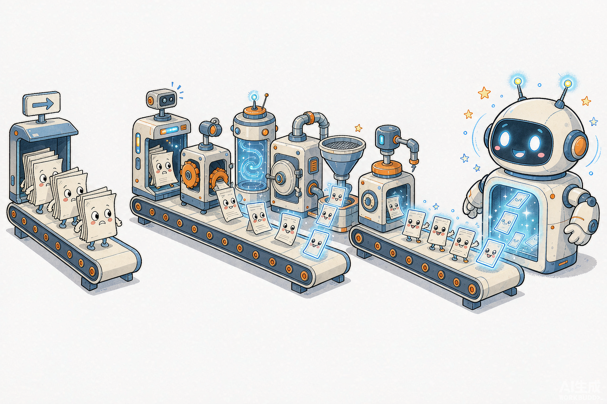
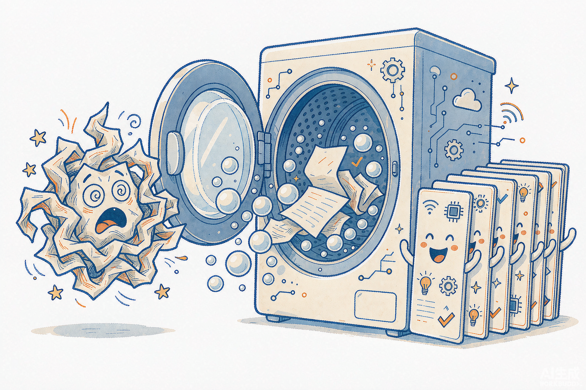
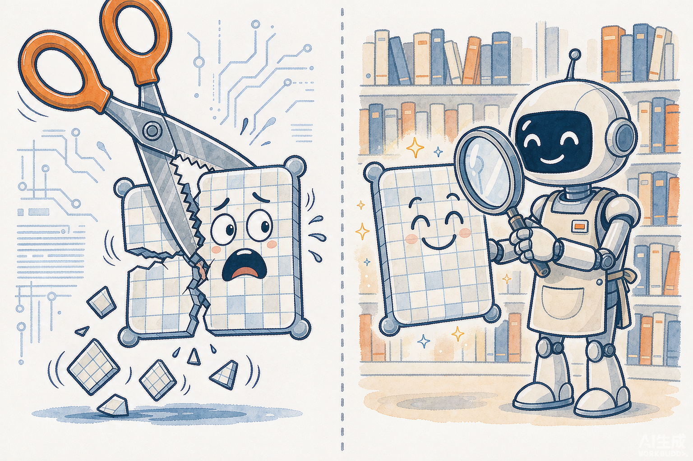

# RAG 检索不准，九成的锅不在向量——不同文件，就该有不同的入库方案

> **向量检索方案全景：从文件解析到混合检索的底层逻辑**
>
> 📦 项目源码：[weather-travel-recommend-system](https://github.com/Ticnix/weather-travel-recommend-system) —— 基于气象大数据的出行推荐系统，AI Agent 全栈项目。FastAPI + PostgreSQL(TimescaleDB/pgvector/PostGIS) + Redis；LangGraph + MCP + Skill + RAG，对接 DeepSeek API。

> **TL;DR**：很多人把"向量检索"当成一个方案，实际上它是一条**六段流水线**：解析 → 切块 → 嵌入 → 索引 → 召回 → 重排。每一环的损耗都会向下游传递，而**损耗最惨烈的恰恰是最少人讨论的前两环**——PDF 表格被线性化、双栏排版被读乱、一整张 Excel 被硬切成渣，这些在向量算相似度之前就已经判了死刑。这篇按文件形式逐一给方案（Markdown / PDF / Word / 表格 / 代码 / 图片），讲清每条方案背后的底层逻辑，最后给一份"值得读的开源项目清单"——每个项目标注它最值得抄的东西。

## 目录

1. 向量检索不是"一个方案"，是一条流水线
2. 30 秒讲清 Embedding 与相似度的底层
3. 不同文件形式，不同入库方案（核心）
4. 切块的底层逻辑：不是越小越好
5. 只有向量会输：混合检索
6. 重排：召回是粗筛，rerank 是面试
7. 向量库怎么选：pgvector / Milvus / Qdrant
8. 值得读的开源项目：每个抄什么
9. 可复用清单

---

## 1. 向量检索不是"一个方案"，是一条流水线

先给全景。任何一个 RAG 系统的检索侧，拆开都是这条流水线：

*图 1｜检索侧的六段流水线：文件们的"入职培训"，任何一站出错都会带病上岗。*

注意箭头方向：信息从左往右流，**误差也从左往右流**。第 ① 步把表格压扁成乱码，第 ③ 步算出来的向量再精确也只是在"给乱码算相似度"；第 ② 步把一句话拦腰切断，第 ⑥ 步的重排模型再强也救不回缺失的另一半语义。

RAGFlow 的文档里有一句话我非常认同：**"Quality in, quality out"**。他们把"深度文档理解"做成整个引擎的核心卖点，而不是把精力全花在向量索引上——这个排序本身就是答案：**业界做 RAG 的人，最容易低估的就是解析这一环**。

我自己的项目可以做个对照：知识库只有 16 个 Markdown 文档，切成 33 块，检索三个中文问题 Top-1 全中（详见第 13 篇）。为什么这么小一个库效果还行？因为 Markdown 是"已结构化"的文件——解析这一环几乎零损耗。**文件越干净，向量检索越接近它的理论效果；文件越脏，越是解析的战场。**

## 2. 30 秒讲清 Embedding 与相似度的底层

后面所有方案都建立在这个理解上，所以先把"向量到底是什么"讲透，只需要 30 秒。

**Embedding 模型是一个 Transformer 编码器**：把一段文本喂进去，最后一层的输出做池化（通常取 [CLS] 或均值），压成一个固定长度的向量——我的项目用智谱 `embedding-3`，输出 1024 维（`EMBED_DIM=1024`，和 pgvector 的 `vector(1024)` 对齐）。

关键问题是：**为什么语义相近的文本，向量会相近？**答案是训练方式——对比学习。训练时把"问题和它的正确答案"作为正样本对往一起拉，把"问题和随机无关文本"作为负样本对往外推。几亿对这样的训练之后，模型被迫学会把"语义"编码进向量的方向里：不是为了表面词汇相似，而是为了"会在相同上下文里出现"的文本落在一起。这就是为什么"明天爬白云山穿什么"和"山区徒步穿搭建议"字面只重叠一个"穿"，向量却能排在一起。

两个直接推论，后面会反复用到：

1. **余弦相似度衡量的是方向，不是长度**——所以它对文本长度相对不敏感，但一段被切碎的文本，它的向量是"半句话"的方向，和完整问题的方向天然有偏差。
2. **Top-K 永远返回 K 个结果**，哪怕库里没有一条真相关。相似度只有相对意义，没有绝对意义——这就是阈值、重排和"检索不到就明说"存在的根本原因。

## 3. 不同文件形式，不同入库方案（核心）

这是全文的核心。原则一句话：**入库方案跟着"结构在哪儿"走，而不是跟着文件后缀走。**

### 3.1 Markdown / 纯文本：保留结构，按语义边界切

Markdown 是最理想的入库格式，因为标题层级、段落、列表这些结构信息就写在文本里。方案：**按二级/三级标题切成"节"，节内超长再按段落切**。

我项目里 `knowledge_loader.py` 就是这个思路的简化版：先按 `\n\n` 分段保证语义完整，段落超长才滑窗硬切，块的标题从首个 `# ` 行提取（这个标题还会随块一起存库，检索命中时把"出处标题"一并给 LLM，引用质量明显更好）。

### 3.2 PDF：RAG 里最大的坑，没有之一

PDF 要分三种情况，方案完全不同：

**文本型 PDF**（能直接选中复制文字的）：看似简单，实则暗坑。用朴素提取器（如 `pypdf`）出来的文本有三大灾难：**双栏论文被按行横穿读乱**、**页眉页脚混进正文**、**表格被线性化成一串没有列含义的碎片**。问"Q3 营收多少"，向量可能召回那个数字，但列头"2024 Q3 营收（亿元）"在另一个块里——数字失去了语义。

**扫描型 PDF**（图片）：必须 OCR，或直接上视觉模型。

**方案**：上**版面解析**。开源里两条主流路线：

- **RAGFlow 的 DeepDoc**：用布局识别模型把一页 PDF 分成 10 类组件（正文/标题/图/表/页眉/页脚/公式……），表格走专门的表结构识别（TSR）还原层级表头和合并单元格，再把表格内容**重新组装成 LLM 能读懂的句子**；
- **MinerU**（OpenDataLab 出品）：把 PDF/图片直接转成保留结构的 **Markdown**——表格转 Markdown 表、公式转 LaTeX，还分 Flash/Basic/Standard/Advanced 四档解析强度。转完 Markdown，就回到 3.1 的理想情况了。

*图 2｜PDF 入库前的"洗衣机"：版面解析负责把一团乱麻洗成结构化文本。*

一句话总结：**别自己用 pypdf 硬啃 PDF，让专门的版面解析先把它"洗"成结构化文本。**

### 3.3 Word / PPT / HTML：用结构解析，拒绝正则

docx/pptx 本质是 zip 里的 XML，结构信息完整。方案：用 `python-docx` / `python-pptx` 或 LlamaIndex 的对应 Reader 按**标题、章节、幻灯片**为单位取内容，块边界对齐结构边界。HTML 同理：先剥掉导航栏/页脚（它们是每个页面都重复的噪声，会被切成一堆高相似度的垃圾块），再按 `<h1>-<h3>` 或语义标签切块。我项目第 08 篇做"正文提取"就是这个问题的实际战斗——新闻页的正文必须从整页 HTML 里剥出来，否则检索全是菜单和推荐位的回声。

### 3.4 表格 / Excel：最不该"向量"的格式

很多人把 Excel 直接切块进向量库，这是最错的一种入库。因为表格的价值在**精确的行列交叉**，而 embedding 会把"华南 2024Q3 12.7"这种单元格内容稀释成一团模糊语义。

按查询类型分三条路：

| 查询类型 | 正确方案 | 为什么不用向量 |
|---|---|---|
| 精确数值（"2024Q3 华南营收"） | **Text-to-SQL**，让 LLM 生成查询直接打表 | 向量给不出精确数字，SQL 才是精确检索 |
| 模糊语义（"哪个区域增长最快"） | **行列叙事化**：每行转成一句自然语言（"2024Q3，华南区营收 12.7 亿，环比 +8%"）再嵌入 | 行级语义完整，向量有用武之地 |
| 小表整体 | **整表入库**（不切） | 切碎的表格两半都无用 |

*图 3｜同一张表格的两种命运：被硬切碎，还是被结构化地"读"。*

判断标准依然是"结构在哪儿"：表格的结构就是列头+行，方案要么保留结构（SQL），要么把结构**翻译成语言**（叙事化），唯独不能把结构切碎。

### 3.5 代码：按语法边界切，不按字符数切

代码文档（API 手册、函数注释）如果和普通文本一起按 300 字硬切，会把一个函数的签名和实现切断。方案：**按 AST/函数边界切块**，LlamaIndex 有现成的 `CodeSplitter`；至少也要按"定义边界"（`def`/`class`）切。每个块自带"文件路径 + 函数名"元数据，检索命中后 LLM 能直接指认出处。

### 3.6 图片：两条路

- **caption 化**：用多模态模型给图生成描述文本，把描述入库参与检索，命中后把原图和描述一起给 LLM。RAGFlow 2025-03 起就内置了"PDF/DOCX 中的图用多模态大模型解析描述"；
- **CLIP 类双塔模型**：图片和文本各编码成一个向量，直接在同一个空间里算相似度。适合"以图搜图/图文混检"。

轻量做法是前者——我项目的视觉链路（`glm-4v-flash`）就是同一思路在对话侧的复用。

## 4. 切块的底层逻辑：不是越小越好

`chunk_size` 是每个做 RAG 的人调的第一个参数，但它的 trade-off 很多人没想透：

- **块太小**：检索精准（向量聚焦），但命中后给 LLM 的上下文缺头少尾——"它说带外套，但没说哪座山"；
- **块太大**：上下文完整，但一个块里混了多个主题，向量变成"平均语义"，什么都像、什么都不准。

我的项目取 `chunk_size=300`（33 块平均 213 字），对"城市出行指南"这种短文档是合适的——每个块基本是一个完整主题（美食/交通/穿搭）。

`overlap` 的作用是防"句子被拦腰切断"：相邻块共享一小段文本，边界上的句子至少在某一侧是完整的。但要提醒一句：**overlap 是补丁，不是设计**——块切得语义完整（按段落/标题切），overlap 的作用就很小；我项目后来实测发现它的 overlap 参数一直是静默失效的（第 13 篇），检索质量却没受影响，正是因为"段落优先"已经承担了防断裂的主责。

真正的进阶是**父子块（small-to-big）**：检索用小块（向量准），命中后把它的**父块**（整节）喂给 LLM（上下文全）。LlamaIndex 内置了这个结构。再往上是 **RAPTOR**（对文本递归聚类+摘要，形成树状索引，"摘要块"负责回答宏观问题）和 **GraphRAG**（抽实体关系建图谱，回答"全局关联"类问题）——它们解决的都是同一个矛盾：**检索粒度和生成粒度不该是同一个**。

## 5. 只有向量会输：混合检索

向量检索有一个结构性盲区：**精确符号**。你问"GB/T 19001 的适用范围"，embedding 会把标准编号这种"没有语义的字符串"平均掉——库里那份真正的标准文档，可能排不到前面。专名、API 名、型号、编号，全是重灾区。

底层原因在第 2 章埋过了：embedding 编码的是"会出现在相似上下文里"，而精确匹配需要的是**字面一致**。这两个目标天然冲突。

所以成熟方案都是**混合检索**：

- **稀疏检索（BM25）**：经典关键词算法，核心是"词频 × 逆文档频率"——这个词在这篇文档出现多、在其他文档出现少，就是强信号。它不懂语义，但**对精确词完美敏感**；
- **稠密检索（向量）**：懂语义，不认字面；
- **融合（RRF）**：Reciprocal Rank Fusion，不看分数只看排名，`score = Σ 1/(k + rank)`——两路结果按排名合并，谁也不用跟谁的分数量纲打架。

| | 稀疏 BM25 | 稠密向量 |
|---|---|---|
| 精确编号/专名/API 名 | ✅ 强 | ❌ 被语义平均稀释 |
| 同义改写（"徒步"↔"爬山"） | ❌ 无能为力 | ✅ 核心优势 |
| 新词/未登录词 | ✅ 字面即命中 | ⚠️ 看训练语料 |

*图 4｜混合检索：放大镜侦探（BM25）管字面，天线侦探（向量）管语义，线索合在一起案子才破。*

开源实现很成熟：Elasticsearch 原生支持混合查询；Qdrant 和 Milvus 2.4+ 支持**稀疏向量**（learned sparse，如 BGE-M3 一个模型同时出稠密+稀疏两路）；Weaviate 内置 BM25 + 向量融合。RAGFlow 的检索层就是"关键词 + 向量 + 混合"三路召回再统一重排。

我的项目目前 `search_knowledge` 是纯向量召回——对"城市旅行指南"这种查询够用，但这是我明确的待办：一旦知识库放进规格、政策类带编号的文档，BM25 那一路就必须补上。

## 6. 重排：召回是粗筛，rerank 是面试

流水线最后一环。这里的关键是第 2 章埋的第二个伏笔：**bi-encoder vs cross-encoder**。

- **召回用的 bi-encoder**：查询和文档**各自独立**编码成向量，再算余弦。好处是文档向量可以离线算好，在线只需编码查询——所以能毫秒级扫全库。代价：两段文本从未"见面"，交互信息全靠训练时压进各自向量里；
- **重排用的 cross-encoder**：把「查询 + 候选文档」**拼接成一个输入**喂给模型，让每个 token 直接和对方的 token 做注意力。精度显著更高——代价是每个候选都要跑一遍完整前向，**不可能对全库做**。

*图 5｜重排就是面试：召回给了 50 份简历，考官只放 5 人进门。*

所以工程上的标准分工：**向量召回 Top-50（快而糙）→ cross-encoder 重排 → 取 Top-5 给 LLM（慢而准）**。我项目的 `EMBED_TOP_K=5`，给 LLM 的就是精排后的 5 块。开源首选 **BAAI 的 bge-reranker** 系列（中文效果好、能本地跑）；RAGFlow 则把重排做成召回后的可配置组件。

重排能救召回的"排序问题"，但救不了解析和切块的"内容问题"——这就是为什么它排在流水线最后一环，而全文把最大篇幅给了最前面两环。

## 7. 向量库怎么选：pgvector / Milvus / Qdrant

先讲索引的底层，选择标准就自然浮现了。数据量小，暴力扫全部向量就是精确最近邻；数据量大（千万级以上）必须近似最近邻（ANN），主流两条路线：

- **HNSW**：把向量组织成多层跳表式图——上层稀疏（高速公路）、下层稠密（乡道），查询从顶层贪心下降。查询快、召回率高，代价是内存占用大、建图慢；
- **IVF**：先聚类成 N 个桶，查询只扫最近的几个桶。省内存，但桶边界上的近邻可能漏。

选型按数据量级和运维成本走，不追"最强"：

| 库 | 定位 | 适合 |
|---|---|---|
| **pgvector** | Postgres 插件，HNSW/IVF | **百万级以下、想少运维一个组件** |
| **Qdrant** | 专用向量库，Rust，稀疏+稠密 | 中等规模、检索功能要求细 |
| **Milvus** | 分布式，亿级 | 大规模、有多团队运维能力 |
| **Weaviate** | 内置 BM25 混合 + 模块化 | 想开箱要混合检索 |
| **Chroma** | 轻量嵌入式 | 原型/demo |

我的项目选 **pgvector**，理由很工程化：知识库只有 33 块，为它们多运维一个向量数据库纯属给自己找事；而 Postgres 本来就在——向量检索就是一个 `ORDER BY embedding <=> :query LIMIT 5`，还免费获得和元数据（`user_id`！）同库联查、事务、备份的能力。HNSW 索引在迁移 0001 里一条 `USING hnsw (embedding vector_cosine_ops)` 建好（这条 DDL 的坑在第 12 篇写过）。**数据到千万级再谈换库，之前 pgvector 的上限高得超出多数项目的生命周期。**

## 8. 值得读的开源项目：每个抄什么

最后给清单。每个项目我只说**最值得抄的一件事**，别整站照搬：

| 项目 | 一句话定位 | 最值得抄什么 |
|---|---|---|
| [RAGFlow](https://github.com/infiniflow/ragflow)（~81k★） | 深度文档理解 RAG 引擎 | **把解析当一等公民**：DeepDoc 十类版面组件 + 表格结构重组；切块过程可视化、可人工修正——"切块可解释"这个理念值得写进任何 RAG 系统 |
| [MinerU](https://github.com/opendatalab/MinerU) | PDF→Markdown 解析器 | **PDF 入库前的"洗衣机"**：表格转 Markdown 表、公式转 LaTeX，转完直接回到最理想的入库路径 |
| [LlamaIndex](https://github.com/run-llama/llama_index) | 数据框架 | **索引结构的百科全书**：父子块、CodeSplitter、几十种 Reader——先读它的索引抽象再决定自己怎么设计 |
| [Dify](https://github.com/langgenius/dify) | LLMOps 平台 | **RAG 的工程化形态**：分段/清洗/索引方法全在界面上可配，适合看"产品化时哪些参数必须暴露给运营" |
| [GraphRAG](https://github.com/microsoft/graphrag)（微软） | 知识图谱增强 RAG | **回答"全局性问题"的思路**（"这批文档的主要主题是什么"）——切片检索天然答不了全局归纳 |
| [txtai](https://github.com/neuml/txtai) | 轻量嵌入式向量库 | **单文件极简实现**，想读懂最小可行检索长什么样，读它比读 Milvus 容易一个量级 |

读法建议：**先读 txtai 和 LlamaIndex 懂原理，再读 RAGFlow 学解析，用 Dify 看产品化，GraphRAG 按需**。

## 9. 可复用清单

- **检索不准先查上游**：按 解析→切块→嵌入→索引→召回→重排 逐环排查，九成问题死在前两环。
- **入库方案跟着"结构在哪儿"走**：Markdown 按标题切、PDF 先版面解析、表格走 SQL 或行叙事化、代码按 AST 切——没有万能切块参数。
- **PDF 别用 pypdf 硬啃**：MinerU 洗成 Markdown，或直接用 RAGFlow 的 DeepDoc。
- **`chunk_size` 是权衡不是配置**：小=准而残、大=全而糊；父子块让"检索粒度 ≠ 生成粒度"。
- **精确编号/专名必须补 BM25**：RRF 融合两路排名，向量负责语义、关键词负责字面。
- **召回 50 重排取 5**：bi-encoder 扫全库、cross-encoder 精排头部，分工不可颠倒。
- **向量库按量级选**：百万级以下 pgvector 就够，它的上限超出多数项目的生命周期。

---

### 下一篇预告

检索聊完，A 辑下一篇是 **A4「记忆」**：对话里的短期记忆（多轮上下文窗口怎么裁剪）和知识库这种长期记忆在工程上的分界——什么时候该"记在会话里"、什么时候该"写进库里"、什么时候该让模型自己决定调用哪边。要的话我接着写。

### 参考资料

1. [项目源码（仍在更新中）](https://github.com/Ticnix/weather-travel-recommend-system) —— 本文项目实例来自 `backend/app/services/{knowledge_loader,rag_service,embedding_client}.py` 与迁移 `0001_initial.py`
2. [RAGFlow 官网与文档](https://ragflow.org/) —— "Quality in, quality out" 与 DeepDoc 版面解析
3. [MinerU（OpenDataLab）](https://github.com/opendatalab/MinerU) —— PDF→Markdown 四档解析
4. [LlamaIndex Documentation](https://docs.llamaindex.ai/) —— 父子块 / CodeSplitter / 索引结构
5. [pgvector](https://github.com/pgvector/pgvector) —— HNSW/IVF 索引与距离算子
6. [RAPTOR: Recursive Abstractive Processing for Tree-Organized Retrieval](https://arxiv.org/abs/2401.18059) —— 分层摘要索引
7. [Microsoft GraphRAG](https://microsoft.github.io/graphrag/) —— 面向全局问题的图谱增强检索
8. [BAAI bge-reranker](https://huggingface.co/BAAI/bge-reranker-large) —— 开源 Cross-Encoder 重排模型
